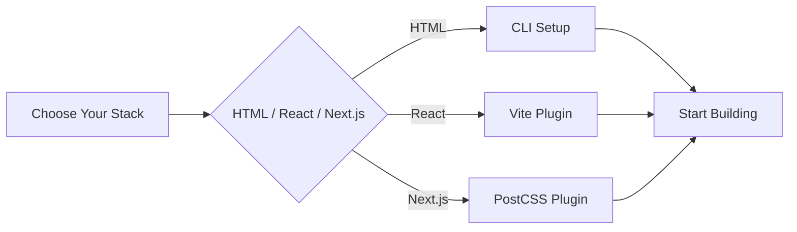

# Tailwind CSS v4+ Complete Documentation

_A comprehensive guide to the modern CSS-first utility framework for HTML, React, and Next.js projects_

---

## 🧭 Quick Navigation

| Section                                                      | Description                                   | Status      |
| ------------------------------------------------------------ | --------------------------------------------- | ----------- |
| [📖 Introduction](./docs/0-introduction/README.md)           | Overview, philosophy, and version comparison  | ✅ Complete |
| [⚙️ Setup & Installation](./docs/1-setup/README.md)          | HTML, React, Next.js setup guides             | ✅ Complete |
| [🎯 Core Concepts](./docs/2-core-concepts/README.md)         | CSS-first config, theme system, utilities     | ✅ Complete |
| [🚀 Advanced Features](./docs/3-advanced-features/README.md) | Custom utilities, variants, plugins           | ✅ Complete |
| [🎨 UI Examples](./docs/4-ui-examples/README.md)             | Components and complete page examples         | ✅ Complete |
| [✨ Best Practices](./docs/5-best-practices/README.md)       | Project structure, performance, accessibility | ✅ Complete |
| [🔄 Migration Guide](./docs/6-migration/README.md)           | v3 to v4 migration and troubleshooting        | ✅ Complete |
| [📚 Resources](./docs/7-resources/README.md)                 | Cheatsheets, tools, and community             | ✅ Complete |

---

## 🚀 Quick Start



### HTML Project

```bash
npm install tailwindcss @tailwindcss/cli
echo '@import "tailwindcss";' > src/input.css
npx @tailwindcss/cli -i ./src/input.css -o ./src/output.css --watch
```

### React/Vite Project

```bash
npm create vite@latest my-app -- --template react
cd my-app
npm install tailwindcss @tailwindcss/vite
```

### Next.js Project

```bash
npx create-next-app@latest my-app --typescript --app
cd my-app
npm install tailwindcss @tailwindcss/postcss postcss
```

---

## 🎯 What's New in v4

| Feature               | v3                                                           | v4                            |
| --------------------- | ------------------------------------------------------------ | ----------------------------- |
| **Configuration**     | `tailwind.config.js`                                         | `@theme` directive in CSS     |
| **CSS Import**        | `@tailwind base; @tailwind components; @tailwind utilities;` | `@import "tailwindcss";`      |
| **PostCSS Plugin**    | `tailwindcss`                                                | `@tailwindcss/postcss`        |
| **Vite Integration**  | Via PostCSS                                                  | Dedicated `@tailwindcss/vite` |
| **Content Detection** | Manual configuration                                         | Automatic detection           |
| **Custom Utilities**  | `@layer utilities`                                           | `@utility` directive          |

---

## 🧩 Key Features

### CSS-First Configuration

```css
@import "tailwindcss";

@theme {
  --color-primary: #3b82f6;
  --color-secondary: #10b981;
  --spacing-18: 4.5rem;
  --font-display: "Satoshi", "sans-serif";
}
```

### Custom Utilities

```css
@utility tab-4 {
  tab-size: 4;
}

@utility container-custom {
  max-width: 1400px;
  margin: 0 auto;
  padding: 0 2rem;
}
```

### Custom Variants

```css
@custom-variant dark (&:where([data-theme="dark"] *));
@custom-variant theme-midnight (&:where([data-theme="midnight"] *));
```

---

## 📊 Project Structure

```
tailwind_docs/
├── README.md                    # This file
├── docs/                        # Complete documentation
│   ├── 0-introduction/          # Overview and philosophy
│   ├── 1-setup/                # Installation guides
│   ├── 2-core-concepts/        # Core Tailwind concepts
│   ├── 3-advanced-features/    # Advanced features
│   ├── 4-ui-examples/          # Component examples
│   ├── 5-best-practices/       # Best practices
│   ├── 6-migration/            # Migration guides
│   └── 7-resources/            # Resources and tools
├── examples/                    # Working examples
│   ├── html-examples/          # HTML projects
│   ├── react-examples/         # React projects
│   └── nextjs-examples/        # Next.js projects
└── assets/                      # Images and diagrams
    ├── images/
    └── diagrams/
```

---

## 🎨 Example Usage

### Basic Component

```jsx
function Button({ variant = "primary", children, ...props }) {
  const baseClasses = "px-4 py-2 rounded-lg font-medium transition-colors";
  const variants = {
    primary: "bg-blue-600 text-white hover:bg-blue-700",
    secondary: "bg-gray-200 text-gray-900 hover:bg-gray-300",
    outline: "border border-gray-300 text-gray-700 hover:bg-gray-50",
  };

  return (
    <button className={`${baseClasses} ${variants[variant]}`} {...props}>
      {children}
    </button>
  );
}
```

### Responsive Layout

```jsx
function Layout({ children }) {
  return (
    <div className="min-h-screen bg-gray-50">
      <header className="bg-white shadow-sm">
        <div className="max-w-7xl mx-auto px-4 sm:px-6 lg:px-8">
          <div className="flex justify-between items-center h-16">
            <h1 className="text-xl font-semibold">My App</h1>
            <nav className="hidden md:flex space-x-8">
              <a href="#" className="text-gray-500 hover:text-gray-900">
                Home
              </a>
              <a href="#" className="text-gray-500 hover:text-gray-900">
                About
              </a>
            </nav>
          </div>
        </div>
      </header>
      <main className="max-w-7xl mx-auto px-4 sm:px-6 lg:px-8 py-8">
        {children}
      </main>
    </div>
  );
}
```

---

## 🔗 External Resources

- [Official Tailwind CSS Website](https://tailwindcss.com)
- [Tailwind CSS v4 Documentation](https://tailwindcss.com/docs)
- [Tailwind CSS GitHub](https://github.com/tailwindlabs/tailwindcss)
- [Tailwind UI](https://tailwindui.com) - Premium components
- [Headless UI](https://headlessui.com) - Unstyled components

---

## 📝 Contributing

This documentation is designed to be comprehensive and up-to-date. If you find any issues or have suggestions for improvement, please:

1. Check the [Issues](../../issues) section
2. Create a new issue with detailed information
3. Follow the contribution guidelines

---

## 📄 License

This documentation is provided under the MIT License. Tailwind CSS itself is licensed under the MIT License.

---

**Ready to get started?** 👉 **[Begin with Introduction](./docs/0-introduction/README.md)**
