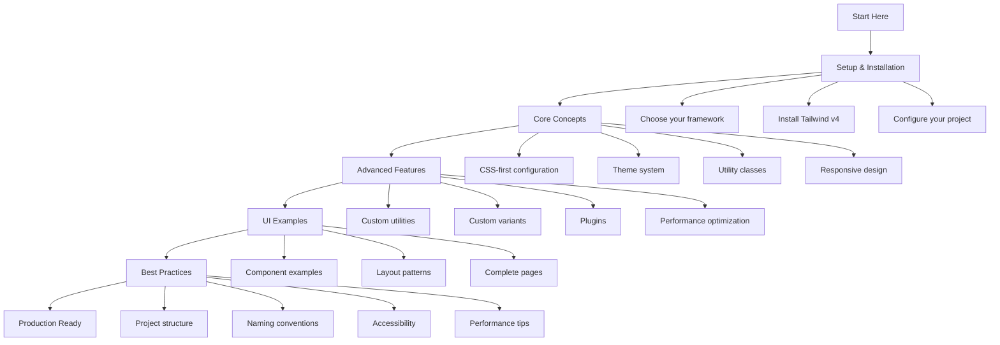

# 📖 Introduction to Tailwind CSS v4+

_Welcome to the modern CSS-first utility framework that's revolutionizing how we build user interfaces_

---

## 🧭 Navigation

- [What is Tailwind CSS?](./what-is-tailwind.md)
- [Version Comparison](./version-comparison.md)
- [Quick Start Guide](../1-setup/README.md)

---

## 🎯 Overview

Tailwind CSS v4+ represents a **fundamental shift** in how we approach CSS frameworks. Moving from JavaScript configuration to CSS-first design, v4 simplifies development while providing unprecedented power and flexibility.

### Key Philosophy Changes

```mermaid
flowchart TD
    A[Tailwind CSS v4] --> B[CSS-First Configuration]
    A --> C[Automatic Content Detection]
    A --> D[Simplified Setup]
    A --> E[Enhanced Performance]

    B --> B1[@theme directive]
    B --> B2[CSS Variables]
    B --> B3[No JS config files]

    C --> C1[Smart file scanning]
    C --> C2[Zero configuration]
    C --> C3[Framework agnostic]

    D --> D1[Single import statement]
    D --> D2[Dedicated plugins]
    D --> D3[Framework-specific tools]

    E --> E1[Faster builds]
    E --> E2[Better HMR]
    E --> E3[Optimized output]
```

---

## 🚀 What Makes v4 Special?

### 1. **CSS-First Configuration**

Instead of JavaScript config files, everything is configured directly in CSS:

```css
/* Old way (v3) */
/* tailwind.config.js */
module.exports = {
  theme: {
    extend: {
      colors: {
        primary: "#3b82f6";
      }
    }
  }
}

/* New way (v4) */
@import "tailwindcss";

@theme {
  --color-primary: #3b82f6;
}
```

### 2. **Automatic Content Detection**

No more manual content path configuration:

```css
/* v4 automatically detects your files */
@import "tailwindcss";

/* Optional: specify additional sources */
@source "../node_modules/@my-company/ui-lib";
@source not "./src/components/legacy";
```

### 3. **Framework-Optimized Plugins**

Dedicated plugins for different build systems:

- **Vite**: `@tailwindcss/vite` - 5x faster builds
- **Next.js**: `@tailwindcss/postcss` - Optimized for App Router
- **CLI**: `@tailwindcss/cli` - Standalone HTML projects

### 4. **Enhanced Developer Experience**

- **Instant HMR**: Changes reflect immediately
- **Better IntelliSense**: Improved autocomplete
- **Simplified Setup**: One command installation
- **Zero Configuration**: Works out of the box

---

## 🎨 Core Concepts

### Utility-First Approach

Tailwind provides low-level utility classes that you compose to build complex designs:

```html
<!-- Traditional CSS approach -->
<div class="card">
  <h2 class="card-title">Hello World</h2>
  <p class="card-content">This is a card component.</p>
</div>

<!-- Tailwind utility-first approach -->
<div class="bg-white rounded-lg shadow-md p-6 max-w-sm">
  <h2 class="text-xl font-bold text-gray-900 mb-2">Hello World</h2>
  <p class="text-gray-600">This is a card component.</p>
</div>
```

### Responsive Design

Mobile-first responsive design with intuitive breakpoints:

```html
<div
  class="
  w-full           <!-- Mobile: full width -->
  sm:w-1/2         <!-- Small screens: half width -->
  md:w-1/3         <!-- Medium screens: third width -->
  lg:w-1/4         <!-- Large screens: quarter width -->
  xl:w-1/5         <!-- Extra large: fifth width -->
"
>
  Responsive content
</div>
```

### Component Composition

Build reusable components by combining utilities:

```jsx
// Button component with variants
function Button({ variant = "primary", size = "md", children, ...props }) {
  const baseClasses =
    "font-medium rounded-lg transition-colors focus:outline-none focus:ring-2";

  const variants = {
    primary: "bg-blue-600 text-white hover:bg-blue-700 focus:ring-blue-500",
    secondary:
      "bg-gray-200 text-gray-900 hover:bg-gray-300 focus:ring-gray-500",
    outline:
      "border border-gray-300 text-gray-700 hover:bg-gray-50 focus:ring-gray-500",
  };

  const sizes = {
    sm: "px-3 py-1.5 text-sm",
    md: "px-4 py-2 text-base",
    lg: "px-6 py-3 text-lg",
  };

  return (
    <button
      className={`${baseClasses} ${variants[variant]} ${sizes[size]}`}
      {...props}
    >
      {children}
    </button>
  );
}
```

---

## 🔄 Migration from v3

If you're coming from Tailwind CSS v3, here's what you need to know:

### Major Changes

1. **Configuration**: JavaScript → CSS
2. **Imports**: Multiple directives → Single import
3. **Plugins**: Separate packages for different tools
4. **Content**: Manual paths → Automatic detection

### Automated Migration

Use the official upgrade tool:

```bash
npx @tailwindcss/upgrade
```

This tool will:

- ✅ Update dependencies
- ✅ Convert `@tailwind` directives to `@import`
- ✅ Migrate JavaScript config to CSS `@theme`
- ✅ Update deprecated utility classes
- ✅ Adjust template files

---

## 🎯 Learning Path



---

## 📚 What's Next?

Ready to dive deeper? Here's your recommended learning path:

1. **[Setup & Installation](../1-setup/README.md)** - Get Tailwind v4 running in your project
2. **[Core Concepts](../2-core-concepts/README.md)** - Master the fundamentals
3. **[Advanced Features](../3-advanced-features/README.md)** - Unlock powerful customization
4. **[UI Examples](../4-ui-examples/README.md)** - See real-world implementations
5. **[Best Practices](../5-best-practices/README.md)** - Learn production-ready patterns

---

## 🆘 Need Help?

- **Setup Issues**: Check the [Setup Troubleshooting](../1-setup/troubleshooting.md)
- **Migration Problems**: See the [Migration Guide](../6-migration/README.md)
- **Community Support**: Visit our [Resources Section](../7-resources/README.md)

---

**Ready to get started?** 👉 **[Setup & Installation Guide](../1-setup/README.md)**

