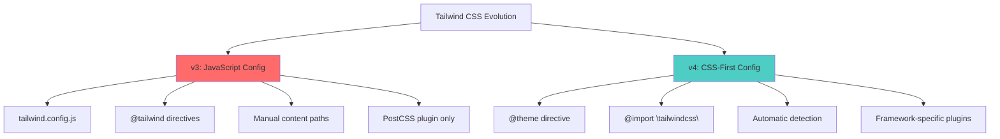
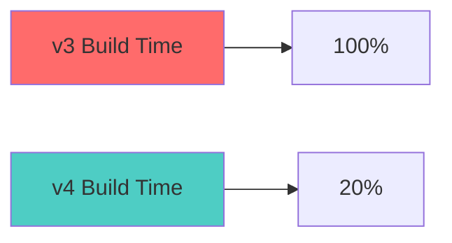
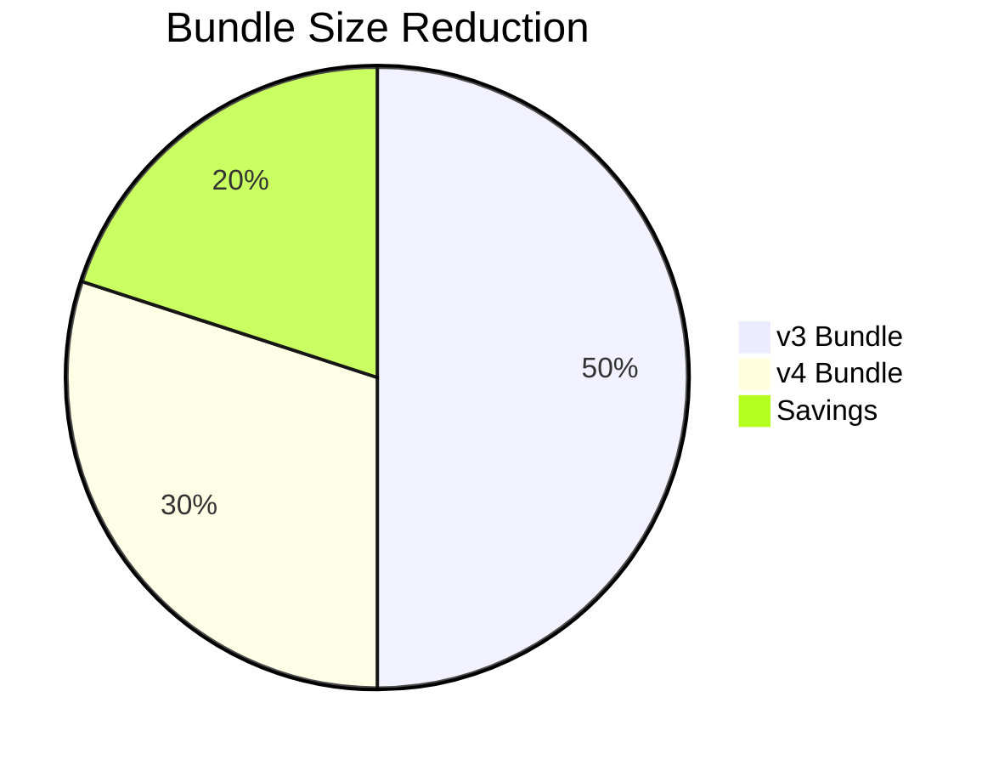
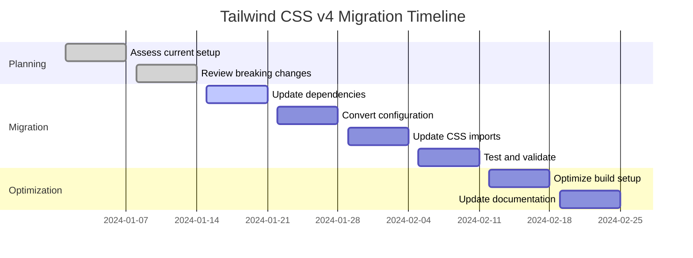

# Tailwind CSS v3 vs v4 Comparison

_A comprehensive guide to the major changes and improvements in Tailwind CSS v4_

---

## 🎯 Overview

Tailwind CSS v4 represents a **fundamental reimagining** of the framework, moving from JavaScript-based configuration to a CSS-first approach. This shift brings significant improvements in performance, developer experience, and simplicity.



---

## 📊 Feature Comparison

| Feature               | v3                                                           | v4                       | Impact         |
| --------------------- | ------------------------------------------------------------ | ------------------------ | -------------- |
| **Configuration**     | `tailwind.config.js`                                         | `@theme` directive       | 🟢 Simplified  |
| **CSS Import**        | `@tailwind base; @tailwind components; @tailwind utilities;` | `@import "tailwindcss";` | 🟢 Cleaner     |
| **PostCSS Plugin**    | `tailwindcss`                                                | `@tailwindcss/postcss`   | 🟢 Separated   |
| **CLI Tool**          | Included in main package                                     | `@tailwindcss/cli`       | 🟢 Modular     |
| **Vite Integration**  | Via PostCSS                                                  | `@tailwindcss/vite`      | 🟢 Optimized   |
| **Content Detection** | Manual configuration                                         | Automatic                | 🟢 Zero config |
| **Imports**           | Requires `postcss-import`                                    | Built-in                 | 🟢 Fewer deps  |
| **Autoprefixer**      | Required separately                                          | Built-in                 | 🟢 Fewer deps  |
| **Custom Utilities**  | `@layer utilities`                                           | `@utility` directive     | 🟢 Better DX   |
| **Plugins**           | In config file                                               | `@plugin` directive      | 🟢 CSS-based   |

---

## 🔧 Configuration Changes

### v3 Configuration

```javascript
// tailwind.config.js
module.exports = {
  content: ["./src/**/*.{js,jsx,ts,tsx}", "./public/index.html"],
  theme: {
    extend: {
      colors: {
        primary: "#3b82f6",
        secondary: "#10b981",
      },
      spacing: {
        18: "4.5rem",
      },
      fontFamily: {
        display: ["Satoshi", "sans-serif"],
      },
    },
  },
  plugins: [require("@tailwindcss/forms"), require("@tailwindcss/typography")],
};
```

### v4 Configuration

```css
/* app.css or globals.css */
@import "tailwindcss";

@theme {
  --color-primary: #3b82f6;
  --color-secondary: #10b981;
  --spacing-18: 4.5rem;
  --font-display: "Satoshi", "sans-serif";
}

@plugin "@tailwindcss/forms";
@plugin "@tailwindcss/typography";
```

---

## 📦 Package Structure Changes

### v3 Packages

```json
{
  "dependencies": {
    "tailwindcss": "^3.4.0",
    "postcss": "^8.4.0",
    "autoprefixer": "^10.4.0"
  }
}
```

### v4 Packages

```json
{
  "dependencies": {
    "tailwindcss": "^4.0.0",
    "@tailwindcss/vite": "^4.0.0" // For Vite projects
  }
}
```

```json
{
  "dependencies": {
    "tailwindcss": "^4.0.0",
    "@tailwindcss/postcss": "^4.0.0", // For PostCSS projects
    "postcss": "^8.4.0"
  }
}
```

```json
{
  "dependencies": {
    "tailwindcss": "^4.0.0",
    "@tailwindcss/cli": "^4.0.0" // For CLI projects
  }
}
```

---

## 🚀 Performance Improvements

### Build Performance



### Key Performance Gains:

- **5x faster builds** with Vite plugin
- **Instant HMR** (Hot Module Replacement)
- **Smaller bundle sizes** through better tree-shaking
- **Faster content scanning** with automatic detection

### Bundle Size Comparison



---

## 🛠️ Setup Changes

### v3 Setup (React/Vite)

```bash
# Install dependencies
npm install tailwindcss postcss autoprefixer

# Initialize config
npx tailwindcss init -p

# Configure PostCSS
# postcss.config.js
module.exports = {
  plugins: {
    tailwindcss: {},
    autoprefixer: {},
  },
}

# CSS file
@tailwind base;
@tailwind components;
@tailwind utilities;
```

### v4 Setup (React/Vite)

```bash
# Install dependencies
npm install tailwindcss @tailwindcss/vite

# Configure Vite
# vite.config.ts
import tailwindcss from "@tailwindcss/vite";

export default defineConfig({
  plugins: [react(), tailwindcss()],
});

# CSS file
@import "tailwindcss";
```

---

## 🎨 Advanced Features Comparison

### Custom Utilities

**v3 Approach:**

```css
@layer utilities {
  .tab-4 {
    tab-size: 4;
  }

  .container-custom {
    max-width: 1400px;
    margin: 0 auto;
    padding: 0 2rem;
  }
}
```

**v4 Approach:**

```css
@utility tab-4 {
  tab-size: 4;
}

@utility container-custom {
  max-width: 1400px;
  margin: 0 auto;
  padding: 0 2rem;
}
```

### Custom Variants

**v3 Approach:**

```javascript
// tailwind.config.js
module.exports = {
  plugins: [
    function ({ addVariant }) {
      addVariant("dark", '&:where([data-theme="dark"] *)');
      addVariant("theme-midnight", '&:where([data-theme="midnight"] *)');
    },
  ],
};
```

**v4 Approach:**

```css
@custom-variant dark (&:where([data-theme="dark"] *));
@custom-variant theme-midnight (&:where([data-theme="midnight"] *));
```

---

## 🔄 Migration Benefits

### Developer Experience Improvements

- **Simplified setup** - No more complex configuration files
- **Better IntelliSense** - Improved autocomplete and suggestions
- **Faster development** - Instant feedback with HMR
- **Less context switching** - Everything in CSS

### Maintenance Benefits

- **Fewer dependencies** - Built-in autoprefixer and imports
- **Automatic updates** - Content detection eliminates manual maintenance
- **Framework optimization** - Dedicated plugins for different tools
- **Better debugging** - Clearer error messages and warnings

---

## 📈 Migration Timeline



---

## 🚨 Breaking Changes

### 1. **Configuration File**

- ❌ `tailwind.config.js` no longer used
- ✅ Use `@theme` directive in CSS

### 2. **CSS Imports**

- ❌ `@tailwind base; @tailwind components; @tailwind utilities;`
- ✅ `@import "tailwindcss";`

### 3. **Plugin Loading**

- ❌ Plugins in JavaScript config
- ✅ Use `@plugin` directive in CSS

### 4. **Package Names**

- ❌ Single `tailwindcss` package for everything
- ✅ Framework-specific packages

---

## 🛠️ Migration Tools

### Automated Migration

```bash
# Run the official upgrade tool
npx @tailwindcss/upgrade
```

This tool automatically:

- ✅ Updates package.json dependencies
- ✅ Converts `@tailwind` directives to `@import`
- ✅ Migrates JavaScript config to CSS `@theme`
- ✅ Updates deprecated utility classes
- ✅ Adjusts build configuration

### Manual Migration Checklist

- [ ] Update dependencies to v4 packages
- [ ] Replace `@tailwind` directives with `@import "tailwindcss"`
- [ ] Convert `tailwind.config.js` to `@theme` directive
- [ ] Update plugin loading to use `@plugin` directive
- [ ] Test build process and fix any issues
- [ ] Update documentation and team guidelines

---

## 🎯 When to Migrate

### ✅ Migrate Now If:

- Starting a new project
- Using modern build tools (Vite, Next.js 13+)
- Want better performance and DX
- Team is comfortable with change

### ⚠️ Consider Waiting If:

- Large existing codebase with complex customizations
- Tight deadlines with no time for testing
- Team needs extensive training on new approach
- Dependencies don't support v4 yet

---

## 📚 Next Steps

Ready to migrate? Here's your path forward:

1. **[Migration Guide](../6-migration/README.md)** - Detailed step-by-step instructions
2. **[Setup Guide](../1-setup/README.md)** - Get v4 running in your project
3. **[Core Concepts](../2-core-concepts/README.md)** - Learn the new CSS-first approach
4. **[Troubleshooting](../6-migration/common-issues.md)** - Common issues and solutions

---

**Ready to upgrade?** 👉 **[Start with Migration Guide](../6-migration/README.md)**
