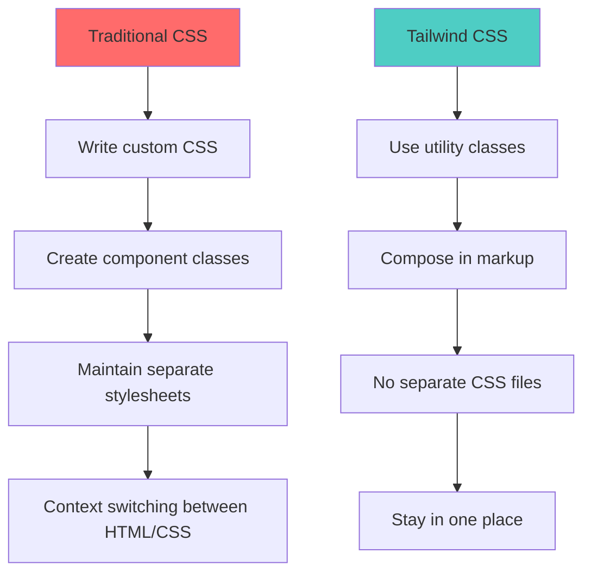
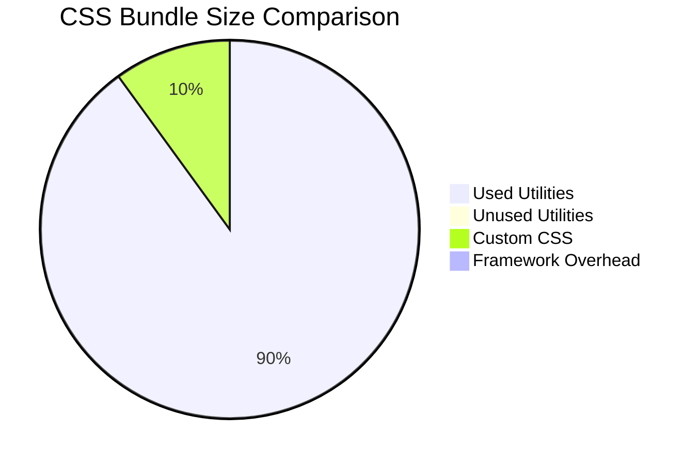
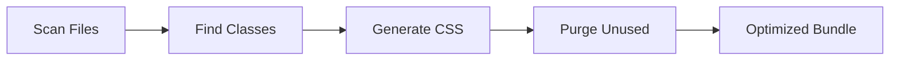

# What is Tailwind CSS?

_Understanding the philosophy and benefits of the utility-first CSS framework_

---

## 🎯 Philosophy

Tailwind CSS is a **utility-first CSS framework** that provides low-level utility classes to build custom designs directly in your markup. Unlike traditional CSS frameworks that provide pre-built components, Tailwind gives you the building blocks to create any design.

### The Utility-First Approach



### Traditional CSS vs Tailwind

**Traditional Approach:**

```html
<!-- HTML -->
<div class="card">
  <h2 class="card-title">Hello World</h2>
  <p class="card-content">This is a card.</p>
</div>

<!-- CSS -->
.card { background: white; border-radius: 0.5rem; box-shadow: 0 4px 6px -1px
rgba(0, 0, 0, 0.1); padding: 1.5rem; max-width: 24rem; } .card-title {
font-size: 1.25rem; font-weight: 700; color: #111827; margin-bottom: 0.5rem; }
.card-content { color: #6b7280; }
```

**Tailwind Approach:**

```html
<div class="bg-white rounded-lg shadow-md p-6 max-w-sm">
  <h2 class="text-xl font-bold text-gray-900 mb-2">Hello World</h2>
  <p class="text-gray-600">This is a card.</p>
</div>
```

---

## 🚀 Key Benefits

### 1. **Rapid Development**

Build interfaces faster by composing utilities instead of writing custom CSS:

```jsx
// Quick button variations
<button className="bg-blue-500 text-white px-4 py-2 rounded">Primary</button>
<button className="bg-gray-500 text-white px-4 py-2 rounded">Secondary</button>
<button className="border border-gray-300 text-gray-700 px-4 py-2 rounded">Outline</button>
```

### 2. **Consistent Design System**

Built-in design tokens ensure consistency across your application:

```html
<!-- Consistent spacing -->
<div class="p-4 m-2">
  <!-- 1rem padding, 0.5rem margin -->
  <div class="p-8 m-4">
    <!-- 2rem padding, 1rem margin -->
    <div class="p-12 m-8">
      <!-- 3rem padding, 2rem margin -->

      <!-- Consistent colors -->
      <div class="bg-blue-500 text-white">Primary</div>
      <div class="bg-blue-600 text-white">Primary Dark</div>
      <div class="bg-blue-400 text-white">Primary Light</div>
    </div>
  </div>
</div>
```

### 3. **Responsive by Default**

Mobile-first responsive design with intuitive breakpoints:

```html
<div
  class="
  w-full           <!-- Mobile: full width -->
  sm:w-1/2         <!-- 640px+: half width -->
  md:w-1/3         <!-- 768px+: third width -->
  lg:w-1/4         <!-- 1024px+: quarter width -->
  xl:w-1/5         <!-- 1280px+: fifth width -->
"
>
  Responsive content
</div>
```

### 4. **Small Bundle Size**

Only the CSS you actually use is included in your final bundle:



### 5. **No Context Switching**

Stay in your HTML/JSX files instead of jumping between CSS and markup:

```jsx
// Everything in one place
function UserCard({ user }) {
  return (
    <div className="bg-white rounded-lg shadow-md p-6 max-w-sm">
      <div className="flex items-center space-x-4">
        
        <div>
          <h3 className="text-lg font-semibold text-gray-900">{user.name}</h3>
          <p className="text-gray-600">{user.email}</p>
        </div>
      </div>
    </div>
  );
}
```

---

## 🎨 Design System Integration

Tailwind CSS v4+ makes it easy to create and maintain design systems:

### Theme Configuration

```css
@import "tailwindcss";

@theme {
  /* Colors */
  --color-primary: #3b82f6;
  --color-primary-dark: #2563eb;
  --color-primary-light: #60a5fa;

  /* Typography */
  --font-display: "Inter", sans-serif;
  --font-body: "Inter", sans-serif;

  /* Spacing */
  --spacing-xs: 0.25rem;
  --spacing-sm: 0.5rem;
  --spacing-md: 1rem;
  --spacing-lg: 1.5rem;
  --spacing-xl: 2rem;

  /* Border Radius */
  --radius-sm: 0.25rem;
  --radius-md: 0.5rem;
  --radius-lg: 0.75rem;
}
```

### Component Variants

```jsx
// Button component with design system integration
function Button({ variant = "primary", size = "md", children, ...props }) {
  const variants = {
    primary: "bg-primary text-white hover:bg-primary-dark",
    secondary: "bg-gray-200 text-gray-900 hover:bg-gray-300",
    outline: "border border-gray-300 text-gray-700 hover:bg-gray-50",
  };

  const sizes = {
    sm: "px-3 py-1.5 text-sm",
    md: "px-4 py-2 text-base",
    lg: "px-6 py-3 text-lg",
  };

  return (
    <button
      className={`
        font-medium rounded-md transition-colors focus:outline-none focus:ring-2
        ${variants[variant]} ${sizes[size]}
      `}
      {...props}
    >
      {children}
    </button>
  );
}
```

---

## 🔧 How It Works

### 1. **Utility Generation**

Tailwind scans your files and generates only the CSS you need:



### 2. **CSS Processing**

```css
/* Input: Your CSS file */
@import "tailwindcss";

/* Output: Generated utilities */
.bg-blue-500 {
  background-color: #3b82f6;
}
.text-white {
  color: #ffffff;
}
.p-4 {
  padding: 1rem;
}
.rounded {
  border-radius: 0.25rem;
}
```

### 3. **Content Detection (v4)**

Tailwind v4 automatically detects your content files:

```css
@import "tailwindcss";

/* Automatically scans: */
/* - src/**/*.{html,js,jsx,ts,tsx,vue,svelte} */
/* - public/**/*.html */
/* - Any files you specify with @source */
```

---

## 🎯 When to Use Tailwind

### ✅ Perfect For:

- **Rapid prototyping** and MVP development
- **Component-based** applications (React, Vue, Svelte)
- **Design systems** and consistent UI
- **Responsive** web applications
- **Teams** that want consistent styling

### ⚠️ Consider Alternatives For:

- **Heavy customization** of existing designs
- **Legacy projects** with complex CSS architecture
- **Teams** not comfortable with utility classes
- **Projects** requiring pixel-perfect control

---

## 🆚 Comparison with Other Frameworks

| Framework             | Approach        | Bundle Size | Learning Curve | Customization |
| --------------------- | --------------- | ----------- | -------------- | ------------- |
| **Tailwind CSS**      | Utility-first   | Small       | Medium         | High          |
| **Bootstrap**         | Component-based | Medium      | Low            | Medium        |
| **Material-UI**       | Component-based | Large       | Medium         | Low           |
| **Chakra UI**         | Component-based | Medium      | Low            | Medium        |
| **Styled Components** | CSS-in-JS       | Medium      | High           | High          |

---

## 🚀 Getting Started

Ready to try Tailwind CSS? Here's how to get started:

1. **[Choose your setup method](../1-setup/README.md)** - HTML, React, or Next.js
2. **[Install Tailwind v4](../1-setup/README.md)** - Follow the installation guide
3. **[Learn the basics](../2-core-concepts/README.md)** - Understand core concepts
4. **[Build your first component](../4-ui-examples/README.md)** - See real examples

---

**Next:** Learn about the [major changes in v4](./version-comparison.md) or jump to [Setup & Installation](../1-setup/README.md)

