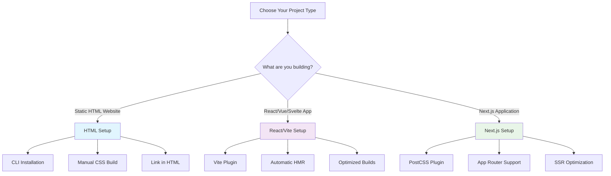

# ⚙️ Setup & Installation

_Complete installation guides for HTML, React, and Next.js projects with Tailwind CSS v4+_

---

## 🧭 Navigation

- [HTML Setup](./html-setup.md) - Standalone HTML projects
- [React/Vite Setup](./react-vite-setup.md) - React, Vue, Svelte with Vite
- [Next.js Setup](./nextjs-setup.md) - Next.js 13+ with App Router
- [Troubleshooting](./troubleshooting.md) - Common issues and solutions

---

## 🎯 Choose Your Setup



---

## 🚀 Quick Start Comparison

| Project Type   | Installation                                           | Configuration  | Build Command                                     |
| -------------- | ------------------------------------------------------ | -------------- | ------------------------------------------------- |
| **HTML**       | `npm install tailwindcss @tailwindcss/cli`             | CSS file only  | `npx @tailwindcss/cli -i input.css -o output.css` |
| **React/Vite** | `npm install tailwindcss @tailwindcss/vite`            | Vite plugin    | `npm run dev`                                     |
| **Next.js**    | `npm install tailwindcss @tailwindcss/postcss postcss` | PostCSS config | `npm run dev`                                     |

---

## 📋 Prerequisites

Before you begin, ensure you have:

- **Node.js** 16.0 or higher
- **npm** 7.0 or higher (or yarn/pnpm)
- Basic knowledge of your chosen framework
- A code editor with CSS/JavaScript support

### Verify Your Environment

```bash
# Check Node.js version
node --version  # Should be 16.0+

# Check npm version
npm --version   # Should be 7.0+

# Check if you have a package.json
ls package.json # Should exist in your project
```

---

## 🎨 What You'll Get

After setup, you'll have:

### 1. **Tailwind CSS v4** installed and configured

### 2. **Automatic content detection** - no manual file paths

### 3. **CSS-first configuration** with `@theme` directive

### 4. **Optimized build process** for your framework

### 5. **Hot reload** for instant development feedback

### Example Output

```html
<!-- Your HTML/JSX -->
<h1 class="text-4xl font-bold text-blue-600">Hello Tailwind v4!</h1>

<!-- Generated CSS -->
.text-4xl { font-size: 2.25rem; line-height: 2.5rem; } .font-bold { font-weight:
700; } .text-blue-600 { color: rgb(37 99 235); }
```

---

## 🔧 Framework-Specific Benefits

### HTML Projects

- **Simple setup** - No build tools required
- **CLI-based** - Direct CSS generation
- **Static output** - Perfect for static sites
- **Easy deployment** - Just upload CSS file

### React/Vite Projects

- **5x faster builds** - Optimized Vite integration
- **Instant HMR** - Changes reflect immediately
- **Tree shaking** - Only used utilities included
- **TypeScript support** - Full type safety

### Next.js Projects

- **SSR optimized** - Server-side rendering support
- **App Router ready** - Works with new routing
- **Image optimization** - Integrates with Next.js features
- **Production ready** - Optimized for deployment

---

## 📚 Setup Guides

### 1. [HTML Setup Guide](./html-setup.md)

Perfect for:

- Static websites
- Landing pages
- Simple HTML projects
- Learning Tailwind basics

**Time to setup:** ~5 minutes

### 2. [React/Vite Setup Guide](./react-vite-setup.md)

Perfect for:

- React applications
- Vue.js projects
- Svelte applications
- Modern JavaScript frameworks

**Time to setup:** ~3 minutes

### 3. [Next.js Setup Guide](./nextjs-setup.md)

Perfect for:

- Next.js 13+ applications
- Full-stack React apps
- Server-side rendering
- Production applications

**Time to setup:** ~5 minutes

---

## 🎯 Post-Setup Checklist

After completing your chosen setup:

- [ ] **Verify installation** - Check that Tailwind classes work
- [ ] **Test responsive design** - Try different screen sizes
- [ ] **Configure theme** - Customize colors, fonts, spacing
- [ ] **Add custom utilities** - Create project-specific classes
- [ ] **Set up development workflow** - Configure your editor
- [ ] **Plan component structure** - Organize your CSS approach

---

## 🆘 Need Help?

### Common Issues

- **Classes not working** - Check CSS import and build process
- **Build errors** - Verify package versions and configuration
- **Slow builds** - Ensure you're using the right plugin for your framework
- **Missing styles** - Check content detection and file paths

### Getting Support

1. **Check [Troubleshooting Guide](./troubleshooting.md)** for common solutions
2. **Review setup guides** for your specific framework
3. **Visit [Resources Section](../7-resources/README.md)** for community help
4. **Check official documentation** for latest updates

---

## 🚀 Next Steps

Once you have Tailwind CSS v4+ set up:

1. **[Learn Core Concepts](../2-core-concepts/README.md)** - Master the fundamentals
2. **[Explore Advanced Features](../3-advanced-features/README.md)** - Unlock powerful customization
3. **[Build UI Components](../4-ui-examples/README.md)** - See real-world examples
4. **[Follow Best Practices](../5-best-practices/README.md)** - Learn production patterns

---

**Ready to get started?** Choose your setup method:

👉 **[HTML Setup](./html-setup.md)** | 👉 **[React/Vite Setup](./react-vite-setup.md)** | 👉 **[Next.js Setup](./nextjs-setup.md)**

