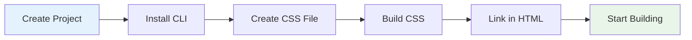

# HTML Setup Guide

_Setting up Tailwind CSS v4+ for standalone HTML projects using the CLI_

---

## 🎯 Overview

This guide shows you how to set up Tailwind CSS v4+ for static HTML projects using the official CLI tool. Perfect for landing pages, static websites, and learning Tailwind basics.



---

## 📋 Prerequisites

- Node.js 16.0 or higher
- npm 7.0 or higher
- Basic HTML knowledge
- A code editor

---

## 🚀 Step-by-Step Setup

### Step 1: Create Project Directory

```bash
# Create a new project directory
mkdir my-tailwind-project
cd my-tailwind-project

# Initialize package.json (optional but recommended)
npm init -y
```

### Step 2: Install Tailwind CSS CLI

```bash
# Install Tailwind CSS and CLI
npm install tailwindcss @tailwindcss/cli
```

### Step 3: Create Input CSS File

Create a CSS file that imports Tailwind:

```bash
# Create the source directory and CSS file
mkdir src
echo '@import "tailwindcss";' > src/input.css
```

**`src/input.css`:**

```css
@import "tailwindcss";
```

### Step 4: Build Your CSS

Generate the final CSS file:

```bash
# Build CSS (one-time)
npx @tailwindcss/cli -i ./src/input.css -o ./src/output.css

# Or build and watch for changes (recommended for development)
npx @tailwindcss/cli -i ./src/input.css -o ./src/output.css --watch
```

### Step 5: Create HTML File

Create your HTML file and link the generated CSS:

**`index.html`:**

```html
<!DOCTYPE html>
<html lang="en">
  <head>
    <meta charset="UTF-8" />
    <meta name="viewport" content="width=device-width, initial-scale=1.0" />
    <title>Tailwind CSS v4+ HTML Setup</title>
    <link href="./src/output.css" rel="stylesheet" />
  </head>
  <body class="bg-gray-100 min-h-screen flex items-center justify-center">
    <div class="bg-white rounded-lg shadow-lg p-8 max-w-md w-full">
      <h1 class="text-3xl font-bold text-gray-900 mb-4">Hello Tailwind v4!</h1>
      <p class="text-gray-600 mb-6">
        You've successfully set up Tailwind CSS v4+ for HTML projects.
      </p>
      <button
        class="bg-blue-600 text-white px-4 py-2 rounded-lg hover:bg-blue-700 transition-colors"
      >
        Get Started
      </button>
    </div>
  </body>
</html>
```

### Step 6: Open in Browser

Open `index.html` in your browser to see Tailwind CSS in action!

---

## 🎨 Customizing Your Setup

### Adding Custom Theme

Create a custom theme by modifying your CSS file:

**`src/input.css`:**

```css
@import "tailwindcss";

@theme {
  /* Custom colors */
  --color-primary: #3b82f6;
  --color-secondary: #10b981;
  --color-accent: #f59e0b;

  /* Custom spacing */
  --spacing-18: 4.5rem;
  --spacing-72: 18rem;

  /* Custom fonts */
  --font-display: "Inter", sans-serif;
  --font-body: "Inter", sans-serif;

  /* Custom border radius */
  --radius-xl: 1rem;
  --radius-2xl: 1.5rem;
}
```

Now you can use your custom values:

```html
<div class="bg-primary text-white p-18 rounded-xl font-display">
  Custom themed content
</div>
```

### Adding Custom Utilities

Create custom utility classes:

**`src/input.css`:**

```css
@import "tailwindcss";

@utility tab-4 {
  tab-size: 4;
}

@utility container-custom {
  max-width: 1400px;
  margin: 0 auto;
  padding: 0 2rem;
}

@utility text-shadow {
  text-shadow: 0 2px 4px rgba(0, 0, 0, 0.1);
}
```

Use your custom utilities:

```html
<div class="container-custom">
  <pre class="tab-4 text-shadow">Custom utility classes</pre>
</div>
```

---

## 🔧 Development Workflow

### Watch Mode (Recommended)

For development, use watch mode to automatically rebuild CSS when files change:

```bash
# Start watch mode
npx @tailwindcss/cli -i ./src/input.css -o ./src/output.css --watch
```

### Production Build

For production, build once with optimizations:

```bash
# Production build
npx @tailwindcss/cli -i ./src/input.css -o ./src/output.css --minify
```

### Package.json Scripts

Add convenient scripts to your `package.json`:

```json
{
  "scripts": {
    "build": "npx @tailwindcss/cli -i ./src/input.css -o ./src/output.css",
    "build:watch": "npx @tailwindcss/cli -i ./src/input.css -o ./src/output.css --watch",
    "build:prod": "npx @tailwindcss/cli -i ./src/input.css -o ./src/output.css --minify"
  }
}
```

Then run:

```bash
npm run build:watch  # Development
npm run build:prod   # Production
```

---

## 📁 Project Structure

Your final project structure should look like this:

```
my-tailwind-project/
├── package.json
├── index.html
├── src/
│   ├── input.css
│   └── output.css (generated)
└── README.md
```

### Example Complete Project

**`package.json`:**

```json
{
  "name": "my-tailwind-project",
  "version": "1.0.0",
  "description": "HTML project with Tailwind CSS v4+",
  "scripts": {
    "build": "npx @tailwindcss/cli -i ./src/input.css -o ./src/output.css",
    "build:watch": "npx @tailwindcss/cli -i ./src/input.css -o ./src/output.css --watch",
    "build:prod": "npx @tailwindcss/cli -i ./src/input.css -o ./src/output.css --minify"
  },
  "devDependencies": {
    "tailwindcss": "^4.0.0",
    "@tailwindcss/cli": "^4.0.0"
  }
}
```

---

## 🎨 Example Components

### Card Component

```html
<div class="bg-white rounded-lg shadow-md p-6 max-w-sm">
  <div class="flex items-center space-x-4 mb-4">
    
    <div>
      <h3 class="text-lg font-semibold text-gray-900">John Doe</h3>
      <p class="text-gray-600">Software Developer</p>
    </div>
  </div>
  <p class="text-gray-700 mb-4">
    Building amazing web experiences with Tailwind CSS v4+.
  </p>
  <button
    class="w-full bg-blue-600 text-white py-2 px-4 rounded-lg hover:bg-blue-700 transition-colors"
  >
    View Profile
  </button>
</div>
```

### Navigation Bar

```html
<nav class="bg-white shadow-sm">
  <div class="max-w-7xl mx-auto px-4 sm:px-6 lg:px-8">
    <div class="flex justify-between items-center h-16">
      <div class="flex items-center">
        <h1 class="text-xl font-bold text-gray-900">My Website</h1>
      </div>
      <div class="hidden md:flex space-x-8">
        <a href="#" class="text-gray-500 hover:text-gray-900 transition-colors"
          >Home</a
        >
        <a href="#" class="text-gray-500 hover:text-gray-900 transition-colors"
          >About</a
        >
        <a href="#" class="text-gray-500 hover:text-gray-900 transition-colors"
          >Contact</a
        >
      </div>
      <button class="md:hidden">
        <svg
          class="w-6 h-6"
          fill="none"
          stroke="currentColor"
          viewBox="0 0 24 24"
        >
          <path
            stroke-linecap="round"
            stroke-linejoin="round"
            stroke-width="2"
            d="M4 6h16M4 12h16M4 18h16"
          ></path>
        </svg>
      </button>
    </div>
  </div>
</nav>
```

### Responsive Grid

```html
<div class="container mx-auto px-4 py-8">
  <div class="grid grid-cols-1 md:grid-cols-2 lg:grid-cols-3 gap-6">
    <div class="bg-white rounded-lg shadow-md p-6">
      <h3 class="text-lg font-semibold mb-2">Feature 1</h3>
      <p class="text-gray-600">Description of feature 1</p>
    </div>
    <div class="bg-white rounded-lg shadow-md p-6">
      <h3 class="text-lg font-semibold mb-2">Feature 2</h3>
      <p class="text-gray-600">Description of feature 2</p>
    </div>
    <div class="bg-white rounded-lg shadow-md p-6">
      <h3 class="text-lg font-semibold mb-2">Feature 3</h3>
      <p class="text-gray-600">Description of feature 3</p>
    </div>
  </div>
</div>
```

---

## 🚀 Deployment

### Static Hosting

For static hosting (Netlify, Vercel, GitHub Pages):

1. **Build for production:**

   ```bash
   npm run build:prod
   ```

2. **Upload files:**
   - `index.html`
   - `src/output.css`
   - Any images or assets

### Local Server

For local development with a server:

```bash
# Using Python
python -m http.server 8000

# Using Node.js (install http-server)
npx http-server

# Using PHP
php -S localhost:8000
```

---

## 🆘 Troubleshooting

### Common Issues

**Classes not working:**

- Ensure CSS file is linked correctly
- Check that build process completed successfully
- Verify file paths are correct

**Build errors:**

- Check Node.js version (16.0+)
- Verify package installation
- Ensure input.css exists

**Large CSS file:**

- Use `--minify` flag for production
- Check for unused classes
- Consider purging unused styles

### Getting Help

1. Check the [Troubleshooting Guide](./troubleshooting.md)
2. Visit the [Resources Section](../7-resources/README.md)
3. Review the [Core Concepts](../2-core-concepts/README.md)

---

## 🎯 Next Steps

Now that you have Tailwind CSS v4+ set up for HTML:

1. **[Learn Core Concepts](../2-core-concepts/README.md)** - Master utilities and responsive design
2. **[Explore Advanced Features](../3-advanced-features/README.md)** - Custom utilities and variants
3. **[See UI Examples](../4-ui-examples/README.md)** - Real-world component examples
4. **[Follow Best Practices](../5-best-practices/README.md)** - Production-ready patterns

---

**Ready for the next step?** 👉 **[Core Concepts Guide](../2-core-concepts/README.md)**

