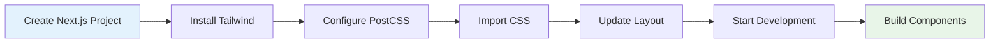

# Next.js Setup Guide

_Setting up Tailwind CSS v4+ for Next.js 13+ applications with App Router support_

---

## 🎯 Overview

This guide shows you how to set up Tailwind CSS v4+ for Next.js applications using the PostCSS plugin. Perfect for full-stack React applications with server-side rendering.



---

## 📋 Prerequisites

- Node.js 16.0 or higher
- npm 7.0 or higher
- Basic Next.js knowledge
- Familiarity with App Router (Next.js 13+)

---

## 🚀 Step-by-Step Setup

### Step 1: Create Next.js Project

```bash
# Create Next.js project with TypeScript and App Router
npx create-next-app@latest my-app --typescript --eslint --app

# Or without TypeScript
npx create-next-app@latest my-app --eslint --app

cd my-app
```

### Step 2: Install Tailwind CSS

```bash
# Install Tailwind CSS and PostCSS plugin
npm install tailwindcss @tailwindcss/postcss postcss
```

### Step 3: Configure PostCSS

Create or update the PostCSS configuration:

**`postcss.config.mjs`:**

```javascript
const config = {
  plugins: {
    "@tailwindcss/postcss": {},
  },
};

export default config;
```

**Alternative: `postcss.config.js`:**

```javascript
module.exports = {
  plugins: {
    "@tailwindcss/postcss": {},
  },
};
```

### Step 4: Import Tailwind CSS

Create or update your global CSS file:

**`app/globals.css`:**

```css
@import "tailwindcss";
```

### Step 5: Import CSS in Layout

Update your root layout to import the CSS:

**`app/layout.tsx`:**

```tsx
import type { Metadata } from "next";
import { Inter } from "next/font/google";
import "./globals.css";

const inter = Inter({ subsets: ["latin"] });

export const metadata: Metadata = {
  title: "My Next.js App",
  description: "Built with Tailwind CSS v4+",
};

export default function RootLayout({
  children,
}: {
  children: React.ReactNode;
}) {
  return (
    <html lang="en">
      <body className={inter.className}>{children}</body>
    </html>
  );
}
```

### Step 6: Start Development Server

```bash
npm run dev
```

Your Next.js app should now be running with Tailwind CSS v4+!

---

## 🎨 Example Pages

### Home Page

**`app/page.tsx`:**

```tsx
export default function Home() {
  return (
    <div className="min-h-screen bg-gray-100">
      <header className="bg-white shadow-sm">
        <div className="max-w-7xl mx-auto px-4 sm:px-6 lg:px-8">
          <div className="flex justify-between items-center h-16">
            <h1 className="text-xl font-semibold">My Next.js App</h1>
            <nav className="hidden md:flex space-x-8">
              <a href="#" className="text-gray-500 hover:text-gray-900">
                Home
              </a>
              <a href="#" className="text-gray-500 hover:text-gray-900">
                About
              </a>
              <a href="#" className="text-gray-500 hover:text-gray-900">
                Contact
              </a>
            </nav>
          </div>
        </div>
      </header>

      <main className="max-w-7xl mx-auto px-4 sm:px-6 lg:px-8 py-8">
        <div className="text-center">
          <h1 className="text-4xl font-bold text-gray-900 mb-4">
            Welcome to Next.js with Tailwind CSS v4+
          </h1>
          <p className="text-xl text-gray-600 mb-8">
            Build amazing web applications with the power of utility-first CSS.
          </p>

          <div className="grid grid-cols-1 md:grid-cols-3 gap-6 max-w-4xl mx-auto">
            <div className="bg-white rounded-lg shadow-md p-6">
              <h3 className="text-lg font-semibold text-gray-900 mb-2">
                Fast Development
              </h3>
              <p className="text-gray-600">
                Build components quickly with utility classes.
              </p>
            </div>
            <div className="bg-white rounded-lg shadow-md p-6">
              <h3 className="text-lg font-semibold text-gray-900 mb-2">
                Responsive Design
              </h3>
              <p className="text-gray-600">
                Mobile-first responsive design out of the box.
              </p>
            </div>
            <div className="bg-white rounded-lg shadow-md p-6">
              <h3 className="text-lg font-semibold text-gray-900 mb-2">
                Production Ready
              </h3>
              <p className="text-gray-600">
                Optimized builds for production deployment.
              </p>
            </div>
          </div>
        </div>
      </main>
    </div>
  );
}
```

### About Page

**`app/about/page.tsx`:**

```tsx
export default function About() {
  return (
    <div className="min-h-screen bg-gray-100">
      <div className="max-w-4xl mx-auto px-4 sm:px-6 lg:px-8 py-8">
        <div className="bg-white rounded-lg shadow-md p-8">
          <h1 className="text-3xl font-bold text-gray-900 mb-6">About Us</h1>

          <div className="prose prose-lg max-w-none">
            <p className="text-gray-600 mb-4">
              We're building the future of web development with Next.js and
              Tailwind CSS v4+.
            </p>

            <div className="grid grid-cols-1 md:grid-cols-2 gap-8 mt-8">
              <div>
                <h2 className="text-xl font-semibold text-gray-900 mb-4">
                  Our Mission
                </h2>
                <p className="text-gray-600">
                  To create beautiful, performant web applications that provide
                  exceptional user experiences.
                </p>
              </div>

              <div>
                <h2 className="text-xl font-semibold text-gray-900 mb-4">
                  Our Technology
                </h2>
                <ul className="text-gray-600 space-y-2">
                  <li>• Next.js 13+ with App Router</li>
                  <li>• Tailwind CSS v4+ for styling</li>
                  <li>• TypeScript for type safety</li>
                  <li>• Modern React patterns</li>
                </ul>
              </div>
            </div>
          </div>
        </div>
      </div>
    </div>
  );
}
```

---

## 🎨 Customizing Your Setup

### Custom Theme Configuration

**`app/globals.css`:**

```css
@import "tailwindcss";

@theme {
  /* Custom colors */
  --color-primary: #3b82f6;
  --color-secondary: #10b981;
  --color-accent: #f59e0b;

  /* Custom spacing */
  --spacing-18: 4.5rem;
  --spacing-72: 18rem;

  /* Custom fonts */
  --font-display: "Inter", sans-serif;
  --font-body: "Inter", sans-serif;

  /* Custom border radius */
  --radius-xl: 1rem;
  --radius-2xl: 1.5rem;
}
```

### Custom Utilities

**`app/globals.css`:**

```css
@import "tailwindcss";

@utility tab-4 {
  tab-size: 4;
}

@utility container-custom {
  max-width: 1400px;
  margin: 0 auto;
  padding: 0 2rem;
}

@utility text-shadow {
  text-shadow: 0 2px 4px rgba(0, 0, 0, 0.1);
}
```

### Custom Variants

**`app/globals.css`:**

```css
@import "tailwindcss";

@custom-variant dark (&:where([data-theme="dark"] *));
@custom-variant theme-midnight (&:where([data-theme="midnight"] *));
```

---

## 🔧 Advanced Configuration

### TypeScript Support

For better TypeScript integration, you can add type definitions:

**`types/tailwind.d.ts`:**

```typescript
import "tailwindcss";

declare module "tailwindcss" {
  interface Config {
    theme: {
      extend: {
        colors: {
          primary: string;
          secondary: string;
          accent: string;
        };
        spacing: {
          18: string;
          72: string;
        };
        fontFamily: {
          display: string[];
          body: string[];
        };
      };
    };
  }
}
```

### Environment-Specific Configuration

**`postcss.config.mjs`:**

```javascript
const config = {
  plugins: {
    "@tailwindcss/postcss": {
      // Development-specific options
      ...(process.env.NODE_ENV === "development" &&
        {
          // Add development-specific config
        }),
    },
  },
};

export default config;
```

### Next.js Configuration

**`next.config.js`:**

```javascript
/** @type {import('next').NextConfig} */
const nextConfig = {
  experimental: {
    // Enable experimental features if needed
  },
  // Optimize CSS loading
  optimizeCss: true,
};

module.exports = nextConfig;
```

---

## 📁 Project Structure

Your final project structure should look like this:

```
my-app/
├── app/
│   ├── globals.css
│   ├── layout.tsx
│   ├── page.tsx
│   └── about/
│       └── page.tsx
├── components/
│   ├── ui/
│   └── layout/
├── lib/
├── public/
├── types/
├── next.config.js
├── postcss.config.mjs
├── package.json
├── tsconfig.json
└── README.md
```

---

## 🚀 Development Workflow

### Development Commands

```bash
# Start development server
npm run dev

# Build for production
npm run build

# Start production server
npm start

# Lint code
npm run lint
```

### Server-Side Rendering

Tailwind CSS v4+ works seamlessly with Next.js SSR:

1. **Server-side rendering** - Styles are rendered on the server
2. **Client-side hydration** - Styles are preserved during hydration
3. **Static generation** - Styles are included in static builds
4. **API routes** - Styles work with API routes and middleware

### Build Optimization

Production builds are automatically optimized:

- **CSS purging** - Only used utilities included
- **Minification** - CSS is minified
- **Code splitting** - Optimal chunk splitting
- **Image optimization** - Next.js image optimization

---

## 🎨 Component Examples

### Reusable Button Component

**`components/ui/Button.tsx`:**

```tsx
import { ButtonHTMLAttributes, ReactNode } from "react";

interface ButtonProps extends ButtonHTMLAttributes<HTMLButtonElement> {
  variant?: "primary" | "secondary" | "outline";
  size?: "sm" | "md" | "lg";
  children: ReactNode;
}

export function Button({
  variant = "primary",
  size = "md",
  children,
  className = "",
  ...props
}: ButtonProps) {
  const baseClasses =
    "font-medium rounded-lg transition-colors focus:outline-none focus:ring-2";

  const variants = {
    primary: "bg-blue-600 text-white hover:bg-blue-700 focus:ring-blue-500",
    secondary:
      "bg-gray-200 text-gray-900 hover:bg-gray-300 focus:ring-gray-500",
    outline:
      "border border-gray-300 text-gray-700 hover:bg-gray-50 focus:ring-gray-500",
  };

  const sizes = {
    sm: "px-3 py-1.5 text-sm",
    md: "px-4 py-2 text-base",
    lg: "px-6 py-3 text-lg",
  };

  return (
    <button
      className={`${baseClasses} ${variants[variant]} ${sizes[size]} ${className}`}
      {...props}
    >
      {children}
    </button>
  );
}
```

### Card Component

**`components/ui/Card.tsx`:**

```tsx
import { ReactNode } from "react";

interface CardProps {
  title?: string;
  children: ReactNode;
  className?: string;
}

export function Card({ title, children, className = "" }: CardProps) {
  return (
    <div className={`bg-white rounded-lg shadow-md p-6 ${className}`}>
      {title && (
        <h3 className="text-lg font-semibold text-gray-900 mb-4">{title}</h3>
      )}
      {children}
    </div>
  );
}
```

### Layout Component

**`components/layout/Header.tsx`:**

```tsx
import Link from "next/link";

export function Header() {
  return (
    <header className="bg-white shadow-sm">
      <div className="max-w-7xl mx-auto px-4 sm:px-6 lg:px-8">
        <div className="flex justify-between items-center h-16">
          <Link href="/" className="text-xl font-semibold text-gray-900">
            My App
          </Link>

          <nav className="hidden md:flex space-x-8">
            <Link href="/" className="text-gray-500 hover:text-gray-900">
              Home
            </Link>
            <Link href="/about" className="text-gray-500 hover:text-gray-900">
              About
            </Link>
            <Link href="/contact" className="text-gray-500 hover:text-gray-900">
              Contact
            </Link>
          </nav>
        </div>
      </div>
    </header>
  );
}
```

---

## 🆘 Troubleshooting

### Common Issues

**Classes not working:**

- Ensure CSS file is imported in layout.tsx
- Check that PostCSS is configured correctly
- Verify file paths are correct

**Build errors:**

- Check Node.js version (16.0+)
- Verify package installation
- Clear .next folder and rebuild

**SSR issues:**

- Check that CSS is imported in root layout
- Verify PostCSS configuration
- Ensure proper Next.js version (13+)

### Performance Issues

**Slow builds:**

- Use the PostCSS plugin (not Vite)
- Check for large dependencies
- Optimize imports

**Large bundle size:**

- Use production build
- Check for unused utilities
- Consider code splitting

---

## 🎯 Next Steps

Now that you have Tailwind CSS v4+ set up with Next.js:

1. **[Learn Core Concepts](../2-core-concepts/README.md)** - Master utilities and responsive design
2. **[Explore Advanced Features](../3-advanced-features/README.md)** - Custom utilities and variants
3. **[See UI Examples](../4-ui-examples/README.md)** - Real-world component examples
4. **[Follow Best Practices](../5-best-practices/README.md)** - Production-ready patterns

---

**Ready for the next step?** 👉 **[Core Concepts Guide](../2-core-concepts/README.md)**

