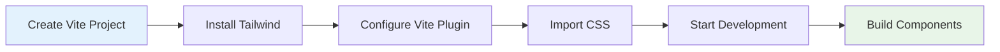

# React/Vite Setup Guide

_Setting up Tailwind CSS v4+ for React, Vue, and Svelte projects using the Vite plugin_

---

## 🎯 Overview

This guide shows you how to set up Tailwind CSS v4+ for modern JavaScript frameworks using Vite. The Vite plugin provides 5x faster builds and instant Hot Module Replacement (HMR).



---

## 📋 Prerequisites

- Node.js 16.0 or higher
- npm 7.0 or higher
- Basic React/Vue/Svelte knowledge
- Familiarity with Vite

---

## 🚀 Step-by-Step Setup

### Step 1: Create Vite Project

Choose your framework:

```bash
# React
npm create vite@latest my-app -- --template react
cd my-app

# React with TypeScript
npm create vite@latest my-app -- --template react-ts
cd my-app

# Vue
npm create vite@latest my-app -- --template vue
cd my-app

# Vue with TypeScript
npm create vite@latest my-app -- --template vue-ts
cd my-app

# Svelte
npm create vite@latest my-app -- --template svelte
cd my-app

# Svelte with TypeScript
npm create vite@latest my-app -- --template svelte-ts
cd my-app
```

### Step 2: Install Tailwind CSS

```bash
# Install Tailwind CSS and Vite plugin
npm install tailwindcss @tailwindcss/vite
```

### Step 3: Configure Vite Plugin

Update your Vite configuration file:

**`vite.config.ts` (TypeScript) or `vite.config.js` (JavaScript):**

```typescript
import { defineConfig } from "vite";
import react from "@vitejs/plugin-react"; // or vue, svelte
import tailwindcss from "@tailwindcss/vite";

export default defineConfig({
  plugins: [
    react(), // or vue(), svelte()
    tailwindcss(),
  ],
});
```

### Step 4: Import Tailwind CSS

Create or update your main CSS file:

**`src/index.css` (React) or `src/style.css` (Vue/Svelte):**

```css
@import "tailwindcss";
```

### Step 5: Import CSS in Your App

**React (`src/main.tsx` or `src/index.tsx`):**

```tsx
import React from "react";
import ReactDOM from "react-dom/client";
import App from "./App.tsx";
import "./index.css"; // Import Tailwind CSS

ReactDOM.createRoot(document.getElementById("root")!).render(
  <React.StrictMode>
    <App />
  </React.StrictMode>
);
```

**Vue (`src/main.js` or `src/main.ts`):**

```js
import { createApp } from "vue";
import App from "./App.vue";
import "./style.css"; // Import Tailwind CSS

createApp(App).mount("#app");
```

**Svelte (`src/main.js` or `src/main.ts`):**

```js
import "./app.css"; // Import Tailwind CSS
import App from "./App.svelte";

const app = new App({
  target: document.getElementById("app"),
});

export default app;
```

### Step 6: Start Development Server

```bash
npm run dev
```

Your app should now be running with Tailwind CSS v4+!

---

## 🎨 Example Components

### React Component

**`src/App.tsx`:**

```tsx
import { useState } from "react";

function App() {
  const [count, setCount] = useState(0);

  return (
    <div className="min-h-screen bg-gray-100 flex items-center justify-center">
      <div className="bg-white rounded-lg shadow-lg p-8 max-w-md w-full">
        <h1 className="text-3xl font-bold text-gray-900 mb-6 text-center">
          Tailwind CSS v4+ with React
        </h1>

        <div className="text-center mb-6">
          <p className="text-gray-600 mb-4">Count: {count}</p>
          <button
            onClick={() => setCount(count + 1)}
            className="bg-blue-600 text-white px-4 py-2 rounded-lg hover:bg-blue-700 transition-colors"
          >
            Increment
          </button>
        </div>

        <div className="grid grid-cols-2 gap-4">
          <div className="bg-blue-50 p-4 rounded-lg">
            <h3 className="font-semibold text-blue-900">Feature 1</h3>
            <p className="text-blue-700 text-sm">Fast builds with Vite</p>
          </div>
          <div className="bg-green-50 p-4 rounded-lg">
            <h3 className="font-semibold text-green-900">Feature 2</h3>
            <p className="text-green-700 text-sm">Instant HMR</p>
          </div>
        </div>
      </div>
    </div>
  );
}

export default App;
```

### Vue Component

**`src/App.vue`:**

```vue
<template>
  <div class="min-h-screen bg-gray-100 flex items-center justify-center">
    <div class="bg-white rounded-lg shadow-lg p-8 max-w-md w-full">
      <h1 class="text-3xl font-bold text-gray-900 mb-6 text-center">
        Tailwind CSS v4+ with Vue
      </h1>

      <div class="text-center mb-6">
        <p class="text-gray-600 mb-4">Count: {{ count }}</p>
        <button
          @click="increment"
          class="bg-blue-600 text-white px-4 py-2 rounded-lg hover:bg-blue-700 transition-colors"
        >
          Increment
        </button>
      </div>

      <div class="grid grid-cols-2 gap-4">
        <div class="bg-blue-50 p-4 rounded-lg">
          <h3 class="font-semibold text-blue-900">Feature 1</h3>
          <p class="text-blue-700 text-sm">Fast builds with Vite</p>
        </div>
        <div class="bg-green-50 p-4 rounded-lg">
          <h3 class="font-semibold text-green-900">Feature 2</h3>
          <p class="text-green-700 text-sm">Instant HMR</p>
        </div>
      </div>
    </div>
  </div>
</template>

<script setup>
import { ref } from "vue";

const count = ref(0);

const increment = () => {
  count.value++;
};
</script>
```

### Svelte Component

**`src/App.svelte`:**

```svelte
<script>
  let count = 0;

  function increment() {
    count += 1;
  }
</script>

<div class="min-h-screen bg-gray-100 flex items-center justify-center">
  <div class="bg-white rounded-lg shadow-lg p-8 max-w-md w-full">
    <h1 class="text-3xl font-bold text-gray-900 mb-6 text-center">
      Tailwind CSS v4+ with Svelte
    </h1>

    <div class="text-center mb-6">
      <p class="text-gray-600 mb-4">Count: {count}</p>
      <button
        on:click={increment}
        class="bg-blue-600 text-white px-4 py-2 rounded-lg hover:bg-blue-700 transition-colors"
      >
        Increment
      </button>
    </div>

    <div class="grid grid-cols-2 gap-4">
      <div class="bg-blue-50 p-4 rounded-lg">
        <h3 class="font-semibold text-blue-900">Feature 1</h3>
        <p class="text-blue-700 text-sm">Fast builds with Vite</p>
      </div>
      <div class="bg-green-50 p-4 rounded-lg">
        <h3 class="font-semibold text-green-900">Feature 2</h3>
        <p class="text-green-700 text-sm">Instant HMR</p>
      </div>
    </div>
  </div>
</div>
```

---

## 🎨 Customizing Your Setup

### Custom Theme Configuration

**`src/index.css`:**

```css
@import "tailwindcss";

@theme {
  /* Custom colors */
  --color-primary: #3b82f6;
  --color-secondary: #10b981;
  --color-accent: #f59e0b;

  /* Custom spacing */
  --spacing-18: 4.5rem;
  --spacing-72: 18rem;

  /* Custom fonts */
  --font-display: "Inter", sans-serif;
  --font-body: "Inter", sans-serif;

  /* Custom border radius */
  --radius-xl: 1rem;
  --radius-2xl: 1.5rem;
}
```

### Custom Utilities

**`src/index.css`:**

```css
@import "tailwindcss";

@utility tab-4 {
  tab-size: 4;
}

@utility container-custom {
  max-width: 1400px;
  margin: 0 auto;
  padding: 0 2rem;
}

@utility text-shadow {
  text-shadow: 0 2px 4px rgba(0, 0, 0, 0.1);
}
```

### Custom Variants

**`src/index.css`:**

```css
@import "tailwindcss";

@custom-variant dark (&:where([data-theme="dark"] *));
@custom-variant theme-midnight (&:where([data-theme="midnight"] *));
```

---

## 🔧 Advanced Configuration

### TypeScript Support

For TypeScript projects, you can add type definitions:

**`src/tailwind.d.ts`:**

```typescript
import "tailwindcss";

declare module "tailwindcss" {
  interface Config {
    theme: {
      extend: {
        colors: {
          primary: string;
          secondary: string;
          accent: string;
        };
        spacing: {
          18: string;
          72: string;
        };
        fontFamily: {
          display: string[];
          body: string[];
        };
      };
    };
  }
}
```

### Environment-Specific Configuration

**`vite.config.ts`:**

```typescript
import { defineConfig } from "vite";
import react from "@vitejs/plugin-react";
import tailwindcss from "@tailwindcss/vite";

export default defineConfig(({ mode }) => ({
  plugins: [
    react(),
    tailwindcss({
      // Development-specific options
      ...(mode === "development" &&
        {
          // Add development-specific config
        }),
    }),
  ],
}));
```

---

## 📁 Project Structure

Your final project structure should look like this:

```
my-app/
├── public/
├── src/
│   ├── components/
│   ├── App.tsx (or .vue, .svelte)
│   ├── main.tsx (or .js, .ts)
│   ├── index.css (or style.css)
│   └── vite-env.d.ts
├── index.html
├── package.json
├── tsconfig.json (if TypeScript)
├── vite.config.ts
└── README.md
```

---

## 🚀 Development Workflow

### Development Commands

```bash
# Start development server
npm run dev

# Build for production
npm run build

# Preview production build
npm run preview

# Lint code
npm run lint
```

### Hot Module Replacement

The Vite plugin provides instant HMR:

1. **CSS changes** - Instant updates without page reload
2. **Component changes** - Fast updates with state preservation
3. **Theme changes** - Immediate visual feedback

### Build Optimization

Production builds are automatically optimized:

- **Tree shaking** - Only used utilities included
- **Minification** - CSS is minified
- **Vendor splitting** - Optimal chunk splitting
- **Asset optimization** - Images and fonts optimized

---

## 🎨 Component Examples

### Reusable Button Component (React)

**`src/components/Button.tsx`:**

```tsx
import { ButtonHTMLAttributes, ReactNode } from "react";

interface ButtonProps extends ButtonHTMLAttributes<HTMLButtonElement> {
  variant?: "primary" | "secondary" | "outline";
  size?: "sm" | "md" | "lg";
  children: ReactNode;
}

export function Button({
  variant = "primary",
  size = "md",
  children,
  className = "",
  ...props
}: ButtonProps) {
  const baseClasses =
    "font-medium rounded-lg transition-colors focus:outline-none focus:ring-2";

  const variants = {
    primary: "bg-blue-600 text-white hover:bg-blue-700 focus:ring-blue-500",
    secondary:
      "bg-gray-200 text-gray-900 hover:bg-gray-300 focus:ring-gray-500",
    outline:
      "border border-gray-300 text-gray-700 hover:bg-gray-50 focus:ring-gray-500",
  };

  const sizes = {
    sm: "px-3 py-1.5 text-sm",
    md: "px-4 py-2 text-base",
    lg: "px-6 py-3 text-lg",
  };

  return (
    <button
      className={`${baseClasses} ${variants[variant]} ${sizes[size]} ${className}`}
      {...props}
    >
      {children}
    </button>
  );
}
```

### Card Component (React)

**`src/components/Card.tsx`:**

```tsx
import { ReactNode } from "react";

interface CardProps {
  title?: string;
  children: ReactNode;
  className?: string;
}

export function Card({ title, children, className = "" }: CardProps) {
  return (
    <div className={`bg-white rounded-lg shadow-md p-6 ${className}`}>
      {title && (
        <h3 className="text-lg font-semibold text-gray-900 mb-4">{title}</h3>
      )}
      {children}
    </div>
  );
}
```

---

## 🆘 Troubleshooting

### Common Issues

**Classes not working:**

- Ensure CSS file is imported in main.tsx/main.js
- Check that Vite plugin is configured correctly
- Verify file paths are correct

**Build errors:**

- Check Node.js version (16.0+)
- Verify package installation
- Clear node_modules and reinstall

**HMR not working:**

- Check Vite configuration
- Ensure CSS file is imported
- Restart development server

### Performance Issues

**Slow builds:**

- Use the Vite plugin (not PostCSS)
- Check for large dependencies
- Optimize imports

**Large bundle size:**

- Use production build
- Check for unused utilities
- Consider code splitting

---

## 🎯 Next Steps

Now that you have Tailwind CSS v4+ set up with Vite:

1. **[Learn Core Concepts](../2-core-concepts/README.md)** - Master utilities and responsive design
2. **[Explore Advanced Features](../3-advanced-features/README.md)** - Custom utilities and variants
3. **[See UI Examples](../4-ui-examples/README.md)** - Real-world component examples
4. **[Follow Best Practices](../5-best-practices/README.md)** - Production-ready patterns

---

**Ready for the next step?** 👉 **[Core Concepts Guide](../2-core-concepts/README.md)**

