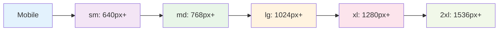

# 🎯 Core Concepts

_Understanding the fundamental concepts of Tailwind CSS v4+ and how to use them effectively_

---

## 🧭 Navigation

- [CSS-First Configuration](./css-first-config.md) - @theme directive and CSS variables
- [Theme System](./theme-system.md) - Colors, spacing, typography, breakpoints
- [Utility Classes](./utility-classes.md) - How utilities work and combining classes
- [Responsive Design](./responsive-design.md) - Mobile-first approach and breakpoints

---

## 🎯 Overview

Tailwind CSS v4+ introduces a **CSS-first approach** that simplifies configuration while providing powerful customization options. Understanding these core concepts is essential for building effective, maintainable designs.

```mermaid
flowchart TD
    A[Tailwind CSS v4+ Core Concepts] --> B[CSS-First Configuration]
    A --> C[Theme System]
    A --> D[Utility Classes]
    A --> E[Responsive Design]

    B --> B1[@theme directive]
    B --> B2[CSS Variables]
    B --> B3[No JS config]

    C --> C1[Colors & Spacing]
    C --> C2[Typography]
    C --> C3[Breakpoints]

    D --> D1[Utility-First Approach]
    D --> D2[Class Composition]
    D --> D3[State Variants]

    E --> E1[Mobile-First]
    E --> E2[Breakpoint System]
    E --> E3[Responsive Utilities]

    style A fill:#e3f2fd
    style B fill:#f3e5f5
    style C fill:#e8f5e8
    style D fill:#fff3e0
    style E fill:#fce4ec
```

---

## 🚀 Key Concepts

### 1. **CSS-First Configuration**

Instead of JavaScript config files, everything is configured directly in CSS:

```css
@import "tailwindcss";

@theme {
  --color-primary: #3b82f6;
  --color-secondary: #10b981;
  --spacing-18: 4.5rem;
  --font-display: "Inter", sans-serif;
}
```

### 2. **Utility-First Approach**

Build designs by composing small, single-purpose utility classes:

```html
<!-- Traditional approach -->
<div class="card">
  <h2 class="card-title">Hello World</h2>
</div>

<!-- Tailwind approach -->
<div class="bg-white rounded-lg shadow-md p-6 max-w-sm">
  <h2 class="text-xl font-bold text-gray-900 mb-2">Hello World</h2>
</div>
```

### 3. **Responsive by Default**

Mobile-first responsive design with intuitive breakpoints:

```html
<div
  class="
  w-full           <!-- Mobile: full width -->
  sm:w-1/2         <!-- 640px+: half width -->
  md:w-1/3         <!-- 768px+: third width -->
  lg:w-1/4         <!-- 1024px+: quarter width -->
"
>
  Responsive content
</div>
```

### 4. **State Variants**

Apply styles based on user interaction and element state:

```html
<button
  class="
  bg-blue-600 text-white px-4 py-2 rounded-lg
  hover:bg-blue-700
  focus:ring-2 focus:ring-blue-500
  active:bg-blue-800
  disabled:opacity-50 disabled:cursor-not-allowed
"
>
  Interactive Button
</button>
```

---

## 🎨 Design System Integration

### Theme Configuration

```css
@import "tailwindcss";

@theme {
  /* Color Palette */
  --color-primary: #3b82f6;
  --color-primary-dark: #2563eb;
  --color-primary-light: #60a5fa;

  --color-secondary: #10b981;
  --color-accent: #f59e0b;

  /* Typography */
  --font-display: "Inter", sans-serif;
  --font-body: "Inter", sans-serif;
  --font-mono: "Fira Code", monospace;

  /* Spacing Scale */
  --spacing-xs: 0.25rem;
  --spacing-sm: 0.5rem;
  --spacing-md: 1rem;
  --spacing-lg: 1.5rem;
  --spacing-xl: 2rem;

  /* Border Radius */
  --radius-sm: 0.25rem;
  --radius-md: 0.5rem;
  --radius-lg: 0.75rem;
  --radius-xl: 1rem;
}
```

### Component Composition

```jsx
// Button component with design system integration
function Button({ variant = "primary", size = "md", children, ...props }) {
  const variants = {
    primary: "bg-primary text-white hover:bg-primary-dark",
    secondary: "bg-secondary text-white hover:bg-secondary-dark",
    outline: "border border-gray-300 text-gray-700 hover:bg-gray-50",
  };

  const sizes = {
    sm: "px-3 py-1.5 text-sm",
    md: "px-4 py-2 text-base",
    lg: "px-6 py-3 text-lg",
  };

  return (
    <button
      className={`
        font-medium rounded-md transition-colors focus:outline-none focus:ring-2
        ${variants[variant]} ${sizes[size]}
      `}
      {...props}
    >
      {children}
    </button>
  );
}
```

---

## 🔧 Utility Class System

### How Utilities Work

Tailwind CSS provides utility classes that map directly to CSS properties:

```html
<!-- Spacing utilities -->
<div class="p-4 m-2">
  <!-- padding: 1rem; margin: 0.5rem; -->
  <div class="px-6 py-3">
    <!-- padding-left: 1.5rem; padding-right: 1.5rem; padding-top: 0.75rem; padding-bottom: 0.75rem; -->

    <!-- Color utilities -->
    <div class="bg-blue-500 text-white">
      <!-- background-color: #3b82f6; color: #ffffff; -->
      <div class="text-gray-600">
        <!-- color: #6b7280; -->

        <!-- Layout utilities -->
        <div class="flex items-center justify-between">
          <!-- display: flex; align-items: center; justify-content: space-between; -->
          <div class="grid grid-cols-3 gap-4">
            <!-- display: grid; grid-template-columns: repeat(3, minmax(0, 1fr)); gap: 1rem; -->
          </div>
        </div>
      </div>
    </div>
  </div>
</div>
```

### Combining Utilities

Utilities can be combined to create complex designs:

```html
<!-- Card component using utilities -->
<div
  class="
  bg-white rounded-lg shadow-md p-6 max-w-sm
  hover:shadow-lg transition-shadow duration-200
  border border-gray-200
"
>
  <h3 class="text-lg font-semibold text-gray-900 mb-2">Card Title</h3>
  <p class="text-gray-600 mb-4">Card description text goes here.</p>
  <button
    class="
    w-full bg-blue-600 text-white py-2 px-4 rounded-md
    hover:bg-blue-700 focus:ring-2 focus:ring-blue-500
    transition-colors duration-200
  "
  >
    Action Button
  </button>
</div>
```

---

## 📱 Responsive Design

### Mobile-First Approach

Tailwind CSS uses a mobile-first approach where styles are applied to mobile devices by default, then enhanced for larger screens:

```html
<!-- Mobile-first responsive design -->
<div
  class="
  w-full           <!-- Mobile: full width -->
  sm:w-1/2         <!-- Small screens (640px+): half width -->
  md:w-1/3         <!-- Medium screens (768px+): third width -->
  lg:w-1/4         <!-- Large screens (1024px+): quarter width -->
  xl:w-1/5         <!-- Extra large screens (1280px+): fifth width -->
"
>
  Responsive content
</div>
```

### Breakpoint System



### Responsive Utilities

```html
<!-- Responsive typography -->
<h1
  class="
  text-2xl          <!-- Mobile: 1.5rem -->
  sm:text-3xl       <!-- Small: 1.875rem -->
  md:text-4xl       <!-- Medium: 2.25rem -->
  lg:text-5xl       <!-- Large: 3rem -->
"
>
  Responsive Heading
</h1>

<!-- Responsive layout -->
<div
  class="
  flex flex-col     <!-- Mobile: vertical stack -->
  md:flex-row       <!-- Medium+: horizontal row -->
  gap-4             <!-- Consistent gap -->
"
>
  <div class="flex-1">Content 1</div>
  <div class="flex-1">Content 2</div>
</div>
```

---

## 🎯 State Variants

### Interactive States

Tailwind CSS provides variants for different element states:

```html
<!-- Hover states -->
<button
  class="
  bg-blue-600 text-white px-4 py-2 rounded-lg
  hover:bg-blue-700
  hover:shadow-lg
  hover:scale-105
  transition-all duration-200
"
>
  Hover Effects
</button>

<!-- Focus states -->
<input
  class="
  border border-gray-300 rounded-lg px-3 py-2
  focus:border-blue-500
  focus:ring-2 focus:ring-blue-200
  focus:outline-none
"
  placeholder="Focus me"
/>

<!-- Active states -->
<button
  class="
  bg-green-600 text-white px-4 py-2 rounded-lg
  active:bg-green-700
  active:scale-95
  transition-all duration-100
"
>
  Click Me
</button>
```

### Conditional States

```html
<!-- Disabled states -->
<button
  class="
  bg-blue-600 text-white px-4 py-2 rounded-lg
  hover:bg-blue-700
  disabled:opacity-50
  disabled:cursor-not-allowed
  disabled:hover:bg-blue-600
"
  disabled
>
  Disabled Button
</button>

<!-- Group hover -->
<div class="group">
  <div
    class="
    bg-white rounded-lg shadow-md p-6
    group-hover:shadow-lg
    group-hover:scale-105
    transition-all duration-200
  "
  >
    <h3
      class="
      text-lg font-semibold text-gray-900
      group-hover:text-blue-600
      transition-colors duration-200
    "
    >
      Group Hover Effect
    </h3>
  </div>
</div>
```

---

## 🎨 Best Practices

### 1. **Consistent Spacing**

Use the spacing scale consistently:

```html
<!-- Good: Consistent spacing -->
<div class="p-4 m-2">
  <h3 class="mb-2">Title</h3>
  <p class="mb-4">Description</p>
  <button class="mt-4">Action</button>
</div>

<!-- Avoid: Inconsistent spacing -->
<div class="p-3 m-1">
  <h3 class="mb-1">Title</h3>
  <p class="mb-3">Description</p>
  <button class="mt-2">Action</button>
</div>
```

### 2. **Semantic Color Usage**

Use colors semantically:

```html
<!-- Good: Semantic colors -->
<button class="bg-blue-600 text-white">Primary Action</button>
<button class="bg-gray-200 text-gray-900">Secondary Action</button>
<button class="bg-red-600 text-white">Danger Action</button>

<!-- Avoid: Random colors -->
<button class="bg-purple-600 text-white">Primary Action</button>
<button class="bg-yellow-200 text-gray-900">Secondary Action</button>
```

### 3. **Responsive Design**

Always consider mobile-first:

```html
<!-- Good: Mobile-first -->
<div
  class="
  grid grid-cols-1
  md:grid-cols-2
  lg:grid-cols-3
  gap-4
"
>
  <!-- Content -->
</div>

<!-- Avoid: Desktop-first -->
<div
  class="
  grid grid-cols-3
  md:grid-cols-2
  sm:grid-cols-1
  gap-4
"
>
  <!-- Content -->
</div>
```

---

## 🚀 Next Steps

Now that you understand the core concepts:

1. **[CSS-First Configuration](./css-first-config.md)** - Master the @theme directive
2. **[Theme System](./theme-system.md)** - Customize colors, spacing, and typography
3. **[Utility Classes](./utility-classes.md)** - Learn advanced utility patterns
4. **[Responsive Design](./responsive-design.md)** - Build mobile-first layouts

---

**Ready to dive deeper?** 👉 **[CSS-First Configuration Guide](./css-first-config.md)**

