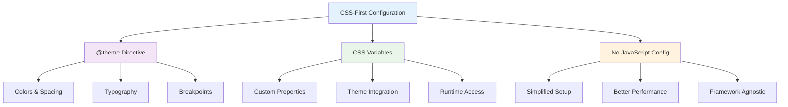

# CSS-First Configuration

_Mastering the @theme directive and CSS variables in Tailwind CSS v4+_

---

## 🎯 Overview

Tailwind CSS v4+ introduces a **CSS-first configuration approach** that eliminates the need for JavaScript config files. Everything is configured directly in CSS using the `@theme` directive and CSS variables.



---

## 🚀 Basic Configuration

### The @theme Directive

The `@theme` directive is the heart of Tailwind CSS v4+ configuration:

```css
@import "tailwindcss";

@theme {
  /* Your custom theme values go here */
  --color-primary: #3b82f6;
  --color-secondary: #10b981;
  --spacing-18: 4.5rem;
  --font-display: "Inter", sans-serif;
}
```

### How It Works

1. **CSS Variables**: All theme values are defined as CSS custom properties
2. **Automatic Integration**: Tailwind automatically uses these variables
3. **Runtime Access**: Variables are available in your CSS and JavaScript
4. **No Build Step**: Changes are reflected immediately

---

## 🎨 Color Configuration

### Basic Colors

```css
@import "tailwindcss";

@theme {
  /* Primary color palette */
  --color-primary: #3b82f6;
  --color-primary-50: #eff6ff;
  --color-primary-100: #dbeafe;
  --color-primary-200: #bfdbfe;
  --color-primary-300: #93c5fd;
  --color-primary-400: #60a5fa;
  --color-primary-500: #3b82f6;
  --color-primary-600: #2563eb;
  --color-primary-700: #1d4ed8;
  --color-primary-800: #1e40af;
  --color-primary-900: #1e3a8a;
  --color-primary-950: #172554;

  /* Secondary colors */
  --color-secondary: #10b981;
  --color-accent: #f59e0b;
  --color-danger: #ef4444;
  --color-warning: #f59e0b;
  --color-success: #10b981;
}
```

### Using Custom Colors

```html
<!-- Use your custom colors -->
<div class="bg-primary text-white">Primary background</div>
<div class="bg-secondary text-white">Secondary background</div>
<div class="text-accent">Accent text color</div>
<div class="border-danger border-2">Danger border</div>
```

### Color Variations

```css
@theme {
  /* You can create variations of existing colors */
  --color-primary-light: #60a5fa;
  --color-primary-dark: #2563eb;
  --color-primary-muted: #93c5fd;

  /* Or use CSS functions for dynamic colors */
  --color-primary-hover: color-mix(in srgb, var(--color-primary) 80%, black);
  --color-primary-active: color-mix(in srgb, var(--color-primary) 60%, black);
}
```

---

## 📏 Spacing Configuration

### Custom Spacing Scale

```css
@theme {
  /* Custom spacing values */
  --spacing-xs: 0.25rem; /* 4px */
  --spacing-sm: 0.5rem; /* 8px */
  --spacing-md: 1rem; /* 16px */
  --spacing-lg: 1.5rem; /* 24px */
  --spacing-xl: 2rem; /* 32px */
  --spacing-2xl: 3rem; /* 48px */
  --spacing-3xl: 4rem; /* 64px */

  /* Custom spacing for specific use cases */
  --spacing-section: 5rem; /* 80px - for section spacing */
  --spacing-container: 1.5rem; /* 24px - for container padding */
  --spacing-card: 1.25rem; /* 20px - for card padding */
}
```

### Using Custom Spacing

```html
<!-- Use your custom spacing values -->
<div class="p-section">Section padding</div>
<div class="m-container">Container margin</div>
<div class="p-card">Card padding</div>

<!-- Combine with responsive design -->
<div
  class="
  p-container
  md:p-section
  lg:p-2xl
"
>
  Responsive spacing
</div>
```

---

## 🔤 Typography Configuration

### Font Families

```css
@theme {
  /* Custom font families */
  --font-display: "Inter", sans-serif;
  --font-body: "Inter", sans-serif;
  --font-mono: "Fira Code", monospace;
  --font-heading: "Playfair Display", serif;

  /* Font weights */
  --font-weight-light: 300;
  --font-weight-normal: 400;
  --font-weight-medium: 500;
  --font-weight-semibold: 600;
  --font-weight-bold: 700;
  --font-weight-extrabold: 800;
}
```

### Font Sizes

```css
@theme {
  /* Custom font sizes */
  --font-size-xs: 0.75rem; /* 12px */
  --font-size-sm: 0.875rem; /* 14px */
  --font-size-base: 1rem; /* 16px */
  --font-size-lg: 1.125rem; /* 18px */
  --font-size-xl: 1.25rem; /* 20px */
  --font-size-2xl: 1.5rem; /* 24px */
  --font-size-3xl: 1.875rem; /* 30px */
  --font-size-4xl: 2.25rem; /* 36px */
  --font-size-5xl: 3rem; /* 48px */
  --font-size-6xl: 3.75rem; /* 60px */

  /* Custom font sizes for specific use cases */
  --font-size-hero: 4rem; /* 64px - for hero headings */
  --font-size-display: 5rem; /* 80px - for display text */
}
```

### Using Custom Typography

```html
<!-- Use your custom fonts -->
<h1 class="font-display text-hero">Hero Heading</h1>
<h2 class="font-heading text-4xl">Section Heading</h2>
<p class="font-body text-base">Body text</p>
<code class="font-mono text-sm">Code snippet</code>

<!-- Combine with responsive design -->
<h1
  class="
  font-display text-4xl
  md:text-5xl
  lg:text-hero
"
>
  Responsive Typography
</h1>
```

---

## 🎯 Border Radius Configuration

### Custom Border Radius

```css
@theme {
  /* Custom border radius values */
  --radius-none: 0;
  --radius-sm: 0.125rem; /* 2px */
  --radius-md: 0.375rem; /* 6px */
  --radius-lg: 0.5rem; /* 8px */
  --radius-xl: 0.75rem; /* 12px */
  --radius-2xl: 1rem; /* 16px */
  --radius-3xl: 1.5rem; /* 24px */
  --radius-full: 9999px;

  /* Custom border radius for specific use cases */
  --radius-card: 0.75rem; /* 12px - for cards */
  --radius-button: 0.5rem; /* 8px - for buttons */
  --radius-input: 0.375rem; /* 6px - for inputs */
}
```

### Using Custom Border Radius

```html
<!-- Use your custom border radius -->
<div class="rounded-card">Card with custom radius</div>
<button class="rounded-button">Button with custom radius</button>
<input class="rounded-input">Input with custom radius</input>

<!-- Combine with other utilities -->
<div class="
  bg-white rounded-card shadow-md p-6
  hover:shadow-lg transition-shadow
">
  Interactive card
</div>
```

---

## 📱 Breakpoint Configuration

### Custom Breakpoints

```css
@theme {
  /* Custom breakpoints */
  --breakpoint-sm: 640px;
  --breakpoint-md: 768px;
  --breakpoint-lg: 1024px;
  --breakpoint-xl: 1280px;
  --breakpoint-2xl: 1536px;

  /* Custom breakpoints for specific use cases */
  --breakpoint-mobile: 480px;
  --breakpoint-tablet: 768px;
  --breakpoint-desktop: 1024px;
  --breakpoint-wide: 1440px;
}
```

### Using Custom Breakpoints

```html
<!-- Use your custom breakpoints -->
<div
  class="
  w-full
  mobile:w-1/2
  tablet:w-1/3
  desktop:w-1/4
  wide:w-1/5
"
>
  Responsive with custom breakpoints
</div>
```

---

## 🎨 Advanced Configuration

### CSS Functions

```css
@theme {
  /* Use CSS functions for dynamic values */
  --color-primary-hover: color-mix(in srgb, var(--color-primary) 80%, black);
  --color-primary-active: color-mix(in srgb, var(--color-primary) 60%, black);

  /* Use calc() for calculated values */
  --spacing-double: calc(var(--spacing-md) * 2);
  --spacing-half: calc(var(--spacing-md) / 2);

  /* Use clamp() for responsive values */
  --font-size-responsive: clamp(1rem, 2.5vw, 2rem);
}
```

### Theme Inheritance

```css
@theme {
  /* Base theme values */
  --color-primary: #3b82f6;
  --color-secondary: #10b981;
  --spacing-md: 1rem;
  --font-display: "Inter", sans-serif;
}

/* Override theme for specific contexts */
.dark-theme {
  --color-primary: #60a5fa;
  --color-secondary: #34d399;
}

.large-spacing {
  --spacing-md: 1.5rem;
}
```

### Runtime Theme Changes

```css
@theme {
  /* Theme values that can be changed at runtime */
  --color-primary: #3b82f6;
  --color-secondary: #10b981;
}

/* JavaScript can change these values */
document.documentElement.style.setProperty('--color-primary', '#ef4444');
```

---

## 🔧 Best Practices

### 1. **Organize Your Theme**

```css
@theme {
  /* Colors */
  --color-primary: #3b82f6;
  --color-secondary: #10b981;
  --color-accent: #f59e0b;

  /* Spacing */
  --spacing-xs: 0.25rem;
  --spacing-sm: 0.5rem;
  --spacing-md: 1rem;

  /* Typography */
  --font-display: "Inter", sans-serif;
  --font-body: "Inter", sans-serif;

  /* Border Radius */
  --radius-sm: 0.25rem;
  --radius-md: 0.5rem;
  --radius-lg: 0.75rem;
}
```

### 2. **Use Semantic Names**

```css
@theme {
  /* Good: Semantic names */
  --color-primary: #3b82f6;
  --color-secondary: #10b981;
  --color-danger: #ef4444;
  --color-success: #10b981;

  /* Avoid: Non-semantic names */
  --color-blue: #3b82f6;
  --color-green: #10b981;
  --color-red: #ef4444;
}
```

### 3. **Keep Values Consistent**

```css
@theme {
  /* Good: Consistent spacing scale */
  --spacing-xs: 0.25rem; /* 4px */
  --spacing-sm: 0.5rem; /* 8px */
  --spacing-md: 1rem; /* 16px */
  --spacing-lg: 1.5rem; /* 24px */
  --spacing-xl: 2rem; /* 32px */

  /* Avoid: Inconsistent spacing */
  --spacing-xs: 0.25rem; /* 4px */
  --spacing-sm: 0.5rem; /* 8px */
  --spacing-md: 1rem; /* 16px */
  --spacing-lg: 1.75rem; /* 28px - breaks the pattern */
  --spacing-xl: 2rem; /* 32px */
}
```

### 4. **Document Your Theme**

```css
@theme {
  /* Primary brand color - used for main actions and links */
  --color-primary: #3b82f6;

  /* Secondary brand color - used for secondary actions */
  --color-secondary: #10b981;

  /* Standard spacing scale - based on 4px grid */
  --spacing-xs: 0.25rem; /* 4px */
  --spacing-sm: 0.5rem; /* 8px */
  --spacing-md: 1rem; /* 16px */
  --spacing-lg: 1.5rem; /* 24px */
  --spacing-xl: 2rem; /* 32px */
}
```

---

## 🚀 Next Steps

Now that you understand CSS-first configuration:

1. **[Theme System](./theme-system.md)** - Learn about the complete theme system
2. **[Utility Classes](./utility-classes.md)** - Master utility class patterns
3. **[Responsive Design](./responsive-design.md)** - Build mobile-first layouts
4. **[Advanced Features](../3-advanced-features/README.md)** - Explore custom utilities and variants

---

**Ready to explore the theme system?** 👉 **[Theme System Guide](./theme-system.md)**
