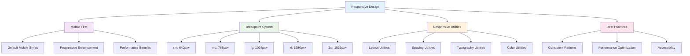
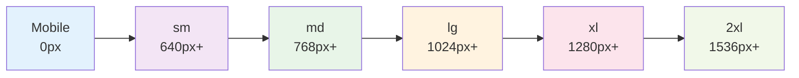

# Responsive Design

_Building mobile-first, responsive layouts with Tailwind CSS v4+ breakpoints and utilities_

---

## 🎯 Overview

Tailwind CSS v4+ uses a **mobile-first approach** to responsive design, where styles are applied to mobile devices by default and then enhanced for larger screens. This approach ensures your designs work well on all devices while providing optimal experiences for each screen size.



---

## 📱 Breakpoint System

### Default Breakpoints

Tailwind CSS v4+ provides five default breakpoints:

```css
@theme {
  /* Default breakpoints */
  --breakpoint-sm: 640px; /* Small devices (landscape phones) */
  --breakpoint-md: 768px; /* Medium devices (tablets) */
  --breakpoint-lg: 1024px; /* Large devices (laptops) */
  --breakpoint-xl: 1280px; /* Extra large devices (desktops) */
  --breakpoint-2xl: 1536px; /* 2X large devices (large desktops) */
}
```

### Breakpoint Visualization



### Custom Breakpoints

You can also define custom breakpoints:

```css
@theme {
  /* Custom breakpoints */
  --breakpoint-mobile: 480px;
  --breakpoint-tablet: 768px;
  --breakpoint-desktop: 1024px;
  --breakpoint-wide: 1440px;
  --breakpoint-ultrawide: 1920px;
}
```

---

## 🏗️ Layout Responsiveness

### Grid Systems

```html
<!-- Responsive grid -->
<div
  class="
  grid grid-cols-1
  sm:grid-cols-2
  md:grid-cols-3
  lg:grid-cols-4
  xl:grid-cols-5
  gap-4
"
>
  <div class="bg-white p-4 rounded-lg shadow">Item 1</div>
  <div class="bg-white p-4 rounded-lg shadow">Item 2</div>
  <div class="bg-white p-4 rounded-lg shadow">Item 3</div>
  <div class="bg-white p-4 rounded-lg shadow">Item 4</div>
  <div class="bg-white p-4 rounded-lg shadow">Item 5</div>
</div>

<!-- Auto-fit grid -->
<div
  class="
  grid grid-cols-1
  sm:grid-cols-2
  lg:grid-cols-3
  xl:grid-cols-4
  gap-6
"
>
  <!-- Grid items -->
</div>
```

### Flexbox Layouts

```html
<!-- Responsive flex direction -->
<div
  class="
  flex flex-col
  md:flex-row
  gap-4
"
>
  <div class="flex-1">Content 1</div>
  <div class="flex-1">Content 2</div>
</div>

<!-- Responsive flex alignment -->
<div
  class="
  flex flex-col items-center
  md:flex-row md:items-start
  lg:justify-between
  gap-4
"
>
  <div>Left content</div>
  <div>Right content</div>
</div>
```

### Container Widths

```html
<!-- Responsive container -->
<div
  class="
  w-full
  sm:max-w-sm
  md:max-w-md
  lg:max-w-lg
  xl:max-w-xl
  mx-auto
"
>
  Responsive container
</div>

<!-- Responsive width classes -->
<div
  class="
  w-full
  sm:w-1/2
  md:w-1/3
  lg:w-1/4
  xl:w-1/5
"
>
  Responsive width
</div>
```

---

## 📏 Spacing Responsiveness

### Responsive Padding

```html
<!-- Responsive padding -->
<div
  class="
  p-4
  sm:p-6
  md:p-8
  lg:p-10
  xl:p-12
"
>
  Responsive padding
</div>

<!-- Responsive horizontal padding -->
<div
  class="
  px-4
  sm:px-6
  md:px-8
  lg:px-10
  xl:px-12
"
>
  Responsive horizontal padding
</div>

<!-- Responsive vertical padding -->
<div
  class="
  py-4
  sm:py-6
  md:py-8
  lg:py-10
  xl:py-12
"
>
  Responsive vertical padding
</div>
```

### Responsive Margin

```html
<!-- Responsive margin -->
<div
  class="
  m-4
  sm:m-6
  md:m-8
  lg:m-10
  xl:m-12
"
>
  Responsive margin
</div>

<!-- Responsive top margin -->
<div
  class="
  mt-4
  sm:mt-6
  md:mt-8
  lg:mt-10
  xl:mt-12
"
>
  Responsive top margin
</div>
```

### Responsive Gap

```html
<!-- Responsive gap -->
<div
  class="
  flex gap-2
  sm:gap-4
  md:gap-6
  lg:gap-8
  xl:gap-10
"
>
  <div>Item 1</div>
  <div>Item 2</div>
  <div>Item 3</div>
</div>

<!-- Responsive grid gap -->
<div
  class="
  grid grid-cols-2 gap-2
  sm:grid-cols-3 sm:gap-4
  md:grid-cols-4 md:gap-6
  lg:grid-cols-5 lg:gap-8
"
>
  <!-- Grid items -->
</div>
```

---

## 🔤 Typography Responsiveness

### Responsive Font Sizes

```html
<!-- Responsive heading -->
<h1
  class="
  text-2xl
  sm:text-3xl
  md:text-4xl
  lg:text-5xl
  xl:text-6xl
  font-bold
"
>
  Responsive Heading
</h1>

<!-- Responsive body text -->
<p
  class="
  text-sm
  sm:text-base
  md:text-lg
  lg:text-xl
"
>
  Responsive body text that scales with screen size.
</p>

<!-- Responsive caption -->
<small
  class="
  text-xs
  sm:text-sm
  md:text-base
"
>
  Responsive caption text
</small>
```

### Responsive Line Heights

```html
<!-- Responsive line height -->
<p
  class="
  text-base leading-tight
  sm:text-lg sm:leading-normal
  md:text-xl md:leading-relaxed
  lg:text-2xl lg:leading-loose
"
>
  Responsive text with different line heights for different screen sizes.
</p>
```

### Responsive Font Weights

```html
<!-- Responsive font weight -->
<h2
  class="
  text-xl font-normal
  sm:text-2xl sm:font-medium
  md:text-3xl md:font-semibold
  lg:text-4xl lg:font-bold
"
>
  Responsive font weight
</h2>
```

---

## 🎨 Color Responsiveness

### Responsive Background Colors

```html
<!-- Responsive background -->
<div
  class="
  bg-gray-100
  sm:bg-gray-200
  md:bg-gray-300
  lg:bg-gray-400
  xl:bg-gray-500
"
>
  Responsive background color
</div>

<!-- Responsive text color -->
<p
  class="
  text-gray-600
  sm:text-gray-700
  md:text-gray-800
  lg:text-gray-900
"
>
  Responsive text color
</p>
```

### Responsive Border Colors

```html
<!-- Responsive border -->
<div
  class="
  border border-gray-200
  sm:border-gray-300
  md:border-gray-400
  lg:border-gray-500
  xl:border-gray-600
"
>
  Responsive border color
</div>
```

---

## 🎯 Component Examples

### Responsive Card

```html
<div
  class="
  bg-white rounded-lg shadow-md p-4
  sm:p-6
  md:p-8
  lg:p-10
  max-w-sm
  sm:max-w-md
  md:max-w-lg
  lg:max-w-xl
  mx-auto
"
>
  <h3
    class="
    text-lg font-semibold text-gray-900 mb-2
    sm:text-xl sm:mb-3
    md:text-2xl md:mb-4
  "
  >
    Card Title
  </h3>
  <p
    class="
    text-sm text-gray-600 mb-4
    sm:text-base sm:mb-6
    md:text-lg md:mb-8
  "
  >
    Card description text that scales with screen size.
  </p>
  <button
    class="
    w-full bg-blue-600 text-white py-2 px-4 rounded-md
    sm:py-3 sm:px-6
    md:py-4 md:px-8
    hover:bg-blue-700 transition-colors
  "
  >
    Action Button
  </button>
</div>
```

### Responsive Navigation

```html
<nav class="bg-white shadow-sm">
  <div
    class="
    max-w-7xl mx-auto px-4
    sm:px-6
    lg:px-8
  "
  >
    <div
      class="
      flex justify-between items-center h-16
      sm:h-20
      md:h-24
    "
    >
      <div class="flex items-center">
        <h1
          class="
          text-lg font-bold text-gray-900
          sm:text-xl
          md:text-2xl
        "
        >
          My Website
        </h1>
      </div>
      <div
        class="
        hidden
        md:flex md:space-x-8
        lg:space-x-12
      "
      >
        <a
          href="#"
          class="
          text-gray-500 hover:text-gray-900
          text-sm
          sm:text-base
          lg:text-lg
          transition-colors
        "
        >
          Home
        </a>
        <a
          href="#"
          class="
          text-gray-500 hover:text-gray-900
          text-sm
          sm:text-base
          lg:text-lg
          transition-colors
        "
        >
          About
        </a>
        <a
          href="#"
          class="
          text-gray-500 hover:text-gray-900
          text-sm
          sm:text-base
          lg:text-lg
          transition-colors
        "
        >
          Contact
        </a>
      </div>
      <button
        class="
        md:hidden
        p-2 rounded-md text-gray-500 hover:text-gray-900
      "
      >
        <svg
          class="w-6 h-6"
          fill="none"
          stroke="currentColor"
          viewBox="0 0 24 24"
        >
          <path
            stroke-linecap="round"
            stroke-linejoin="round"
            stroke-width="2"
            d="M4 6h16M4 12h16M4 18h16"
          ></path>
        </svg>
      </button>
    </div>
  </div>
</nav>
```

### Responsive Form

```html
<form
  class="
  space-y-4
  sm:space-y-6
  md:space-y-8
"
>
  <div>
    <label
      class="
      block text-sm font-medium text-gray-700 mb-1
      sm:text-base sm:mb-2
      md:text-lg md:mb-3
    "
    >
      Email Address
    </label>
    <input
      type="email"
      class="
      w-full border border-gray-300 rounded-lg px-3 py-2
      sm:px-4 sm:py-3
      md:px-5 md:py-4
      focus:border-blue-500 focus:ring-2 focus:ring-blue-200
      focus:outline-none
    "
      placeholder="Enter your email"
    />
  </div>
  <button
    type="submit"
    class="
    w-full bg-blue-600 text-white py-2 px-4 rounded-lg
    sm:py-3 sm:px-6
    md:py-4 md:px-8
    hover:bg-blue-700 focus:ring-2 focus:ring-blue-500
    transition-colors duration-200
  "
  >
    Submit
  </button>
</form>
```

---

## 🎨 Advanced Responsive Patterns

### Responsive Image Gallery

```html
<div
  class="
  grid grid-cols-1
  sm:grid-cols-2
  md:grid-cols-3
  lg:grid-cols-4
  xl:grid-cols-5
  gap-2
  sm:gap-4
  md:gap-6
  lg:gap-8
"
>
  <div
    class="
    aspect-square bg-gray-200 rounded-lg
    sm:aspect-video
    md:aspect-square
    lg:aspect-video
  "
  >
    <!-- Image content -->
  </div>
  <!-- Repeat for more images -->
</div>
```

### Responsive Sidebar Layout

```html
<div
  class="
  flex flex-col
  lg:flex-row
  min-h-screen
"
>
  <!-- Sidebar -->
  <aside
    class="
    w-full
    lg:w-64
    bg-gray-100 p-4
    lg:p-6
  "
  >
    <h2
      class="
      text-lg font-semibold text-gray-900 mb-4
      lg:text-xl lg:mb-6
    "
    >
      Sidebar
    </h2>
    <nav class="space-y-2">
      <a
        href="#"
        class="
        block text-gray-600 hover:text-gray-900
        text-sm
        lg:text-base
        transition-colors
      "
      >
        Link 1
      </a>
      <a
        href="#"
        class="
        block text-gray-600 hover:text-gray-900
        text-sm
        lg:text-base
        transition-colors
      "
      >
        Link 2
      </a>
    </nav>
  </aside>

  <!-- Main content -->
  <main
    class="
    flex-1 p-4
    lg:p-6
    xl:p-8
  "
  >
    <h1
      class="
      text-2xl font-bold text-gray-900 mb-4
      sm:text-3xl sm:mb-6
      md:text-4xl md:mb-8
    "
    >
      Main Content
    </h1>
    <p
      class="
      text-gray-600
      text-sm
      sm:text-base
      md:text-lg
    "
    >
      Main content goes here.
    </p>
  </main>
</div>
```

### Responsive Modal

```html
<div
  class="
  fixed inset-0 bg-black bg-opacity-50
  flex items-center justify-center
  p-4
  sm:p-6
  md:p-8
"
>
  <div
    class="
    bg-white rounded-lg shadow-xl
    w-full max-w-sm
    sm:max-w-md
    md:max-w-lg
    lg:max-w-xl
    p-4
    sm:p-6
    md:p-8
  "
  >
    <h2
      class="
      text-lg font-semibold text-gray-900 mb-4
      sm:text-xl sm:mb-6
      md:text-2xl md:mb-8
    "
    >
      Modal Title
    </h2>
    <p
      class="
      text-gray-600 mb-6
      sm:mb-8
      md:mb-10
      text-sm
      sm:text-base
      md:text-lg
    "
    >
      Modal content goes here.
    </p>
    <div
      class="
      flex flex-col
      sm:flex-row
      gap-2
      sm:gap-4
    "
    >
      <button
        class="
        flex-1 bg-blue-600 text-white py-2 px-4 rounded-lg
        sm:py-3 sm:px-6
        hover:bg-blue-700 transition-colors
      "
      >
        Primary Action
      </button>
      <button
        class="
        flex-1 bg-gray-200 text-gray-900 py-2 px-4 rounded-lg
        sm:py-3 sm:px-6
        hover:bg-gray-300 transition-colors
      "
      >
        Secondary Action
      </button>
    </div>
  </div>
</div>
```

---

## 🎯 Best Practices

### 1. **Mobile-First Approach**

```html
<!-- Good: Mobile-first -->
<div
  class="
  grid grid-cols-1
  sm:grid-cols-2
  md:grid-cols-3
  lg:grid-cols-4
  gap-4
"
>
  <!-- Content -->
</div>

<!-- Avoid: Desktop-first -->
<div
  class="
  grid grid-cols-4
  md:grid-cols-3
  sm:grid-cols-2
  grid-cols-1
  gap-4
"
>
  <!-- Content -->
</div>
```

### 2. **Consistent Breakpoints**

```html
<!-- Good: Consistent breakpoint usage -->
<div
  class="
  text-sm
  sm:text-base
  md:text-lg
  lg:text-xl
"
>
  Consistent typography
</div>

<!-- Avoid: Inconsistent breakpoints -->
<div
  class="
  text-sm
  md:text-base
  lg:text-lg
  xl:text-xl
"
>
  Inconsistent typography
</div>
```

### 3. **Performance Considerations**

```html
<!-- Good: Efficient responsive classes -->
<div
  class="
  p-4
  md:p-8
  lg:p-12
"
>
  Efficient spacing
</div>

<!-- Avoid: Too many breakpoints -->
<div
  class="
  p-4
  sm:p-5
  md:p-6
  lg:p-7
  xl:p-8
  2xl:p-9
"
>
  Too many breakpoints
</div>
```

### 4. **Accessibility**

```html
<!-- Good: Accessible responsive design -->
<button
  class="
  w-full
  sm:w-auto
  py-3 px-6
  text-base
  font-medium
  bg-blue-600 text-white
  rounded-lg
  focus:ring-2 focus:ring-blue-500
  focus:outline-none
"
>
  Accessible button
</button>

<!-- Avoid: Inaccessible responsive design -->
<button
  class="
  w-full
  sm:w-auto
  py-3 px-6
  text-base
  font-medium
  bg-blue-600 text-white
  rounded-lg
"
>
  Inaccessible button
</button>
```

---

## 🚀 Next Steps

Now that you understand responsive design:

1. **[Advanced Features](../3-advanced-features/README.md)** - Explore custom utilities and variants
2. **[UI Examples](../4-ui-examples/README.md)** - See real-world responsive implementations
3. **[Best Practices](../5-best-practices/README.md)** - Learn production patterns
4. **[Migration Guide](../6-migration/README.md)** - Upgrade from v3 to v4

---

**Ready to explore advanced features?** 👉 **[Advanced Features Guide](../3-advanced-features/README.md)**

