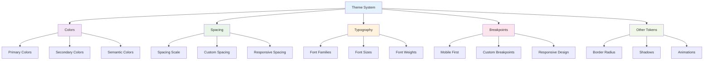

# Theme System

_Understanding Tailwind CSS v4+ theme system: colors, spacing, typography, and breakpoints_

---

## 🎯 Overview

The Tailwind CSS v4+ theme system provides a comprehensive set of design tokens that can be customized through the `@theme` directive. This system ensures consistency across your application while providing flexibility for customization.



---

## 🎨 Color System

### Default Color Palette

Tailwind CSS v4+ comes with a comprehensive color palette:

```css
@theme {
  /* Gray scale */
  --color-gray-50: #f9fafb;
  --color-gray-100: #f3f4f6;
  --color-gray-200: #e5e7eb;
  --color-gray-300: #d1d5db;
  --color-gray-400: #9ca3af;
  --color-gray-500: #6b7280;
  --color-gray-600: #4b5563;
  --color-gray-700: #374151;
  --color-gray-800: #1f2937;
  --color-gray-900: #111827;
  --color-gray-950: #030712;

  /* Primary colors */
  --color-blue-50: #eff6ff;
  --color-blue-500: #3b82f6;
  --color-blue-900: #1e3a8a;

  /* Secondary colors */
  --color-green-50: #ecfdf5;
  --color-green-500: #10b981;
  --color-green-900: #064e3b;

  /* Accent colors */
  --color-red-50: #fef2f2;
  --color-red-500: #ef4444;
  --color-red-900: #7f1d1d;

  --color-yellow-50: #fffbeb;
  --color-yellow-500: #f59e0b;
  --color-yellow-900: #78350f;

  --color-purple-50: #faf5ff;
  --color-purple-500: #8b5cf6;
  --color-purple-900: #4c1d95;
}
```

### Custom Color Palette

```css
@theme {
  /* Brand colors */
  --color-primary: #3b82f6;
  --color-primary-50: #eff6ff;
  --color-primary-100: #dbeafe;
  --color-primary-200: #bfdbfe;
  --color-primary-300: #93c5fd;
  --color-primary-400: #60a5fa;
  --color-primary-500: #3b82f6;
  --color-primary-600: #2563eb;
  --color-primary-700: #1d4ed8;
  --color-primary-800: #1e40af;
  --color-primary-900: #1e3a8a;
  --color-primary-950: #172554;

  /* Secondary colors */
  --color-secondary: #10b981;
  --color-secondary-50: #ecfdf5;
  --color-secondary-100: #d1fae5;
  --color-secondary-200: #a7f3d0;
  --color-secondary-300: #6ee7b7;
  --color-secondary-400: #34d399;
  --color-secondary-500: #10b981;
  --color-secondary-600: #059669;
  --color-secondary-700: #047857;
  --color-secondary-800: #065f46;
  --color-secondary-900: #064e3b;
  --color-secondary-950: #022c22;

  /* Semantic colors */
  --color-success: #10b981;
  --color-warning: #f59e0b;
  --color-error: #ef4444;
  --color-info: #3b82f6;
}
```

### Using Colors

```html
<!-- Background colors -->
<div class="bg-primary">Primary background</div>
<div class="bg-secondary">Secondary background</div>
<div class="bg-success">Success background</div>

<!-- Text colors -->
<p class="text-primary">Primary text</p>
<p class="text-secondary">Secondary text</p>
<p class="text-error">Error text</p>

<!-- Border colors -->
<div class="border border-primary">Primary border</div>
<div class="border-2 border-secondary">Secondary border</div>

<!-- Color variations -->
<div class="bg-primary-100 text-primary-900">Light primary</div>
<div class="bg-primary-500 text-white">Medium primary</div>
<div class="bg-primary-900 text-primary-100">Dark primary</div>
```

---

## 📏 Spacing System

### Default Spacing Scale

```css
@theme {
  /* Default spacing scale (based on 4px grid) */
  --spacing-0: 0;
  --spacing-px: 1px;
  --spacing-0-5: 0.125rem; /* 2px */
  --spacing-1: 0.25rem; /* 4px */
  --spacing-1-5: 0.375rem; /* 6px */
  --spacing-2: 0.5rem; /* 8px */
  --spacing-2-5: 0.625rem; /* 10px */
  --spacing-3: 0.75rem; /* 12px */
  --spacing-3-5: 0.875rem; /* 14px */
  --spacing-4: 1rem; /* 16px */
  --spacing-5: 1.25rem; /* 20px */
  --spacing-6: 1.5rem; /* 24px */
  --spacing-7: 1.75rem; /* 28px */
  --spacing-8: 2rem; /* 32px */
  --spacing-9: 2.25rem; /* 36px */
  --spacing-10: 2.5rem; /* 40px */
  --spacing-11: 2.75rem; /* 44px */
  --spacing-12: 3rem; /* 48px */
  --spacing-14: 3.5rem; /* 56px */
  --spacing-16: 4rem; /* 64px */
  --spacing-20: 5rem; /* 80px */
  --spacing-24: 6rem; /* 96px */
  --spacing-28: 7rem; /* 112px */
  --spacing-32: 8rem; /* 128px */
  --spacing-36: 9rem; /* 144px */
  --spacing-40: 10rem; /* 160px */
  --spacing-44: 11rem; /* 176px */
  --spacing-48: 12rem; /* 192px */
  --spacing-52: 13rem; /* 208px */
  --spacing-56: 14rem; /* 224px */
  --spacing-60: 15rem; /* 240px */
  --spacing-64: 16rem; /* 256px */
  --spacing-72: 18rem; /* 288px */
  --spacing-80: 20rem; /* 320px */
  --spacing-96: 24rem; /* 384px */
}
```

### Custom Spacing Scale

```css
@theme {
  /* Custom spacing scale */
  --spacing-xs: 0.25rem; /* 4px */
  --spacing-sm: 0.5rem; /* 8px */
  --spacing-md: 1rem; /* 16px */
  --spacing-lg: 1.5rem; /* 24px */
  --spacing-xl: 2rem; /* 32px */
  --spacing-2xl: 3rem; /* 48px */
  --spacing-3xl: 4rem; /* 64px */
  --spacing-4xl: 6rem; /* 96px */
  --spacing-5xl: 8rem; /* 128px */

  /* Semantic spacing */
  --spacing-section: 5rem; /* 80px - for section spacing */
  --spacing-container: 1.5rem; /* 24px - for container padding */
  --spacing-card: 1.25rem; /* 20px - for card padding */
  --spacing-button: 0.75rem; /* 12px - for button padding */
}
```

### Using Spacing

```html
<!-- Padding -->
<div class="p-4">Padding on all sides</div>
<div class="px-6 py-3">Horizontal and vertical padding</div>
<div class="pt-8 pb-4">Top and bottom padding</div>

<!-- Margin -->
<div class="m-4">Margin on all sides</div>
<div class="mx-auto">Horizontal center</div>
<div class="mt-8 mb-4">Top and bottom margin</div>

<!-- Custom spacing -->
<div class="p-section">Section padding</div>
<div class="m-container">Container margin</div>
<div class="p-card">Card padding</div>

<!-- Responsive spacing -->
<div
  class="
  p-4
  md:p-6
  lg:p-8
"
>
  Responsive padding
</div>
```

---

## 🔤 Typography System

### Font Families

```css
@theme {
  /* Default font families */
  --font-sans: ui-sans-serif, system-ui, -apple-system, BlinkMacSystemFont, "Segoe UI",
    Roboto, "Helvetica Neue", Arial, "Noto Sans", sans-serif, "Apple Color Emoji",
    "Segoe UI Emoji", "Segoe UI Symbol", "Noto Color Emoji";
  --font-serif: ui-serif, Georgia, Cambria, "Times New Roman", Times, serif;
  --font-mono: ui-monospace, SFMono-Regular, "SF Mono", Consolas,
    "Liberation Mono", Menlo, monospace;

  /* Custom font families */
  --font-display: "Inter", sans-serif;
  --font-body: "Inter", sans-serif;
  --font-heading: "Playfair Display", serif;
  --font-code: "Fira Code", monospace;
}
```

### Font Sizes

```css
@theme {
  /* Default font sizes */
  --font-size-xs: 0.75rem; /* 12px */
  --font-size-sm: 0.875rem; /* 14px */
  --font-size-base: 1rem; /* 16px */
  --font-size-lg: 1.125rem; /* 18px */
  --font-size-xl: 1.25rem; /* 20px */
  --font-size-2xl: 1.5rem; /* 24px */
  --font-size-3xl: 1.875rem; /* 30px */
  --font-size-4xl: 2.25rem; /* 36px */
  --font-size-5xl: 3rem; /* 48px */
  --font-size-6xl: 3.75rem; /* 60px */
  --font-size-7xl: 4.5rem; /* 72px */
  --font-size-8xl: 6rem; /* 96px */
  --font-size-9xl: 8rem; /* 128px */

  /* Custom font sizes */
  --font-size-hero: 4rem; /* 64px - for hero headings */
  --font-size-display: 5rem; /* 80px - for display text */
  --font-size-caption: 0.75rem; /* 12px - for captions */
}
```

### Font Weights

```css
@theme {
  /* Default font weights */
  --font-weight-thin: 100;
  --font-weight-extralight: 200;
  --font-weight-light: 300;
  --font-weight-normal: 400;
  --font-weight-medium: 500;
  --font-weight-semibold: 600;
  --font-weight-bold: 700;
  --font-weight-extrabold: 800;
  --font-weight-black: 900;
}
```

### Line Heights

```css
@theme {
  /* Default line heights */
  --line-height-none: 1;
  --line-height-tight: 1.25;
  --line-height-snug: 1.375;
  --line-height-normal: 1.5;
  --line-height-relaxed: 1.625;
  --line-height-loose: 2;
}
```

### Using Typography

```html
<!-- Font families -->
<h1 class="font-display">Display heading</h1>
<p class="font-body">Body text</p>
<code class="font-code">Code snippet</code>

<!-- Font sizes -->
<h1 class="text-hero">Hero heading</h1>
<h2 class="text-4xl">Section heading</h2>
<p class="text-base">Body text</p>
<small class="text-caption">Caption text</small>

<!-- Font weights -->
<h1 class="font-bold">Bold heading</h1>
<p class="font-medium">Medium weight text</p>
<span class="font-light">Light text</span>

<!-- Line heights -->
<p class="leading-tight">Tight line height</p>
<p class="leading-normal">Normal line height</p>
<p class="leading-relaxed">Relaxed line height</p>

<!-- Responsive typography -->
<h1
  class="
  text-3xl
  md:text-4xl
  lg:text-hero
  font-display
  font-bold
  leading-tight
"
>
  Responsive Typography
</h1>
```

---

## 📱 Breakpoint System

### Default Breakpoints

```css
@theme {
  /* Default breakpoints */
  --breakpoint-sm: 640px;
  --breakpoint-md: 768px;
  --breakpoint-lg: 1024px;
  --breakpoint-xl: 1280px;
  --breakpoint-2xl: 1536px;
}
```

### Custom Breakpoints

```css
@theme {
  /* Custom breakpoints */
  --breakpoint-mobile: 480px;
  --breakpoint-tablet: 768px;
  --breakpoint-desktop: 1024px;
  --breakpoint-wide: 1440px;
  --breakpoint-ultrawide: 1920px;
}
```

### Using Breakpoints

```html
<!-- Responsive grid -->
<div
  class="
  grid grid-cols-1
  sm:grid-cols-2
  md:grid-cols-3
  lg:grid-cols-4
  xl:grid-cols-5
"
>
  <!-- Grid items -->
</div>

<!-- Responsive typography -->
<h1
  class="
  text-2xl
  sm:text-3xl
  md:text-4xl
  lg:text-5xl
  xl:text-6xl
"
>
  Responsive Heading
</h1>

<!-- Responsive spacing -->
<div
  class="
  p-4
  sm:p-6
  md:p-8
  lg:p-10
  xl:p-12
"
>
  Responsive Padding
</div>

<!-- Custom breakpoints -->
<div
  class="
  w-full
  mobile:w-1/2
  tablet:w-1/3
  desktop:w-1/4
  wide:w-1/5
"
>
  Custom Breakpoints
</div>
```

---

## 🎨 Other Theme Tokens

### Border Radius

```css
@theme {
  /* Default border radius */
  --radius-none: 0;
  --radius-sm: 0.125rem; /* 2px */
  --radius-md: 0.375rem; /* 6px */
  --radius-lg: 0.5rem; /* 8px */
  --radius-xl: 0.75rem; /* 12px */
  --radius-2xl: 1rem; /* 16px */
  --radius-3xl: 1.5rem; /* 24px */
  --radius-full: 9999px;

  /* Custom border radius */
  --radius-card: 0.75rem; /* 12px - for cards */
  --radius-button: 0.5rem; /* 8px - for buttons */
  --radius-input: 0.375rem; /* 6px - for inputs */
}
```

### Shadows

```css
@theme {
  /* Default shadows */
  --shadow-sm: 0 1px 2px 0 rgb(0 0 0 / 0.05);
  --shadow-md: 0 4px 6px -1px rgb(0 0 0 / 0.1), 0 2px 4px -2px rgb(0 0 0 / 0.1);
  --shadow-lg: 0 10px 15px -3px rgb(0 0 0 / 0.1), 0 4px 6px -4px rgb(0 0 0 / 0.1);
  --shadow-xl: 0 20px 25px -5px rgb(0 0 0 / 0.1), 0 8px 10px -6px rgb(0 0 0 /
          0.1);
  --shadow-2xl: 0 25px 50px -12px rgb(0 0 0 / 0.25);
  --shadow-inner: inset 0 2px 4px 0 rgb(0 0 0 / 0.05);

  /* Custom shadows */
  --shadow-card: 0 4px 6px -1px rgb(0 0 0 / 0.1);
  --shadow-button: 0 2px 4px 0 rgb(0 0 0 / 0.1);
  --shadow-modal: 0 20px 25px -5px rgb(0 0 0 / 0.1);
}
```

### Animations

```css
@theme {
  /* Default animations */
  --animate-spin: spin 1s linear infinite;
  --animate-ping: ping 1s cubic-bezier(0, 0, 0.2, 1) infinite;
  --animate-pulse: pulse 2s cubic-bezier(0.4, 0, 0.6, 1) infinite;
  --animate-bounce: bounce 1s infinite;

  /* Custom animations */
  --animate-fade-in: fadeIn 0.5s ease-in-out;
  --animate-slide-up: slideUp 0.3s ease-out;
  --animate-scale-in: scaleIn 0.2s ease-out;
}
```

---

## 🎯 Best Practices

### 1. **Consistent Scale**

```css
@theme {
  /* Good: Consistent spacing scale */
  --spacing-xs: 0.25rem; /* 4px */
  --spacing-sm: 0.5rem; /* 8px */
  --spacing-md: 1rem; /* 16px */
  --spacing-lg: 1.5rem; /* 24px */
  --spacing-xl: 2rem; /* 32px */

  /* Good: Consistent color scale */
  --color-primary-50: #eff6ff;
  --color-primary-100: #dbeafe;
  --color-primary-200: #bfdbfe;
  --color-primary-300: #93c5fd;
  --color-primary-400: #60a5fa;
  --color-primary-500: #3b82f6;
  --color-primary-600: #2563eb;
  --color-primary-700: #1d4ed8;
  --color-primary-800: #1e40af;
  --color-primary-900: #1e3a8a;
}
```

### 2. **Semantic Naming**

```css
@theme {
  /* Good: Semantic names */
  --color-primary: #3b82f6;
  --color-secondary: #10b981;
  --color-success: #10b981;
  --color-warning: #f59e0b;
  --color-error: #ef4444;

  /* Avoid: Non-semantic names */
  --color-blue: #3b82f6;
  --color-green: #10b981;
  --color-yellow: #f59e0b;
  --color-red: #ef4444;
}
```

### 3. **Documentation**

```css
@theme {
  /* Primary brand color - used for main actions and links */
  --color-primary: #3b82f6;

  /* Secondary brand color - used for secondary actions */
  --color-secondary: #10b981;

  /* Standard spacing scale - based on 4px grid */
  --spacing-xs: 0.25rem; /* 4px */
  --spacing-sm: 0.5rem; /* 8px */
  --spacing-md: 1rem; /* 16px */
  --spacing-lg: 1.5rem; /* 24px */
  --spacing-xl: 2rem; /* 32px */
}
```

---

## 🚀 Next Steps

Now that you understand the theme system:

1. **[Utility Classes](./utility-classes.md)** - Learn how to use theme values in utilities
2. **[Responsive Design](./responsive-design.md)** - Build mobile-first layouts
3. **[Advanced Features](../3-advanced-features/README.md)** - Explore custom utilities and variants
4. **[UI Examples](../4-ui-examples/README.md)** - See real-world implementations

---

**Ready to learn about utility classes?** 👉 **[Utility Classes Guide](./utility-classes.md)**

