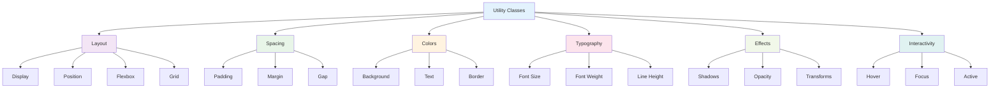

# Utility Classes

_Understanding how Tailwind CSS utility classes work and how to combine them effectively_

---

## 🎯 Overview

Tailwind CSS utility classes are small, single-purpose CSS classes that can be combined to build complex designs. Each utility class maps directly to a CSS property, making it easy to understand and maintain.



---

## 🏗️ Layout Utilities

### Display

```html
<!-- Block elements -->
<div class="block">Block element</div>
<div class="inline-block">Inline block element</div>
<div class="inline">Inline element</div>

<!-- Flexbox -->
<div class="flex">Flex container</div>
<div class="inline-flex">Inline flex container</div>

<!-- Grid -->
<div class="grid">Grid container</div>
<div class="inline-grid">Inline grid container</div>

<!-- Hidden -->
<div class="hidden">Hidden element</div>
```

### Position

```html
<!-- Positioning -->
<div class="static">Static positioning</div>
<div class="relative">Relative positioning</div>
<div class="absolute">Absolute positioning</div>
<div class="fixed">Fixed positioning</div>
<div class="sticky">Sticky positioning</div>

<!-- Positioning with values -->
<div class="absolute top-4 left-4">Absolute positioned</div>
<div class="fixed top-0 right-0">Fixed positioned</div>
<div class="sticky top-0">Sticky positioned</div>
```

### Flexbox

```html
<!-- Flex direction -->
<div class="flex flex-row">Horizontal flex</div>
<div class="flex flex-col">Vertical flex</div>
<div class="flex flex-row-reverse">Reverse horizontal</div>
<div class="flex flex-col-reverse">Reverse vertical</div>

<!-- Flex wrap -->
<div class="flex flex-wrap">Wrap items</div>
<div class="flex flex-nowrap">No wrap</div>
<div class="flex flex-wrap-reverse">Reverse wrap</div>

<!-- Justify content -->
<div class="flex justify-start">Start alignment</div>
<div class="flex justify-center">Center alignment</div>
<div class="flex justify-end">End alignment</div>
<div class="flex justify-between">Space between</div>
<div class="flex justify-around">Space around</div>
<div class="flex justify-evenly">Space evenly</div>

<!-- Align items -->
<div class="flex items-start">Align start</div>
<div class="flex items-center">Align center</div>
<div class="flex items-end">Align end</div>
<div class="flex items-stretch">Align stretch</div>
<div class="flex items-baseline">Align baseline</div>

<!-- Flex grow/shrink -->
<div class="flex-1">Grow to fill space</div>
<div class="flex-auto">Auto flex</div>
<div class="flex-initial">Initial flex</div>
<div class="flex-none">No flex</div>
<div class="grow">Grow</div>
<div class="shrink">Shrink</div>
```

### Grid

```html
<!-- Grid columns -->
<div class="grid grid-cols-1">1 column</div>
<div class="grid grid-cols-2">2 columns</div>
<div class="grid grid-cols-3">3 columns</div>
<div class="grid grid-cols-4">4 columns</div>
<div class="grid grid-cols-6">6 columns</div>
<div class="grid grid-cols-12">12 columns</div>

<!-- Grid rows -->
<div class="grid grid-rows-1">1 row</div>
<div class="grid grid-rows-2">2 rows</div>
<div class="grid grid-rows-3">3 rows</div>
<div class="grid grid-rows-4">4 rows</div>
<div class="grid grid-rows-6">6 rows</div>

<!-- Grid gap -->
<div class="grid gap-2">Small gap</div>
<div class="grid gap-4">Medium gap</div>
<div class="grid gap-6">Large gap</div>
<div class="grid gap-x-4 gap-y-2">Different x/y gaps</div>

<!-- Grid placement -->
<div class="col-span-1">Span 1 column</div>
<div class="col-span-2">Span 2 columns</div>
<div class="col-span-3">Span 3 columns</div>
<div class="row-span-1">Span 1 row</div>
<div class="row-span-2">Span 2 rows</div>
<div class="row-span-3">Span 3 rows</div>
```

---

## 📏 Spacing Utilities

### Padding

```html
<!-- All sides -->
<div class="p-0">No padding</div>
<div class="p-1">Small padding</div>
<div class="p-2">Medium padding</div>
<div class="p-4">Large padding</div>
<div class="p-8">Extra large padding</div>

<!-- Individual sides -->
<div class="pt-4">Top padding</div>
<div class="pr-4">Right padding</div>
<div class="pb-4">Bottom padding</div>
<div class="pl-4">Left padding</div>

<!-- Horizontal and vertical -->
<div class="px-4">Horizontal padding</div>
<div class="py-4">Vertical padding</div>

<!-- Custom values -->
<div class="p-3.5">Custom padding</div>
<div class="p-18">Custom spacing value</div>
```

### Margin

```html
<!-- All sides -->
<div class="m-0">No margin</div>
<div class="m-1">Small margin</div>
<div class="m-2">Medium margin</div>
<div class="m-4">Large margin</div>
<div class="m-8">Extra large margin</div>

<!-- Individual sides -->
<div class="mt-4">Top margin</div>
<div class="mr-4">Right margin</div>
<div class="mb-4">Bottom margin</div>
<div class="ml-4">Left margin</div>

<!-- Horizontal and vertical -->
<div class="mx-4">Horizontal margin</div>
<div class="my-4">Vertical margin</div>

<!-- Auto margins -->
<div class="mx-auto">Center horizontally</div>
<div class="ml-auto">Push to right</div>
<div class="mr-auto">Push to left</div>
```

### Gap

```html
<!-- Flex gap -->
<div class="flex gap-2">Small gap</div>
<div class="flex gap-4">Medium gap</div>
<div class="flex gap-6">Large gap</div>

<!-- Grid gap -->
<div class="grid gap-2">Small gap</div>
<div class="grid gap-4">Medium gap</div>
<div class="grid gap-6">Large gap</div>

<!-- Different gaps -->
<div class="flex gap-x-4 gap-y-2">Different x/y gaps</div>
```

---

## 🎨 Color Utilities

### Background Colors

```html
<!-- Solid backgrounds -->
<div class="bg-white">White background</div>
<div class="bg-black">Black background</div>
<div class="bg-gray-100">Light gray</div>
<div class="bg-gray-500">Medium gray</div>
<div class="bg-gray-900">Dark gray</div>

<!-- Brand colors -->
<div class="bg-blue-500">Blue background</div>
<div class="bg-green-500">Green background</div>
<div class="bg-red-500">Red background</div>
<div class="bg-yellow-500">Yellow background</div>
<div class="bg-purple-500">Purple background</div>

<!-- Custom colors -->
<div class="bg-primary">Primary background</div>
<div class="bg-secondary">Secondary background</div>
<div class="bg-accent">Accent background</div>
```

### Text Colors

```html
<!-- Text colors -->
<p class="text-white">White text</p>
<p class="text-black">Black text</p>
<p class="text-gray-500">Gray text</p>
<p class="text-gray-900">Dark gray text</p>

<!-- Brand text colors -->
<p class="text-blue-500">Blue text</p>
<p class="text-green-500">Green text</p>
<p class="text-red-500">Red text</p>
<p class="text-yellow-500">Yellow text</p>
<p class="text-purple-500">Purple text</p>

<!-- Custom text colors -->
<p class="text-primary">Primary text</p>
<p class="text-secondary">Secondary text</p>
<p class="text-accent">Accent text</p>
```

### Border Colors

```html
<!-- Border colors -->
<div class="border border-gray-300">Gray border</div>
<div class="border border-blue-500">Blue border</div>
<div class="border border-green-500">Green border</div>
<div class="border border-red-500">Red border</div>

<!-- Custom border colors -->
<div class="border border-primary">Primary border</div>
<div class="border border-secondary">Secondary border</div>
<div class="border border-accent">Accent border</div>
```

---

## 🔤 Typography Utilities

### Font Size

```html
<!-- Font sizes -->
<h1 class="text-xs">Extra small text</h1>
<h1 class="text-sm">Small text</h1>
<h1 class="text-base">Base text</h1>
<h1 class="text-lg">Large text</h1>
<h1 class="text-xl">Extra large text</h1>
<h1 class="text-2xl">2x large text</h1>
<h1 class="text-3xl">3x large text</h1>
<h1 class="text-4xl">4x large text</h1>
<h1 class="text-5xl">5x large text</h1>
<h1 class="text-6xl">6x large text</h1>

<!-- Custom font sizes -->
<h1 class="text-hero">Hero text</h1>
<h1 class="text-display">Display text</h1>
```

### Font Weight

```html
<!-- Font weights -->
<p class="font-thin">Thin text</p>
<p class="font-extralight">Extra light text</p>
<p class="font-light">Light text</p>
<p class="font-normal">Normal text</p>
<p class="font-medium">Medium text</p>
<p class="font-semibold">Semibold text</p>
<p class="font-bold">Bold text</p>
<p class="font-extrabold">Extra bold text</p>
<p class="font-black">Black text</p>
```

### Font Family

```html
<!-- Font families -->
<p class="font-sans">Sans serif font</p>
<p class="font-serif">Serif font</p>
<p class="font-mono">Monospace font</p>

<!-- Custom font families -->
<p class="font-display">Display font</p>
<p class="font-body">Body font</p>
<p class="font-code">Code font</p>
```

### Line Height

```html
<!-- Line heights -->
<p class="leading-none">No line height</p>
<p class="leading-tight">Tight line height</p>
<p class="leading-snug">Snug line height</p>
<p class="leading-normal">Normal line height</p>
<p class="leading-relaxed">Relaxed line height</p>
<p class="leading-loose">Loose line height</p>
```

### Text Alignment

```html
<!-- Text alignment -->
<p class="text-left">Left aligned</p>
<p class="text-center">Center aligned</p>
<p class="text-right">Right aligned</p>
<p class="text-justify">Justified text</p>
```

---

## ✨ Effects Utilities

### Shadows

```html
<!-- Box shadows -->
<div class="shadow-sm">Small shadow</div>
<div class="shadow-md">Medium shadow</div>
<div class="shadow-lg">Large shadow</div>
<div class="shadow-xl">Extra large shadow</div>
<div class="shadow-2xl">2x large shadow</div>
<div class="shadow-inner">Inner shadow</div>
<div class="shadow-none">No shadow</div>

<!-- Custom shadows -->
<div class="shadow-card">Card shadow</div>
<div class="shadow-button">Button shadow</div>
<div class="shadow-modal">Modal shadow</div>
```

### Opacity

```html
<!-- Opacity -->
<div class="opacity-0">Fully transparent</div>
<div class="opacity-25">25% opacity</div>
<div class="opacity-50">50% opacity</div>
<div class="opacity-75">75% opacity</div>
<div class="opacity-100">Fully opaque</div>
```

### Transforms

```html
<!-- Scale -->
<div class="scale-0">No scale</div>
<div class="scale-50">Half scale</div>
<div class="scale-75">75% scale</div>
<div class="scale-100">Normal scale</div>
<div class="scale-110">110% scale</div>
<div class="scale-125">125% scale</div>
<div class="scale-150">150% scale</div>

<!-- Rotate -->
<div class="rotate-0">No rotation</div>
<div class="rotate-45">45° rotation</div>
<div class="rotate-90">90° rotation</div>
<div class="rotate-180">180° rotation</div>
<div class="rotate-270">270° rotation</div>

<!-- Translate -->
<div class="translate-x-0">No x translation</div>
<div class="translate-x-4">Move right</div>
<div class="translate-x-8">Move right more</div>
<div class="translate-y-0">No y translation</div>
<div class="translate-y-4">Move down</div>
<div class="translate-y-8">Move down more</div>
```

---

## 🎯 Interactivity Utilities

### Hover States

```html
<!-- Hover effects -->
<button
  class="
  bg-blue-500 text-white px-4 py-2 rounded
  hover:bg-blue-600
  hover:shadow-lg
  hover:scale-105
  transition-all duration-200
"
>
  Hover Button
</button>

<!-- Hover on parent affects child -->
<div class="group">
  <div
    class="
    bg-white rounded-lg shadow-md p-6
    group-hover:shadow-lg
    group-hover:scale-105
    transition-all duration-200
  "
  >
    <h3
      class="
      text-lg font-semibold text-gray-900
      group-hover:text-blue-600
      transition-colors duration-200
    "
    >
      Group Hover Effect
    </h3>
  </div>
</div>
```

### Focus States

```html
<!-- Focus effects -->
<input
  class="
  border border-gray-300 rounded-lg px-3 py-2
  focus:border-blue-500
  focus:ring-2 focus:ring-blue-200
  focus:outline-none
"
  placeholder="Focus me"
/>

<button
  class="
  bg-blue-600 text-white px-4 py-2 rounded-lg
  focus:ring-2 focus:ring-blue-500
  focus:ring-offset-2
  focus:outline-none
"
>
  Focus Button
</button>
```

### Active States

```html
<!-- Active effects -->
<button
  class="
  bg-green-600 text-white px-4 py-2 rounded-lg
  active:bg-green-700
  active:scale-95
  transition-all duration-100
"
>
  Active Button
</button>
```

### Disabled States

```html
<!-- Disabled effects -->
<button
  class="
  bg-blue-600 text-white px-4 py-2 rounded-lg
  hover:bg-blue-700
  disabled:opacity-50
  disabled:cursor-not-allowed
  disabled:hover:bg-blue-600
"
  disabled
>
  Disabled Button
</button>
```

---

## 🔄 Combining Utilities

### Component Examples

```html
<!-- Card component -->
<div
  class="
  bg-white rounded-lg shadow-md p-6 max-w-sm
  hover:shadow-lg transition-shadow duration-200
  border border-gray-200
"
>
  <h3 class="text-lg font-semibold text-gray-900 mb-2">Card Title</h3>
  <p class="text-gray-600 mb-4">Card description text goes here.</p>
  <button
    class="
    w-full bg-blue-600 text-white py-2 px-4 rounded-md
    hover:bg-blue-700 focus:ring-2 focus:ring-blue-500
    transition-colors duration-200
  "
  >
    Action Button
  </button>
</div>

<!-- Navigation component -->
<nav class="bg-white shadow-sm">
  <div class="max-w-7xl mx-auto px-4 sm:px-6 lg:px-8">
    <div class="flex justify-between items-center h-16">
      <div class="flex items-center">
        <h1 class="text-xl font-bold text-gray-900">My Website</h1>
      </div>
      <div class="hidden md:flex space-x-8">
        <a href="#" class="text-gray-500 hover:text-gray-900 transition-colors"
          >Home</a
        >
        <a href="#" class="text-gray-500 hover:text-gray-900 transition-colors"
          >About</a
        >
        <a href="#" class="text-gray-500 hover:text-gray-900 transition-colors"
          >Contact</a
        >
      </div>
    </div>
  </div>
</nav>

<!-- Form component -->
<form class="space-y-4">
  <div>
    <label class="block text-sm font-medium text-gray-700 mb-1">
      Email Address
    </label>
    <input
      type="email"
      class="
      w-full border border-gray-300 rounded-lg px-3 py-2
      focus:border-blue-500 focus:ring-2 focus:ring-blue-200
      focus:outline-none
    "
      placeholder="Enter your email"
    />
  </div>
  <button
    type="submit"
    class="
    w-full bg-blue-600 text-white py-2 px-4 rounded-lg
    hover:bg-blue-700 focus:ring-2 focus:ring-blue-500
    transition-colors duration-200
  "
  >
    Submit
  </button>
</form>
```

---

## 🎯 Best Practices

### 1. **Consistent Spacing**

```html
<!-- Good: Consistent spacing -->
<div class="p-4 m-2">
  <h3 class="mb-2">Title</h3>
  <p class="mb-4">Description</p>
  <button class="mt-4">Action</button>
</div>

<!-- Avoid: Inconsistent spacing -->
<div class="p-3 m-1">
  <h3 class="mb-1">Title</h3>
  <p class="mb-3">Description</p>
  <button class="mt-2">Action</button>
</div>
```

### 2. **Semantic Color Usage**

```html
<!-- Good: Semantic colors -->
<button class="bg-blue-600 text-white">Primary Action</button>
<button class="bg-gray-200 text-gray-900">Secondary Action</button>
<button class="bg-red-600 text-white">Danger Action</button>

<!-- Avoid: Random colors -->
<button class="bg-purple-600 text-white">Primary Action</button>
<button class="bg-yellow-200 text-gray-900">Secondary Action</button>
```

### 3. **Responsive Design**

```html
<!-- Good: Mobile-first -->
<div
  class="
  grid grid-cols-1
  md:grid-cols-2
  lg:grid-cols-3
  gap-4
"
>
  <!-- Content -->
</div>

<!-- Avoid: Desktop-first -->
<div
  class="
  grid grid-cols-3
  md:grid-cols-2
  sm:grid-cols-1
  gap-4
"
>
  <!-- Content -->
</div>
```

### 4. **Performance Considerations**

```html
<!-- Good: Efficient classes -->
<div class="flex items-center justify-between">
  <span>Left content</span>
  <span>Right content</span>
</div>

<!-- Avoid: Unnecessary classes -->
<div class="flex items-center justify-between">
  <span class="flex items-center">Left content</span>
  <span class="flex items-center">Right content</span>
</div>
```

---

## 🚀 Next Steps

Now that you understand utility classes:

1. **[Responsive Design](./responsive-design.md)** - Build mobile-first layouts
2. **[Advanced Features](../3-advanced-features/README.md)** - Explore custom utilities and variants
3. **[UI Examples](../4-ui-examples/README.md)** - See real-world implementations
4. **[Best Practices](../5-best-practices/README.md)** - Learn production patterns

---

**Ready to learn about responsive design?** 👉 **[Responsive Design Guide](./responsive-design.md)**

