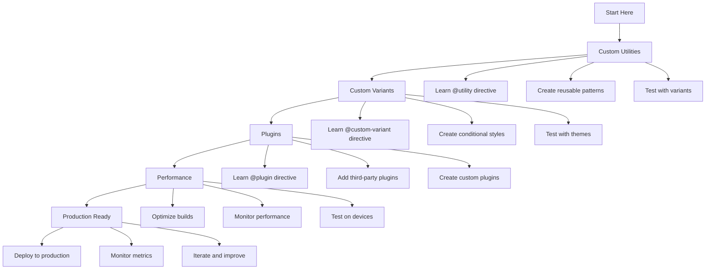

# 🚀 Advanced Features

_Unlock the full power of Tailwind CSS v4+ with custom utilities, variants, plugins, and performance optimization_

---

## 🧭 Navigation

- [Custom Utilities](./custom-utilities.md) - Create reusable utility classes with @utility
- [Custom Variants](./custom-variants.md) - Build conditional styles with @custom-variant
- [Plugins](./plugins.md) - Extend functionality with @plugin directive
- [Performance](./performance.md) - Optimize builds and runtime performance

---

## 🎯 Overview

Tailwind CSS v4+ provides powerful advanced features that allow you to create custom utilities, variants, and plugins while maintaining excellent performance. These features enable you to build sophisticated design systems and maintain consistency across large applications.

```mermaid
flowchart TD
    A[Advanced Features] --> B[Custom Utilities]
    A --> C[Custom Variants]
    A --> D[Plugins]
    A --> E[Performance]

    B --> B1[@utility directive]
    B --> B2[Reusable patterns]
    B --> B3[Variant support]

    C --> C1[@custom-variant directive]
    C --> C2[Conditional styles]
    C --> C3[Theme variants]

    D --> D1[@plugin directive]
    D --> D2[Third-party plugins]
    D --> D3[Custom plugins]

    E --> E1[Build optimization]
    E --> E2[Runtime performance]
    E --> E3[Bundle size]

    style A fill:#e3f2fd
    style B fill:#f3e5f5
    style C fill:#e8f5e8
    style D fill:#fff3e0
    style E fill:#fce4ec
```

---

## 🛠️ Custom Utilities

### The @utility Directive

Create custom utility classes that work with all Tailwind variants:

```css
@import "tailwindcss";

@utility tab-4 {
  tab-size: 4;
}

@utility container-custom {
  max-width: 1400px;
  margin: 0 auto;
  padding: 0 2rem;
}

@utility text-shadow {
  text-shadow: 0 2px 4px rgba(0, 0, 0, 0.1);
}
```

### Using Custom Utilities

```html
<!-- Use your custom utilities -->
<pre class="tab-4">Code with custom tab size</pre>
<div class="container-custom">Custom container</div>
<h1 class="text-shadow">Text with shadow</h1>

<!-- Custom utilities work with variants -->
<pre class="tab-4 hover:tab-8">Hover to change tab size</pre>
<div class="container-custom md:max-w-6xl">Responsive container</div>
<h1 class="text-shadow dark:text-shadow-lg">Theme-aware shadow</h1>
```

---

## 🎨 Custom Variants

### The @custom-variant Directive

Create custom conditional styles for specific use cases:

```css
@import "tailwindcss";

/* Dark mode variant */
@custom-variant dark (&:where([data-theme="dark"] *));

/* Custom theme variant */
@custom-variant theme-midnight (&:where([data-theme="midnight"] *));

/* Hover support detection */
@custom-variant any-hover {
  @media (any-hover: hover) {
    &:hover {
      @slot;
    }
  }
}
```

### Using Custom Variants

```html
<!-- Use your custom variants -->
<button class="bg-white dark:bg-black theme-midnight:bg-purple-900">
  Theme-aware button
</button>

<div class="bg-blue-500 any-hover:bg-blue-600">Hover-aware element</div>
```

---

## 🔌 Plugins

### The @plugin Directive

Load plugins directly in your CSS:

```css
@import "tailwindcss";

@plugin "@tailwindcss/typography";
@plugin "@tailwindcss/forms";
@plugin "@tailwindcss/container-queries";
```

### Popular Plugins

- **@tailwindcss/typography** - Beautiful typography styles
- **@tailwindcss/forms** - Better form styling
- **@tailwindcss/container-queries** - Container query support
- **@tailwindcss/aspect-ratio** - Aspect ratio utilities

---

## ⚡ Performance Features

### Build Optimization

Tailwind CSS v4+ provides several performance improvements:

- **5x faster builds** with Vite plugin
- **Instant HMR** for development
- **Automatic tree-shaking** of unused utilities
- **Optimized CSS output** for production

### Runtime Performance

- **Smaller bundle sizes** through better purging
- **Faster CSS parsing** with optimized selectors
- **Better caching** with stable class names
- **Reduced specificity** for better performance

---

## 🎯 Key Benefits

### 1. **Enhanced Developer Experience**

- **Better IntelliSense** with custom utilities
- **Faster development** with instant feedback
- **Simplified configuration** with CSS-first approach
- **Better debugging** with clear error messages

### 2. **Improved Maintainability**

- **Consistent patterns** with custom utilities
- **Reusable components** with variant support
- **Better organization** with plugin system
- **Easier updates** with automated migration

### 3. **Production Ready**

- **Optimized builds** for all frameworks
- **Small bundle sizes** through tree-shaking
- **Fast runtime** with efficient CSS
- **Better caching** with stable output

---

## 🚀 Getting Started

### 1. **Create Custom Utilities**

Start by creating utilities for common patterns:

```css
@import "tailwindcss";

@utility btn-primary {
  @apply bg-blue-600 text-white px-4 py-2 rounded-lg hover:bg-blue-700 transition-colors;
}

@utility card {
  @apply bg-white rounded-lg shadow-md p-6;
}
```

### 2. **Add Custom Variants**

Create variants for specific use cases:

```css
@import "tailwindcss";

@custom-variant dark (&:where([data-theme="dark"] *));
@custom-variant reduced-motion {
  @media (prefers-reduced-motion: reduce) {
    @slot;
  }
}
```

### 3. **Load Plugins**

Add plugins for extended functionality:

```css
@import "tailwindcss";

@plugin "@tailwindcss/typography";
@plugin "@tailwindcss/forms";
```

### 4. **Optimize Performance**

Configure your build for optimal performance:

```javascript
// vite.config.ts
export default defineConfig({
  plugins: [react(), tailwindcss()],
  build: {
    cssCodeSplit: true,
    rollupOptions: {
      output: {
        manualChunks: {
          tailwind: ["tailwindcss"],
        },
      },
    },
  },
});
```

---

## 📚 Learning Path



---

## 🎨 Example Use Cases

### Design System Utilities

```css
@import "tailwindcss";

@utility btn {
  @apply px-4 py-2 rounded-lg font-medium transition-colors focus:outline-none focus:ring-2;
}

@utility btn-primary {
  @apply btn bg-blue-600 text-white hover:bg-blue-700 focus:ring-blue-500;
}

@utility btn-secondary {
  @apply btn bg-gray-200 text-gray-900 hover:bg-gray-300 focus:ring-gray-500;
}

@utility btn-outline {
  @apply btn border border-gray-300 text-gray-700 hover:bg-gray-50 focus:ring-gray-500;
}
```

### Theme Variants

```css
@import "tailwindcss";

@custom-variant dark (&:where([data-theme="dark"] *));
@custom-variant light (&:where([data-theme="light"] *));
@custom-variant high-contrast (&:where([data-theme="high-contrast"] *));
```

### Responsive Utilities

```css
@import "tailwindcss";

@utility container-responsive {
  @apply w-full max-w-7xl mx-auto px-4 sm:px-6 lg:px-8;
}

@utility grid-responsive {
  @apply grid grid-cols-1 sm:grid-cols-2 md:grid-cols-3 lg:grid-cols-4 gap-4;
}
```

---

## 🎯 Best Practices

### 1. **Naming Conventions**

```css
/* Good: Clear, descriptive names */
@utility btn-primary {
  /* ... */
}
@utility card-elevated {
  /* ... */
}
@utility text-shadow-sm {
  /* ... */
}

/* Avoid: Unclear, generic names */
@utility button {
  /* ... */
}
@utility card {
  /* ... */
}
@utility shadow {
  /* ... */
}
```

### 2. **Consistent Patterns**

```css
/* Good: Consistent utility structure */
@utility btn {
  @apply px-4 py-2 rounded-lg font-medium transition-colors;
}

@utility btn-primary {
  @apply btn bg-blue-600 text-white hover:bg-blue-700;
}

@utility btn-secondary {
  @apply btn bg-gray-200 text-gray-900 hover:bg-gray-300;
}
```

### 3. **Performance Considerations**

```css
/* Good: Efficient utilities */
@utility btn {
  @apply px-4 py-2 rounded-lg font-medium transition-colors;
}

/* Avoid: Inefficient utilities */
@utility btn {
  @apply px-4 py-2 rounded-lg font-medium transition-colors;
  /* Don't add unnecessary properties */
  background-image: linear-gradient(45deg, transparent, transparent);
}
```

---

## 🚀 Next Steps

Ready to dive deeper into advanced features:

1. **[Custom Utilities](./custom-utilities.md)** - Master the @utility directive
2. **[Custom Variants](./custom-variants.md)** - Create conditional styles
3. **[Plugins](./plugins.md)** - Extend functionality with plugins
4. **[Performance](./performance.md)** - Optimize your builds

---

**Ready to create custom utilities?** 👉 **[Custom Utilities Guide](./custom-utilities.md)**

