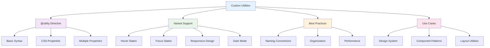

# Custom Utilities

_Create reusable utility classes with the @utility directive in Tailwind CSS v4+_

---

## 🎯 Overview

The `@utility` directive in Tailwind CSS v4+ allows you to create custom utility classes that work seamlessly with all Tailwind variants (hover, focus, responsive, etc.). This powerful feature enables you to build consistent, reusable patterns while maintaining the utility-first approach.



---

## 🚀 Basic Syntax

### Simple Utility

```css
@import "tailwindcss";

@utility tab-4 {
  tab-size: 4;
}
```

### Multiple Properties

```css
@import "tailwindcss";

@utility container-custom {
  max-width: 1400px;
  margin: 0 auto;
  padding: 0 2rem;
}
```

### Using @apply

```css
@import "tailwindcss";

@utility btn-primary {
  @apply bg-blue-600 text-white px-4 py-2 rounded-lg hover:bg-blue-700 transition-colors;
}
```

---

## 🎨 Design System Utilities

### Button Utilities

```css
@import "tailwindcss";

/* Base button utility */
@utility btn {
  @apply px-4 py-2 rounded-lg font-medium transition-colors focus:outline-none focus:ring-2;
}

/* Primary button */
@utility btn-primary {
  @apply btn bg-blue-600 text-white hover:bg-blue-700 focus:ring-blue-500;
}

/* Secondary button */
@utility btn-secondary {
  @apply btn bg-gray-200 text-gray-900 hover:bg-gray-300 focus:ring-gray-500;
}

/* Outline button */
@utility btn-outline {
  @apply btn border border-gray-300 text-gray-700 hover:bg-gray-50 focus:ring-gray-500;
}

/* Danger button */
@utility btn-danger {
  @apply btn bg-red-600 text-white hover:bg-red-700 focus:ring-red-500;
}
```

### Using Button Utilities

```html
<!-- Use your custom button utilities -->
<button class="btn-primary">Primary Button</button>
<button class="btn-secondary">Secondary Button</button>
<button class="btn-outline">Outline Button</button>
<button class="btn-danger">Danger Button</button>

<!-- Custom utilities work with all variants -->
<button class="btn-primary disabled:opacity-50">Disabled Primary</button>
<button class="btn-secondary md:btn-primary">Responsive Button</button>
<button class="btn-outline dark:btn-primary">Theme-aware Button</button>
```

### Card Utilities

```css
@import "tailwindcss";

/* Base card utility */
@utility card {
  @apply bg-white rounded-lg shadow-md p-6;
}

/* Elevated card */
@utility card-elevated {
  @apply card shadow-lg hover:shadow-xl transition-shadow;
}

/* Compact card */
@utility card-compact {
  @apply card p-4;
}

/* Interactive card */
@utility card-interactive {
  @apply card-elevated cursor-pointer hover:scale-105 transition-transform;
}
```

### Using Card Utilities

```html
<!-- Use your custom card utilities -->
<div class="card">
  <h3 class="text-lg font-semibold mb-2">Basic Card</h3>
  <p class="text-gray-600">Card content goes here.</p>
</div>

<div class="card-elevated">
  <h3 class="text-lg font-semibold mb-2">Elevated Card</h3>
  <p class="text-gray-600">This card has enhanced shadow.</p>
</div>

<div class="card-interactive">
  <h3 class="text-lg font-semibold mb-2">Interactive Card</h3>
  <p class="text-gray-600">This card responds to hover.</p>
</div>
```

---

## 🏗️ Layout Utilities

### Container Utilities

```css
@import "tailwindcss";

/* Responsive container */
@utility container-responsive {
  @apply w-full max-w-7xl mx-auto px-4 sm:px-6 lg:px-8;
}

/* Section container */
@utility container-section {
  @apply container-responsive py-8 md:py-12 lg:py-16;
}

/* Content container */
@utility container-content {
  @apply container-responsive max-w-4xl;
}
```

### Grid Utilities

```css
@import "tailwindcss";

/* Responsive grid */
@utility grid-responsive {
  @apply grid grid-cols-1 sm:grid-cols-2 md:grid-cols-3 lg:grid-cols-4 gap-4;
}

/* Auto-fit grid */
@utility grid-auto-fit {
  @apply grid grid-cols-[repeat(auto-fit,minmax(250px,1fr))] gap-4;
}

/* Masonry grid */
@utility grid-masonry {
  @apply grid grid-cols-1 sm:grid-cols-2 lg:grid-cols-3 gap-4;
}
```

### Flexbox Utilities

```css
@import "tailwindcss";

/* Center content */
@utility flex-center {
  @apply flex items-center justify-center;
}

/* Space between */
@utility flex-between {
  @apply flex items-center justify-between;
}

/* Stack vertically */
@utility flex-stack {
  @apply flex flex-col space-y-4;
}
```

### Using Layout Utilities

```html
<!-- Use your custom layout utilities -->
<div class="container-section">
  <div class="grid-responsive">
    <div class="card">Item 1</div>
    <div class="card">Item 2</div>
    <div class="card">Item 3</div>
    <div class="card">Item 4</div>
  </div>
</div>

<div class="container-content">
  <div class="flex-between">
    <h1 class="text-2xl font-bold">Title</h1>
    <button class="btn-primary">Action</button>
  </div>
</div>
```

---

## 🔤 Typography Utilities

### Text Utilities

```css
@import "tailwindcss";

/* Heading styles */
@utility heading-1 {
  @apply text-4xl font-bold text-gray-900 leading-tight;
}

@utility heading-2 {
  @apply text-3xl font-semibold text-gray-900 leading-tight;
}

@utility heading-3 {
  @apply text-2xl font-semibold text-gray-900 leading-tight;
}

/* Body text */
@utility body-large {
  @apply text-lg text-gray-700 leading-relaxed;
}

@utility body-base {
  @apply text-base text-gray-700 leading-relaxed;
}

@utility body-small {
  @apply text-sm text-gray-600 leading-relaxed;
}

/* Text with shadow */
@utility text-shadow {
  text-shadow: 0 2px 4px rgba(0, 0, 0, 0.1);
}

@utility text-shadow-lg {
  text-shadow: 0 4px 8px rgba(0, 0, 0, 0.15);
}
```

### Using Typography Utilities

```html
<!-- Use your custom typography utilities -->
<h1 class="heading-1">Main Heading</h1>
<h2 class="heading-2">Section Heading</h2>
<h3 class="heading-3">Subsection Heading</h3>

<p class="body-large">Large body text for important content.</p>
<p class="body-base">Regular body text for most content.</p>
<p class="body-small">Small text for captions and metadata.</p>

<h1 class="heading-1 text-shadow">Heading with shadow</h1>
```

---

## 🎨 Visual Effects Utilities

### Shadow Utilities

```css
@import "tailwindcss";

/* Custom shadows */
@utility shadow-card {
  box-shadow: 0 4px 6px -1px rgba(0, 0, 0, 0.1), 0 2px 4px -2px rgba(0, 0, 0, 0.1);
}

@utility shadow-button {
  box-shadow: 0 2px 4px 0 rgba(0, 0, 0, 0.1);
}

@utility shadow-modal {
  box-shadow: 0 20px 25px -5px rgba(0, 0, 0, 0.1), 0 8px 10px -6px rgba(0, 0, 0, 0.1);
}

/* Glow effects */
@utility glow-blue {
  box-shadow: 0 0 20px rgba(59, 130, 246, 0.5);
}

@utility glow-green {
  box-shadow: 0 0 20px rgba(16, 185, 129, 0.5);
}
```

### Animation Utilities

```css
@import "tailwindcss";

/* Fade animations */
@utility fade-in {
  animation: fadeIn 0.5s ease-in-out;
}

@utility fade-out {
  animation: fadeOut 0.5s ease-in-out;
}

/* Slide animations */
@utility slide-up {
  animation: slideUp 0.3s ease-out;
}

@utility slide-down {
  animation: slideDown 0.3s ease-out;
}

/* Scale animations */
@utility scale-in {
  animation: scaleIn 0.2s ease-out;
}

@utility scale-out {
  animation: scaleOut 0.2s ease-out;
}

/* Keyframes */
@keyframes fadeIn {
  from {
    opacity: 0;
  }
  to {
    opacity: 1;
  }
}

@keyframes slideUp {
  from {
    transform: translateY(20px);
    opacity: 0;
  }
  to {
    transform: translateY(0);
    opacity: 1;
  }
}

@keyframes scaleIn {
  from {
    transform: scale(0.9);
    opacity: 0;
  }
  to {
    transform: scale(1);
    opacity: 1;
  }
}
```

### Using Visual Effects

```html
<!-- Use your custom visual effects -->
<div class="card shadow-card">Card with custom shadow</div>
<button class="btn-primary glow-blue">Button with glow</button>

<div class="fade-in">Fading in content</div>
<div class="slide-up">Sliding up content</div>
<div class="scale-in">Scaling in content</div>
```

---

## 🎯 Variant Support

### Hover States

```css
@import "tailwindcss";

@utility btn-hover {
  @apply bg-blue-600 text-white px-4 py-2 rounded-lg transition-colors;
}

/* Custom utilities work with hover variants */
<button class="btn-hover hover:bg-blue-700">Hover Button</button>
```

### Focus States

```css
@import "tailwindcss";

@utility input-focus {
  @apply border border-gray-300 rounded-lg px-3 py-2 focus:border-blue-500 focus:ring-2 focus:ring-blue-200 focus:outline-none;
}

/* Custom utilities work with focus variants */
<input class="input-focus focus:ring-blue-500" placeholder="Focus me">
```

### Responsive Design

```css
@import "tailwindcss";

@utility text-responsive {
  @apply text-base;
}

/* Custom utilities work with responsive variants */
<h1 class="text-responsive sm:text-lg md:text-xl lg:text-2xl">Responsive Text</h1>
```

### Dark Mode

```css
@import "tailwindcss";

@utility card-dark {
  @apply bg-white dark:bg-gray-800 text-gray-900 dark:text-gray-100;
}

/* Custom utilities work with dark mode variants */
<div class="card-dark dark:border-gray-700">Theme-aware card</div>
```

---

## 🎨 Advanced Patterns

### Component Utilities

```css
@import "tailwindcss";

/* Navigation utility */
@utility nav-item {
  @apply text-gray-500 hover:text-gray-900 transition-colors px-3 py-2 rounded-md;
}

@utility nav-item-active {
  @apply nav-item bg-gray-100 text-gray-900;
}

/* Form utility */
@utility form-group {
  @apply space-y-2;
}

@utility form-label {
  @apply block text-sm font-medium text-gray-700;
}

@utility form-input {
  @apply w-full border border-gray-300 rounded-lg px-3 py-2 focus:border-blue-500 focus:ring-2 focus:ring-blue-200 focus:outline-none;
}

@utility form-error {
  @apply text-sm text-red-600;
}
```

### Using Component Utilities

```html
<!-- Navigation -->
<nav class="flex space-x-4">
  <a href="#" class="nav-item">Home</a>
  <a href="#" class="nav-item-active">About</a>
  <a href="#" class="nav-item">Contact</a>
</nav>

<!-- Form -->
<form class="space-y-6">
  <div class="form-group">
    <label class="form-label">Email Address</label>
    <input type="email" class="form-input" placeholder="Enter your email" />
    <p class="form-error">Please enter a valid email address.</p>
  </div>
</form>
```

### State Utilities

```css
@import "tailwindcss";

/* Loading state */
@utility loading {
  @apply opacity-50 pointer-events-none;
}

/* Disabled state */
@utility disabled {
  @apply opacity-50 cursor-not-allowed;
}

/* Active state */
@utility active {
  @apply scale-95;
}
```

### Using State Utilities

```html
<!-- Loading state -->
<button class="btn-primary loading">Loading...</button>

<!-- Disabled state -->
<button class="btn-primary disabled">Disabled Button</button>

<!-- Active state -->
<button class="btn-primary active:active">Active Button</button>
```

---

## 🎯 Best Practices

### 1. **Naming Conventions**

```css
/* Good: Clear, descriptive names */
@utility btn-primary {
  /* ... */
}
@utility card-elevated {
  /* ... */
}
@utility text-shadow-sm {
  /* ... */
}

/* Avoid: Unclear, generic names */
@utility button {
  /* ... */
}
@utility card {
  /* ... */
}
@utility shadow {
  /* ... */
}
```

### 2. **Organization**

```css
/* Good: Group related utilities */
/* Buttons */
@utility btn {
  /* ... */
}
@utility btn-primary {
  /* ... */
}
@utility btn-secondary {
  /* ... */
}

/* Cards */
@utility card {
  /* ... */
}
@utility card-elevated {
  /* ... */
}
@utility card-compact {
  /* ... */
}

/* Avoid: Random organization */
@utility btn {
  /* ... */
}
@utility card {
  /* ... */
}
@utility btn-primary {
  /* ... */
}
```

### 3. **Performance**

```css
/* Good: Efficient utilities */
@utility btn {
  @apply px-4 py-2 rounded-lg font-medium transition-colors;
}

/* Avoid: Inefficient utilities */
@utility btn {
  @apply px-4 py-2 rounded-lg font-medium transition-colors;
  /* Don't add unnecessary properties */
  background-image: linear-gradient(45deg, transparent, transparent);
}
```

### 4. **Consistency**

```css
/* Good: Consistent patterns */
@utility btn {
  @apply px-4 py-2 rounded-lg font-medium transition-colors;
}

@utility btn-primary {
  @apply btn bg-blue-600 text-white hover:bg-blue-700;
}

@utility btn-secondary {
  @apply btn bg-gray-200 text-gray-900 hover:bg-gray-300;
}

/* Avoid: Inconsistent patterns */
@utility btn-primary {
  @apply px-4 py-2 rounded-lg font-medium transition-colors bg-blue-600 text-white hover:bg-blue-700;
}

@utility btn-secondary {
  @apply px-3 py-1.5 rounded-md font-semibold transition-all bg-gray-200 text-gray-900 hover:bg-gray-300;
}
```

---

## 🚀 Next Steps

Now that you understand custom utilities:

1. **[Custom Variants](./custom-variants.md)** - Create conditional styles
2. **[Plugins](./plugins.md)** - Extend functionality with plugins
3. **[Performance](./performance.md)** - Optimize your builds
4. **[UI Examples](../4-ui-examples/README.md)** - See real-world implementations

---

**Ready to create custom variants?** 👉 **[Custom Variants Guide](./custom-variants.md)**
