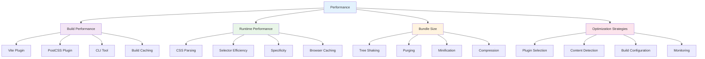
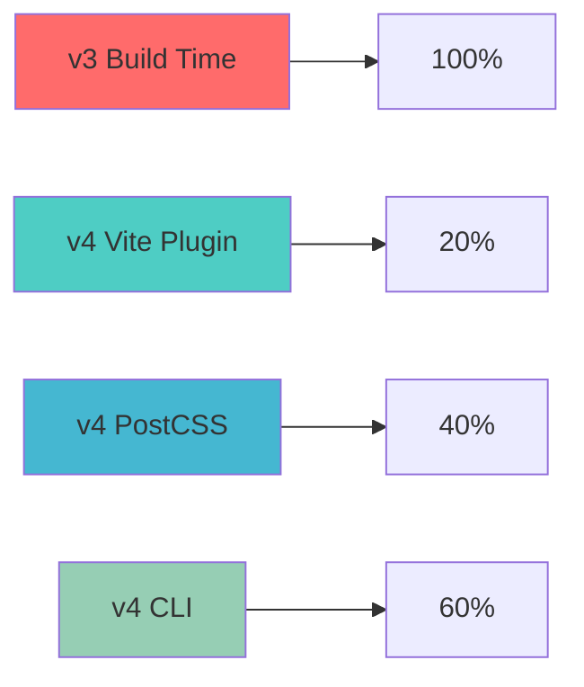

# Performance

_Optimize Tailwind CSS v4+ builds and runtime performance for production applications_

---

## 🎯 Overview

Tailwind CSS v4+ provides significant performance improvements over previous versions, with faster builds, smaller bundle sizes, and better runtime performance. Understanding these optimizations and how to leverage them is crucial for building high-performance applications.



---

## 🚀 Build Performance

### Vite Plugin Performance

The Vite plugin provides the best build performance for modern JavaScript frameworks:

```javascript
// vite.config.ts
import { defineConfig } from "vite";
import react from "@vitejs/plugin-react";
import tailwindcss from "@tailwindcss/vite";

export default defineConfig({
  plugins: [react(), tailwindcss()],
  build: {
    // Optimize CSS output
    cssCodeSplit: true,
    rollupOptions: {
      output: {
        manualChunks: {
          tailwind: ["tailwindcss"],
        },
      },
    },
  },
});
```

### Performance Comparison



### Build Optimization

```javascript
// vite.config.ts - Optimized configuration
export default defineConfig({
  plugins: [react(), tailwindcss()],
  build: {
    // Enable CSS code splitting
    cssCodeSplit: true,

    // Optimize chunk splitting
    rollupOptions: {
      output: {
        manualChunks: {
          tailwind: ["tailwindcss"],
          vendor: ["react", "react-dom"],
        },
      },
    },

    // Enable source maps for debugging
    sourcemap: process.env.NODE_ENV === "development",

    // Optimize for production
    minify: "terser",
    terserOptions: {
      compress: {
        drop_console: true,
        drop_debugger: true,
      },
    },
  },
});
```

---

## ⚡ Runtime Performance

### CSS Parsing Performance

Tailwind CSS v4+ generates more efficient CSS with:

- **Optimized selectors** - Reduced specificity conflicts
- **Better caching** - Stable class names for browser caching
- **Faster parsing** - Optimized CSS structure

### Selector Efficiency

```css
/* v4 generates more efficient selectors */
.bg-blue-500 {
  background-color: #3b82f6;
}
.text-white {
  color: #ffffff;
}
.p-4 {
  padding: 1rem;
}

/* vs v3 which might generate */
.bg-blue-500 {
  background-color: #3b82f6 !important;
}
.text-white {
  color: #ffffff !important;
}
.p-4 {
  padding: 1rem !important;
}
```

### Browser Caching

```html
<!-- Stable class names improve caching -->
<div class="bg-blue-500 text-white p-4">
  <!-- Class names remain consistent across builds -->
</div>

<!-- Avoid dynamic class names -->
<div class="bg-blue-500 text-white p-4">
  <!-- Don't use JavaScript to generate class names -->
</div>
```

---

## 📦 Bundle Size Optimization

### Tree Shaking

Tailwind CSS v4+ automatically includes only the utilities you use:

```css
/* Only used utilities are included in the final bundle */
.bg-blue-500 {
  background-color: #3b82f6;
}
.text-white {
  color: #ffffff;
}
.p-4 {
  padding: 1rem;
}

/* Unused utilities are automatically removed */
/* .bg-red-500, .text-black, .p-8, etc. are not included */
```

### Content Detection

```css
@import "tailwindcss";

/* Automatically detects content in these locations: */
/* - src/**/*.{html,js,jsx,ts,tsx,vue,svelte} */
/* - public/**/*.html */
/* - Any files you specify with @source */

/* Optional: Specify additional sources */
@source "../node_modules/@my-company/ui-lib";
@source not "./src/components/legacy";
```

### Purging Strategies

```css
@import "tailwindcss";

/* Include external UI libraries */
@source "../node_modules/@my-company/ui-lib";

/* Exclude legacy code */
@source not "./src/components/legacy";

/* Safelist specific utilities for dynamic classes */
@source inline("underline");
@source inline("{hover:,}bg-red-{50,100,200,300}");
```

---

## 🎯 Optimization Strategies

### 1. **Plugin Selection**

```css
/* Good: Only load plugins you need */
@import "tailwindcss";

@plugin "@tailwindcss/typography";
@plugin "@tailwindcss/forms";

/* Avoid: Loading unnecessary plugins */
@import "tailwindcss";

@plugin "@tailwindcss/typography";
@plugin "@tailwindcss/forms";
@plugin "@tailwindcss/container-queries";
@plugin "@tailwindcss/aspect-ratio";
@plugin "@headlessui/tailwindcss";
@plugin "@heroicons/tailwindcss";
/* ... many more plugins */
```

### 2. **Content Detection Optimization**

```css
@import "tailwindcss";

/* Good: Specific content detection */
@source "./src/**/*.{js,jsx,ts,tsx}";
@source "./public/**/*.html";

/* Avoid: Overly broad content detection */
@source "./**/*";
@source "../node_modules/**/*";
```

### 3. **Build Configuration**

```javascript
// vite.config.ts - Production optimization
export default defineConfig({
  plugins: [react(), tailwindcss()],
  build: {
    // Enable CSS minification
    cssMinify: true,

    // Optimize chunk splitting
    rollupOptions: {
      output: {
        manualChunks: {
          tailwind: ["tailwindcss"],
          vendor: ["react", "react-dom"],
        },
      },
    },

    // Enable compression
    minify: "terser",
    terserOptions: {
      compress: {
        drop_console: true,
        drop_debugger: true,
      },
    },
  },
});
```

### 4. **Runtime Optimization**

```html
<!-- Good: Efficient class usage -->
<div class="bg-blue-500 text-white p-4">
  <!-- Use specific, necessary classes -->
</div>

<!-- Avoid: Redundant or conflicting classes -->
<div class="bg-blue-500 bg-red-500 text-white text-black p-4 p-8">
  <!-- Conflicting classes reduce performance -->
</div>
```

---

## 📊 Performance Monitoring

### Build Time Monitoring

```bash
# Monitor build times
npm run build -- --profile

# Analyze bundle size
npm run build -- --analyze

# Check for unused CSS
npm run build -- --purge
```

### Bundle Analysis

```javascript
// vite.config.ts - Bundle analysis
import { defineConfig } from "vite";
import { visualizer } from "rollup-plugin-visualizer";

export default defineConfig({
  plugins: [
    react(),
    tailwindcss(),
    visualizer({
      filename: "dist/stats.html",
      open: true,
      gzipSize: true,
      brotliSize: true,
    }),
  ],
});
```

### Performance Metrics

```javascript
// performance-monitor.js
function measurePerformance() {
  // Measure CSS parsing time
  const start = performance.now();
  document.querySelectorAll("*");
  const end = performance.now();

  console.log(`CSS parsing time: ${end - start}ms`);

  // Measure paint time
  const paintEntries = performance.getEntriesByType("paint");
  paintEntries.forEach((entry) => {
    console.log(`${entry.name}: ${entry.startTime}ms`);
  });
}

// Run after page load
window.addEventListener("load", measurePerformance);
```

---

## 🎨 Performance Best Practices

### 1. **Efficient Class Usage**

```html
<!-- Good: Specific, necessary classes -->
<div class="bg-blue-500 text-white p-4 rounded-lg">
  <!-- Only use classes you need -->
</div>

<!-- Avoid: Redundant or conflicting classes -->
<div class="bg-blue-500 bg-red-500 text-white text-black p-4 p-8">
  <!-- Conflicting classes reduce performance -->
</div>
```

### 2. **Optimized Selectors**

```css
/* Good: Efficient selectors */
@utility btn {
  @apply px-4 py-2 rounded-lg font-medium;
}

/* Avoid: Inefficient selectors */
@utility btn {
  @apply px-4 py-2 rounded-lg font-medium;
  /* Don't add unnecessary properties */
  background-image: linear-gradient(45deg, transparent, transparent);
}
```

### 3. **Content Detection**

```css
@import "tailwindcss";

/* Good: Specific content detection */
@source "./src/**/*.{js,jsx,ts,tsx}";
@source "./public/**/*.html";

/* Avoid: Overly broad content detection */
@source "./**/*";
@source "../node_modules/**/*";
```

### 4. **Plugin Management**

```css
/* Good: Load plugins in order of importance */
@import "tailwindcss";

@plugin "@tailwindcss/typography"; /* Most used */
@plugin "@tailwindcss/forms"; /* Frequently used */
@plugin "@tailwindcss/container-queries"; /* Occasionally used */

/* Avoid: Loading plugins in random order */
@import "tailwindcss";

@plugin "@tailwindcss/container-queries";
@plugin "@tailwindcss/typography";
@plugin "@tailwindcss/forms";
```

---

## 🚀 Production Optimization

### Build Configuration

```javascript
// vite.config.ts - Production build
export default defineConfig({
  plugins: [react(), tailwindcss()],
  build: {
    // Enable CSS minification
    cssMinify: true,

    // Optimize chunk splitting
    rollupOptions: {
      output: {
        manualChunks: {
          tailwind: ["tailwindcss"],
          vendor: ["react", "react-dom"],
        },
      },
    },

    // Enable compression
    minify: "terser",
    terserOptions: {
      compress: {
        drop_console: true,
        drop_debugger: true,
      },
    },
  },
});
```

### CSS Optimization

```css
@import "tailwindcss";

/* Production-optimized theme */
@theme {
  /* Only include colors you use */
  --color-primary: #3b82f6;
  --color-secondary: #10b981;

  /* Only include spacing you use */
  --spacing-4: 1rem;
  --spacing-6: 1.5rem;
  --spacing-8: 2rem;
}
```

### Content Optimization

```css
@import "tailwindcss";

/* Production content detection */
@source "./src/**/*.{js,jsx,ts,tsx}";
@source "./public/**/*.html";

/* Exclude development files */
@source not "./src/**/*.test.{js,jsx,ts,tsx}";
@source not "./src/**/*.stories.{js,jsx,ts,tsx}";
```

---

## 🎯 Performance Checklist

### Build Performance

- [ ] Use Vite plugin for React/Vue/Svelte projects
- [ ] Use PostCSS plugin for Next.js projects
- [ ] Use CLI tool for HTML projects
- [ ] Enable CSS code splitting
- [ ] Optimize chunk splitting
- [ ] Enable source maps for development
- [ ] Enable minification for production

### Runtime Performance

- [ ] Use specific, necessary classes
- [ ] Avoid conflicting classes
- [ ] Optimize selector efficiency
- [ ] Enable browser caching
- [ ] Monitor CSS parsing time
- [ ] Measure paint performance
- [ ] Test on real devices

### Bundle Size

- [ ] Enable tree shaking
- [ ] Optimize content detection
- [ ] Remove unused utilities
- [ ] Minimize plugin usage
- [ ] Analyze bundle size
- [ ] Enable compression
- [ ] Monitor bundle growth

### Monitoring

- [ ] Set up build time monitoring
- [ ] Configure bundle analysis
- [ ] Monitor performance metrics
- [ ] Test on different devices
- [ ] Set up performance budgets
- [ ] Track performance over time
- [ ] Optimize based on metrics

---

## 🚀 Next Steps

Now that you understand performance optimization:

1. **[UI Examples](../4-ui-examples/README.md)** - See real-world implementations
2. **[Best Practices](../5-best-practices/README.md)** - Learn production patterns
3. **[Migration Guide](../6-migration/README.md)** - Upgrade from v3 to v4
4. **[Resources](../7-resources/README.md)** - Find tools and community help

---

**Ready to see real-world examples?** 👉 **[UI Examples Guide](../4-ui-examples/README.md)**

