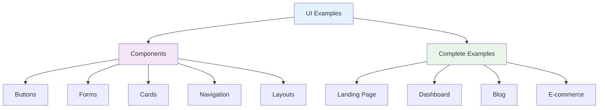

# 🎨 UI Examples

_Real-world component examples and complete page implementations using Tailwind CSS v4+_

---

## 🧭 Navigation

- [Components](./components/) - Individual component examples
- [Complete Examples](./complete-examples/) - Full page implementations

---

## 🎯 Overview

This section provides comprehensive UI examples that demonstrate how to build real-world components and pages using Tailwind CSS v4+. Each example includes code, explanations, and best practices.



---

## 🧩 Component Examples

### [Buttons](./components/buttons.md)

Learn how to create various button styles and states:

- Primary, secondary, and outline buttons
- Button sizes and variants
- Loading and disabled states
- Icon buttons and button groups

### [Forms](./components/forms.md)

Build comprehensive form components:

- Input fields and textareas
- Checkboxes and radio buttons
- Select dropdowns and file inputs
- Form validation and error states

### [Cards](./components/cards.md)

Create flexible card components:

- Basic and elevated cards
- Card headers and footers
- Image cards and product cards
- Interactive and hover effects

### [Navigation](./components/navigation.md)

Build responsive navigation systems:

- Header navigation bars
- Sidebar navigation
- Breadcrumb navigation
- Mobile menu implementations

### [Layouts](./components/layouts.md)

Design flexible layout systems:

- Grid and flexbox layouts
- Container and wrapper components
- Responsive layout patterns
- Spacing and alignment utilities

---

## 🏗️ Complete Examples

### [Landing Page](./complete-examples/landing-page.md)

A complete landing page implementation:

- Hero section with call-to-action
- Feature showcase grid
- Testimonials and social proof
- Footer with links and contact info

### [Dashboard](./complete-examples/dashboard.md)

A comprehensive dashboard layout:

- Sidebar navigation
- Main content area
- Data tables and charts
- User profile and settings

### [Blog](./complete-examples/blog.md)

A modern blog layout:

- Article listing and pagination
- Individual article pages
- Author profiles and social sharing
- Search and filtering functionality

---

## 🎨 Design System Integration

### Custom Utilities

All examples use custom utilities for consistency:

```css
@import "tailwindcss";

@utility btn {
  @apply px-4 py-2 rounded-lg font-medium transition-colors focus:outline-none focus:ring-2;
}

@utility btn-primary {
  @apply btn bg-blue-600 text-white hover:bg-blue-700 focus:ring-blue-500;
}

@utility card {
  @apply bg-white rounded-lg shadow-md p-6;
}

@utility container-responsive {
  @apply w-full max-w-7xl mx-auto px-4 sm:px-6 lg:px-8;
}
```

### Theme Configuration

Examples use a consistent theme:

```css
@import "tailwindcss";

@theme {
  --color-primary: #3b82f6;
  --color-secondary: #10b981;
  --color-accent: #f59e0b;
  --color-danger: #ef4444;
  --color-warning: #f59e0b;
  --color-success: #10b981;

  --font-display: "Inter", sans-serif;
  --font-body: "Inter", sans-serif;

  --spacing-section: 5rem;
  --spacing-container: 1.5rem;
  --spacing-card: 1.25rem;
}
```

---

## 🚀 Getting Started

### 1. **Choose Your Component**

Browse the component examples to find what you need:

- **Buttons** - For interactive elements
- **Forms** - For user input and data collection
- **Cards** - For content display and organization
- **Navigation** - For site structure and user flow
- **Layouts** - For page structure and spacing

### 2. **Copy and Customize**

Each example includes:

- **Complete HTML/JSX code**
- **CSS configuration**
- **Responsive design patterns**
- **Accessibility considerations**
- **Customization options**

### 3. **Integrate with Your Project**

Examples are designed to work with:

- **React/Vue/Svelte** - Component-based frameworks
- **Next.js** - Full-stack React applications
- **HTML** - Static websites and prototypes

---

## 🎯 Best Practices

### 1. **Consistent Design**

```html
<!-- Use consistent spacing and colors -->
<div class="container-responsive">
  <div class="card">
    <h2 class="heading-2">Consistent Heading</h2>
    <p class="body-base">Consistent body text</p>
    <button class="btn-primary">Consistent Button</button>
  </div>
</div>
```

### 2. **Responsive Design**

```html
<!-- Mobile-first responsive design -->
<div
  class="
  grid grid-cols-1
  sm:grid-cols-2
  md:grid-cols-3
  lg:grid-cols-4
  gap-4
"
>
  <!-- Responsive grid items -->
</div>
```

### 3. **Accessibility**

```html
<!-- Accessible form elements -->
<label for="email" class="form-label">Email Address</label>
<input
  type="email"
  id="email"
  class="form-input"
  placeholder="Enter your email"
  required
  aria-describedby="email-error"
/>
<div id="email-error" class="form-error" role="alert">
  Please enter a valid email address
</div>
```

### 4. **Performance**

```html
<!-- Efficient class usage -->
<div class="bg-white rounded-lg shadow-md p-6">
  <!-- Use specific, necessary classes -->
</div>

<!-- Avoid redundant classes -->
<div class="bg-white bg-gray-100 rounded-lg shadow-md p-6 p-8">
  <!-- Don't use conflicting classes -->
</div>
```

---

## 🎨 Customization

### Color Themes

```css
@import "tailwindcss";

@theme {
  /* Light theme */
  --color-primary: #3b82f6;
  --color-secondary: #10b981;
  --color-background: #ffffff;
  --color-text: #111827;

  /* Dark theme */
  --color-primary-dark: #60a5fa;
  --color-secondary-dark: #34d399;
  --color-background-dark: #111827;
  --color-text-dark: #f9fafb;
}
```

### Spacing Scale

```css
@import "tailwindcss";

@theme {
  /* Custom spacing scale */
  --spacing-xs: 0.25rem; /* 4px */
  --spacing-sm: 0.5rem; /* 8px */
  --spacing-md: 1rem; /* 16px */
  --spacing-lg: 1.5rem; /* 24px */
  --spacing-xl: 2rem; /* 32px */
  --spacing-2xl: 3rem; /* 48px */
  --spacing-3xl: 4rem; /* 64px */
}
```

### Typography

```css
@import "tailwindcss";

@theme {
  /* Custom typography */
  --font-display: "Inter", sans-serif;
  --font-body: "Inter", sans-serif;
  --font-mono: "Fira Code", monospace;

  --font-size-hero: 4rem;
  --font-size-display: 3rem;
  --font-size-heading: 2rem;
  --font-size-body: 1rem;
  --font-size-caption: 0.875rem;
}
```

---

## 🚀 Next Steps

Ready to start building with UI examples:

1. **[Browse Components](./components/)** - Find the components you need
2. **[See Complete Examples](./complete-examples/)** - Get inspiration for full pages
3. **[Follow Best Practices](../5-best-practices/README.md)** - Learn production patterns
4. **[Explore Resources](../7-resources/README.md)** - Find tools and community help

---

**Ready to explore components?** 👉 **[Component Examples](./components/)**
