# Button Components

_Comprehensive button examples with various styles, states, and interactions using Tailwind CSS v4+_

---

## 🎯 Overview

Buttons are fundamental interactive elements in any user interface. This guide shows you how to create various button styles, states, and interactions using Tailwind CSS v4+ with custom utilities and variants.

```mermaid
flowchart TD
    A[Button Components] --> B[Basic Styles]
    A --> C[Button States]
    A --> D[Button Sizes]
    A --> E[Button Variants]
    A --> F[Interactive Effects]

    B --> B1[Primary Buttons]
    B --> B2[Secondary Buttons]
    B --> B3[Outline Buttons]
    B --> B4[Ghost Buttons]

    C --> C1[Default State]
    C --> C2[Hover State]
    C --> C3[Focus State]
    C --> C4[Active State]
    C --> C5[Disabled State]

    D --> D1[Small Buttons]
    D --> D2[Medium Buttons]
    D --> D3[Large Buttons]
    D --> D4[Extra Large Buttons]

    E --> E1[Icon Buttons]
    E --> E2[Button Groups]
    E --> E3[Loading Buttons]
    E --> E4[Toggle Buttons]

    F --> F1[Hover Effects]
    F --> F2[Focus Effects]
    F --> F3[Active Effects]
    F --> F4[Transition Effects]

    style A fill:#e3f2fd
    style B fill:#f3e5f5
    style C fill:#e8f5e8
    style D fill:#fff3e0
    style E fill:#fce4ec
    style F fill:#f1f8e9
```



---

## 🚀 Basic Button Styles

### Custom Button Utilities

```css
@import "tailwindcss";

@utility btn {
  @apply px-4 py-2 rounded-lg font-medium transition-colors focus:outline-none focus:ring-2;
}

@utility btn-primary {
  @apply btn bg-blue-600 text-white hover:bg-blue-700 focus:ring-blue-500;
}

@utility btn-secondary {
  @apply btn bg-gray-200 text-gray-900 hover:bg-gray-300 focus:ring-gray-500;
}

@utility btn-outline {
  @apply btn border border-gray-300 text-gray-700 hover:bg-gray-50 focus:ring-gray-500;
}

@utility btn-ghost {
  @apply btn text-gray-700 hover:bg-gray-100 focus:ring-gray-500;
}
```

### Basic Button Examples

```html
<!-- Primary Button -->
<button class="btn-primary">Primary Button</button>

<!-- Secondary Button -->
<button class="btn-secondary">Secondary Button</button>

<!-- Outline Button -->
<button class="btn-outline">Outline Button</button>

<!-- Ghost Button -->
<button class="btn-ghost">Ghost Button</button>
```

### Button with Custom Colors

```css
@import "tailwindcss";

@utility btn-success {
  @apply btn bg-green-600 text-white hover:bg-green-700 focus:ring-green-500;
}

@utility btn-warning {
  @apply btn bg-yellow-600 text-white hover:bg-yellow-700 focus:ring-yellow-500;
}

@utility btn-danger {
  @apply btn bg-red-600 text-white hover:bg-red-700 focus:ring-red-500;
}

@utility btn-info {
  @apply btn bg-cyan-600 text-white hover:bg-cyan-700 focus:ring-cyan-500;
}
```

```html
<!-- Success Button -->
<button class="btn-success">Success Button</button>

<!-- Warning Button -->
<button class="btn-warning">Warning Button</button>

<!-- Danger Button -->
<button class="btn-danger">Danger Button</button>

<!-- Info Button -->
<button class="btn-info">Info Button</button>
```

---

## 📏 Button Sizes

### Size Utilities

```css
@import "tailwindcss";

@utility btn-sm {
  @apply px-3 py-1.5 text-sm;
}

@utility btn-md {
  @apply px-4 py-2 text-base;
}

@utility btn-lg {
  @apply px-6 py-3 text-lg;
}

@utility btn-xl {
  @apply px-8 py-4 text-xl;
}
```

### Size Examples

```html
<!-- Small Button -->
<button class="btn-primary btn-sm">Small Button</button>

<!-- Medium Button (Default) -->
<button class="btn-primary btn-md">Medium Button</button>

<!-- Large Button -->
<button class="btn-primary btn-lg">Large Button</button>

<!-- Extra Large Button -->
<button class="btn-primary btn-xl">Extra Large Button</button>
```

### Responsive Button Sizes

```html
<!-- Responsive button sizes -->
<button
  class="
  btn-primary
  btn-sm
  sm:btn-md
  md:btn-lg
  lg:btn-xl
"
>
  Responsive Button
</button>
```

---

## 🎨 Button States

### Default State

```html
<!-- Default button state -->
<button class="btn-primary">Default Button</button>
```

### Hover State

```html
<!-- Button with hover effects -->
<button
  class="
  btn-primary
  hover:bg-blue-700
  hover:shadow-lg
  hover:scale-105
  transition-all duration-200
"
>
  Hover Button
</button>
```

### Focus State

```html
<!-- Button with focus effects -->
<button
  class="
  btn-primary
  focus:ring-2
  focus:ring-blue-500
  focus:ring-offset-2
  focus:outline-none
"
>
  Focus Button
</button>
```

### Active State

```html
<!-- Button with active effects -->
<button
  class="
  btn-primary
  active:bg-blue-800
  active:scale-95
  transition-all duration-100
"
>
  Active Button
</button>
```

### Disabled State

```html
<!-- Disabled button -->
<button
  class="
  btn-primary
  disabled:opacity-50
  disabled:cursor-not-allowed
  disabled:hover:bg-blue-600
"
  disabled
>
  Disabled Button
</button>
```

### Loading State

```html
<!-- Loading button -->
<button
  class="
  btn-primary
  opacity-50
  cursor-wait
  relative
"
  disabled
>
  <span class="mr-2">Loading...</span>
  <svg class="animate-spin h-4 w-4" fill="none" viewBox="0 0 24 24">
    <circle
      class="opacity-25"
      cx="12"
      cy="12"
      r="10"
      stroke="currentColor"
      stroke-width="4"
    ></circle>
    <path
      class="opacity-75"
      fill="currentColor"
      d="M4 12a8 8 0 018-8V0C5.373 0 0 5.373 0 12h4zm2 5.291A7.962 7.962 0 014 12H0c0 3.042 1.135 5.824 3 7.938l3-2.647z"
    ></path>
  </svg>
</button>
```

---

## 🎯 Button Variants

### Icon Buttons

```html
<!-- Icon button with text -->
<button class="btn-primary">
  <svg
    class="w-4 h-4 mr-2"
    fill="none"
    stroke="currentColor"
    viewBox="0 0 24 24"
  >
    <path
      stroke-linecap="round"
      stroke-linejoin="round"
      stroke-width="2"
      d="M12 4v16m8-8H4"
    ></path>
  </svg>
  Add Item
</button>

<!-- Icon-only button -->
<button
  class="
  btn-ghost
  p-2
  rounded-full
  hover:bg-gray-100
  focus:ring-2
  focus:ring-gray-500
"
>
  <svg class="w-5 h-5" fill="none" stroke="currentColor" viewBox="0 0 24 24">
    <path
      stroke-linecap="round"
      stroke-linejoin="round"
      stroke-width="2"
      d="M12 4v16m8-8H4"
    ></path>
  </svg>
</button>

<!-- Floating action button -->
<button
  class="
  bg-blue-600
  text-white
  p-4
  rounded-full
  shadow-lg
  hover:bg-blue-700
  hover:shadow-xl
  focus:ring-2
  focus:ring-blue-500
  focus:ring-offset-2
  transition-all duration-200
"
>
  <svg class="w-6 h-6" fill="none" stroke="currentColor" viewBox="0 0 24 24">
    <path
      stroke-linecap="round"
      stroke-linejoin="round"
      stroke-width="2"
      d="M12 4v16m8-8H4"
    ></path>
  </svg>
</button>
```

### Button Groups

```html
<!-- Horizontal button group -->
<div class="flex space-x-2">
  <button class="btn-primary">First</button>
  <button class="btn-secondary">Second</button>
  <button class="btn-outline">Third</button>
</div>

<!-- Vertical button group -->
<div class="flex flex-col space-y-2">
  <button class="btn-primary">First</button>
  <button class="btn-secondary">Second</button>
  <button class="btn-outline">Third</button>
</div>

<!-- Segmented button group -->
<div class="flex">
  <button
    class="
    px-4 py-2
    border border-gray-300
    bg-white
    text-gray-700
    hover:bg-gray-50
    focus:ring-2
    focus:ring-blue-500
    focus:outline-none
    rounded-l-lg
  "
  >
    First
  </button>
  <button
    class="
    px-4 py-2
    border-t border-b border-gray-300
    bg-white
    text-gray-700
    hover:bg-gray-50
    focus:ring-2
    focus:ring-blue-500
    focus:outline-none
  "
  >
    Second
  </button>
  <button
    class="
    px-4 py-2
    border border-gray-300
    bg-white
    text-gray-700
    hover:bg-gray-50
    focus:ring-2
    focus:ring-blue-500
    focus:outline-none
    rounded-r-lg
  "
  >
    Third
  </button>
</div>
```

### Toggle Buttons

```html
<!-- Toggle button -->
<button
  class="
  px-4 py-2
  rounded-lg
  font-medium
  transition-colors
  focus:outline-none
  focus:ring-2
  focus:ring-blue-500
  bg-gray-200
  text-gray-700
  hover:bg-gray-300
  data-[state=active]:bg-blue-600
  data-[state=active]:text-white
  data-[state=active]:hover:bg-blue-700
"
  data-state="inactive"
>
  Toggle Button
</button>

<!-- Checkbox-style toggle -->
<button
  class="
  relative
  inline-flex
  h-6
  w-11
  items-center
  rounded-full
  bg-gray-200
  transition-colors
  focus:outline-none
  focus:ring-2
  focus:ring-blue-500
  focus:ring-offset-2
  data-[state=active]:bg-blue-600
"
  data-state="inactive"
>
  <span
    class="
    inline-block
    h-4
    w-4
    transform
    rounded-full
    bg-white
    transition-transform
    translate-x-1
    data-[state=active]:translate-x-6
  "
    data-state="inactive"
  ></span>
</button>
```

---

## 🎨 Interactive Effects

### Hover Effects

```html
<!-- Button with hover effects -->
<button
  class="
  btn-primary
  hover:bg-blue-700
  hover:shadow-lg
  hover:scale-105
  hover:-translate-y-1
  transition-all duration-200
"
>
  Hover Effects
</button>

<!-- Button with glow effect -->
<button
  class="
  btn-primary
  hover:shadow-lg
  hover:shadow-blue-500/50
  transition-all duration-200
"
>
  Glow Effect
</button>

<!-- Button with border animation -->
<button
  class="
  btn-outline
  relative
  overflow-hidden
  hover:border-blue-500
  hover:text-blue-600
  transition-all duration-200
"
>
  <span class="relative z-10">Border Animation</span>
  <div
    class="
    absolute
    inset-0
    bg-blue-500
    transform
    scale-x-0
    hover:scale-x-100
    transition-transform
    duration-200
    origin-left
  "
  ></div>
</button>
```

### Focus Effects

```html
<!-- Button with focus effects -->
<button
  class="
  btn-primary
  focus:ring-2
  focus:ring-blue-500
  focus:ring-offset-2
  focus:outline-none
  focus:scale-105
  transition-all duration-200
"
>
  Focus Effects
</button>

<!-- Button with focus glow -->
<button
  class="
  btn-primary
  focus:ring-2
  focus:ring-blue-500
  focus:ring-offset-2
  focus:outline-none
  focus:shadow-lg
  focus:shadow-blue-500/50
  transition-all duration-200
"
>
  Focus Glow
</button>
```

### Active Effects

```html
<!-- Button with active effects -->
<button
  class="
  btn-primary
  active:bg-blue-800
  active:scale-95
  active:shadow-inner
  transition-all duration-100
"
>
  Active Effects
</button>

<!-- Button with ripple effect -->
<button
  class="
  btn-primary
  relative
  overflow-hidden
  active:scale-95
  transition-all duration-100
"
>
  <span class="relative z-10">Ripple Effect</span>
  <div
    class="
    absolute
    inset-0
    bg-white
    opacity-0
    active:opacity-20
    transition-opacity
    duration-100
  "
  ></div>
</button>
```

---

## 🎯 Best Practices

### 1. **Consistent Styling**

```html
<!-- Good: Consistent button styling -->
<button class="btn-primary">Primary Action</button>
<button class="btn-secondary">Secondary Action</button>
<button class="btn-outline">Tertiary Action</button>

<!-- Avoid: Inconsistent styling -->
<button class="bg-blue-600 text-white px-4 py-2 rounded">Primary</button>
<button class="bg-gray-200 text-gray-900 px-3 py-1.5 rounded-md">
  Secondary
</button>
<button class="border border-gray-300 text-gray-700 px-5 py-2.5 rounded-lg">
  Tertiary
</button>
```

### 2. **Accessibility**

```html
<!-- Good: Accessible button -->
<button class="
  btn-primary
  focus:ring-2
  focus:ring-blue-500
  focus:ring-offset-2
  focus:outline-none
  aria-label="Add new item"
">
  <svg class="w-4 h-4" fill="none" stroke="currentColor" viewBox="0 0 24 24">
    <path stroke-linecap="round" stroke-linejoin="round" stroke-width="2" d="M12 4v16m8-8H4"></path>
  </svg>
</button>

<!-- Avoid: Inaccessible button -->
<button class="btn-primary">
  <svg class="w-4 h-4" fill="none" stroke="currentColor" viewBox="0 0 24 24">
    <path stroke-linecap="round" stroke-linejoin="round" stroke-width="2" d="M12 4v16m8-8H4"></path>
  </svg>
</button>
```

### 3. **Performance**

```html
<!-- Good: Efficient button classes -->
<button class="btn-primary">Efficient Button</button>

<!-- Avoid: Redundant button classes -->
<button
  class="
  btn-primary
  bg-blue-600
  text-white
  px-4
  py-2
  rounded-lg
  font-medium
  transition-colors
  focus:outline-none
  focus:ring-2
  hover:bg-blue-700
  focus:ring-blue-500
"
>
  Redundant Button
</button>
```

### 4. **Responsive Design**

```html
<!-- Good: Responsive button -->
<button
  class="
  btn-primary
  btn-sm
  sm:btn-md
  md:btn-lg
  w-full
  sm:w-auto
"
>
  Responsive Button
</button>

<!-- Avoid: Fixed button -->
<button class="btn-primary btn-lg w-32">Fixed Button</button>
```

---

## 🚀 Next Steps

Now that you understand button components:

1. **[Form Components](./forms.md)** - Learn about form inputs and validation
2. **[Card Components](./cards.md)** - Create flexible content containers
3. **[Navigation Components](./navigation.md)** - Build responsive navigation systems
4. **[Layout Components](./layouts.md)** - Design flexible layout systems

---

**Ready to explore form components?** 👉 **[Form Components Guide](./forms.md)**

