# Card Components

_Flexible card components for content display and organization using Tailwind CSS v4+_

---

## 🎯 Overview

Cards are versatile components for displaying content in organized, visually appealing containers. This guide shows you how to create various card styles, layouts, and interactions using Tailwind CSS v4+.

```mermaid
flowchart TD
    A[Card Components] --> B[Basic Cards]
    A --> C[Card Variants]
    A --> D[Card Layouts]
    A --> E[Interactive Cards]
    A --> F[Card Content]

    B --> B1[Simple Cards]
    B --> B2[Elevated Cards]
    B --> B3[Outlined Cards]
    B --> B4[Filled Cards]

    C --> C1[Product Cards]
    C --> C2[Profile Cards]
    C --> C3[Feature Cards]
    C --> C4[Testimonial Cards]

    D --> D1[Card Headers]
    D --> D2[Card Bodies]
    D --> D3[Card Footers]
    D --> D4[Card Images]

    E --> E1[Hover Effects]
    E --> E2[Click Effects]
    E --> E3[Focus States]
    E --> E4[Loading States]

    F --> F1[Text Content]
    F --> F2[Image Content]
    F --> F3[Action Buttons]
    F --> F4[Metadata]

    style A fill:#e3f2fd
    style B fill:#f3e5f5
    style C fill:#e8f5e8
    style D fill:#fff3e0
    style E fill:#fce4ec
    style F fill:#f1f8e9
```



---

## 🚀 Basic Card Styles

### Custom Card Utilities

```css
@import "tailwindcss";

@utility card {
  @apply bg-white rounded-lg shadow-md p-6;
}

@utility card-elevated {
  @apply card shadow-lg hover:shadow-xl transition-shadow;
}

@utility card-outlined {
  @apply bg-white border border-gray-200 rounded-lg p-6;
}

@utility card-filled {
  @apply bg-gray-50 rounded-lg p-6;
}

@utility card-header {
  @apply mb-4;
}

@utility card-body {
  @apply mb-4;
}

@utility card-footer {
  @apply mt-4 pt-4 border-t border-gray-200;
}
```

### Basic Card Examples

```html
<!-- Simple Card -->
<div class="card">
  <h3 class="text-lg font-semibold text-gray-900 mb-2">Card Title</h3>
  <p class="text-gray-600">This is a simple card with basic content.</p>
</div>

<!-- Elevated Card -->
<div class="card-elevated">
  <h3 class="text-lg font-semibold text-gray-900 mb-2">Elevated Card</h3>
  <p class="text-gray-600">This card has enhanced shadow and hover effects.</p>
</div>

<!-- Outlined Card -->
<div class="card-outlined">
  <h3 class="text-lg font-semibold text-gray-900 mb-2">Outlined Card</h3>
  <p class="text-gray-600">This card uses a border instead of shadow.</p>
</div>

<!-- Filled Card -->
<div class="card-filled">
  <h3 class="text-lg font-semibold text-gray-900 mb-2">Filled Card</h3>
  <p class="text-gray-600">This card has a background color.</p>
</div>
```

---

## 🎨 Card Variants

### Product Cards

```html
<!-- Product Card -->
<div class="card-elevated max-w-sm">
  <div class="aspect-square bg-gray-200 rounded-lg mb-4">
    <!-- Product image placeholder -->
  </div>

  <div class="card-header">
    <h3 class="text-lg font-semibold text-gray-900">Product Name</h3>
    <p class="text-gray-600 text-sm">Product description goes here.</p>
  </div>

  <div class="card-body">
    <div class="flex items-center justify-between">
      <span class="text-2xl font-bold text-gray-900">$99.99</span>
      <div class="flex items-center">
        <svg
          class="w-4 h-4 text-yellow-400"
          fill="currentColor"
          viewBox="0 0 20 20"
        >
          <path
            d="M9.049 2.927c.3-.921 1.603-.921 1.902 0l1.07 3.292a1 1 0 00.95.69h3.462c.969 0 1.371 1.24.588 1.81l-2.8 2.034a1 1 0 00-.364 1.118l1.07 3.292c.3.921-.755 1.688-1.54 1.118l-2.8-2.034a1 1 0 00-1.175 0l-2.8 2.034c-.784.57-1.838-.197-1.539-1.118l1.07-3.292a1 1 0 00-.364-1.118L2.98 8.72c-.783-.57-.38-1.81.588-1.81h3.461a1 1 0 00.951-.69l1.07-3.292z"
          ></path>
        </svg>
        <span class="text-sm text-gray-600 ml-1">4.5</span>
      </div>
    </div>
  </div>

  <div class="card-footer">
    <button class="btn-primary w-full">Add to Cart</button>
  </div>
</div>
```

### Profile Cards

```html
<!-- Profile Card -->
<div class="card-elevated max-w-sm text-center">
  <div class="card-header">
    <div class="w-20 h-20 bg-gray-300 rounded-full mx-auto mb-4">
      <!-- Profile image placeholder -->
    </div>
    <h3 class="text-xl font-semibold text-gray-900">John Doe</h3>
    <p class="text-gray-600">Software Developer</p>
  </div>

  <div class="card-body">
    <p class="text-gray-600 text-sm mb-4">
      Passionate about building amazing web experiences with modern
      technologies.
    </p>

    <div class="flex justify-center space-x-4">
      <a href="#" class="text-blue-600 hover:text-blue-700">
        <svg class="w-5 h-5" fill="currentColor" viewBox="0 0 20 20">
          <path
            fill-rule="evenodd"
            d="M20 10C20 4.477 15.523 0 10 0S0 4.477 0 10c0 4.991 3.657 9.128 8.438 9.878v-6.987h-2.54V10h2.54V7.797c0-2.506 1.492-3.89 3.777-3.89 1.094 0 2.238.195 2.238.195v2.46h-1.26c-1.243 0-1.63.771-1.63 1.562V10h2.773l-.443 2.89h-2.33v6.988C16.343 19.128 20 14.991 20 10z"
            clip-rule="evenodd"
          ></path>
        </svg>
      </a>
      <a href="#" class="text-blue-600 hover:text-blue-700">
        <svg class="w-5 h-5" fill="currentColor" viewBox="0 0 20 20">
          <path
            d="M6.29 18.251c7.547 0 11.675-6.253 11.675-11.675 0-.178 0-.355-.012-.53A8.348 8.348 0 0020 3.92a8.19 8.19 0 01-2.357.646 4.118 4.118 0 001.804-2.27 8.224 8.224 0 01-2.605.996 4.107 4.107 0 00-6.993 3.743 11.65 11.65 0 01-8.457-4.287 4.106 4.106 0 001.27 5.477A4.073 4.073 0 01.8 7.713v.052a4.105 4.105 0 003.292 4.022 4.095 4.095 0 01-1.853.07 4.108 4.108 0 003.834 2.85A8.233 8.233 0 010 16.407a11.616 11.616 0 006.29 1.84"
          ></path>
        </svg>
      </a>
      <a href="#" class="text-blue-600 hover:text-blue-700">
        <svg class="w-5 h-5" fill="currentColor" viewBox="0 0 20 20">
          <path
            fill-rule="evenodd"
            d="M16.338 16.338H13.67V12.16c0-.995-.017-2.277-1.387-2.277-1.39 0-1.601 1.086-1.601 2.207v4.248H8.014v-8.59h2.559v1.174h.037c.356-.675 1.227-1.387 2.526-1.387 2.703 0 3.203 1.778 3.203 4.092v4.711zM5.005 6.575a1.548 1.548 0 11-.003-3.096 1.548 1.548 0 01.003 3.096zm-1.337 9.763H6.34v-8.59H3.667v8.59zM17.668 1H2.328C1.595 1 1 1.581 1 2.298v15.403C1 18.418 1.595 19 2.328 19h15.34c.734 0 1.332-.582 1.332-1.299V2.298C19 1.581 18.402 1 17.668 1z"
            clip-rule="evenodd"
          ></path>
        </svg>
      </a>
    </div>
  </div>
</div>
```

### Feature Cards

```html
<!-- Feature Card -->
<div class="card-elevated text-center">
  <div class="card-header">
    <div
      class="w-12 h-12 bg-blue-100 rounded-lg mx-auto mb-4 flex items-center justify-center"
    >
      <svg
        class="w-6 h-6 text-blue-600"
        fill="none"
        stroke="currentColor"
        viewBox="0 0 24 24"
      >
        <path
          stroke-linecap="round"
          stroke-linejoin="round"
          stroke-width="2"
          d="M13 10V3L4 14h7v7l9-11h-7z"
        ></path>
      </svg>
    </div>
    <h3 class="text-xl font-semibold text-gray-900">Fast Performance</h3>
  </div>

  <div class="card-body">
    <p class="text-gray-600">
      Built with modern technologies for lightning-fast performance and optimal
      user experience.
    </p>
  </div>
</div>
```

### Testimonial Cards

```html
<!-- Testimonial Card -->
<div class="card-elevated max-w-md">
  <div class="card-body">
    <div class="flex items-center mb-4">
      <svg
        class="w-5 h-5 text-yellow-400"
        fill="currentColor"
        viewBox="0 0 20 20"
      >
        <path
          d="M9.049 2.927c.3-.921 1.603-.921 1.902 0l1.07 3.292a1 1 0 00.95.69h3.462c.969 0 1.371 1.24.588 1.81l-2.8 2.034a1 1 0 00-.364 1.118l1.07 3.292c.3.921-.755 1.688-1.54 1.118l-2.8-2.034a1 1 0 00-1.175 0l-2.8 2.034c-.784.57-1.838-.197-1.539-1.118l1.07-3.292a1 1 0 00-.364-1.118L2.98 8.72c-.783-.57-.38-1.81.588-1.81h3.461a1 1 0 00.951-.69l1.07-3.292z"
        ></path>
      </svg>
      <svg
        class="w-5 h-5 text-yellow-400"
        fill="currentColor"
        viewBox="0 0 20 20"
      >
        <path
          d="M9.049 2.927c.3-.921 1.603-.921 1.902 0l1.07 3.292a1 1 0 00.95.69h3.462c.969 0 1.371 1.24.588 1.81l-2.8 2.034a1 1 0 00-.364 1.118l1.07 3.292c.3.921-.755 1.688-1.54 1.118l-2.8-2.034a1 1 0 00-1.175 0l-2.8 2.034c-.784.57-1.838-.197-1.539-1.118l1.07-3.292a1 1 0 00-.364-1.118L2.98 8.72c-.783-.57-.38-1.81.588-1.81h3.461a1 1 0 00.951-.69l1.07-3.292z"
        ></path>
      </svg>
      <svg
        class="w-5 h-5 text-yellow-400"
        fill="currentColor"
        viewBox="0 0 20 20"
      >
        <path
          d="M9.049 2.927c.3-.921 1.603-.921 1.902 0l1.07 3.292a1 1 0 00.95.69h3.462c.969 0 1.371 1.24.588 1.81l-2.8 2.034a1 1 0 00-.364 1.118l1.07 3.292c.3.921-.755 1.688-1.54 1.118l-2.8-2.034a1 1 0 00-1.175 0l-2.8 2.034c-.784.57-1.838-.197-1.539-1.118l1.07-3.292a1 1 0 00-.364-1.118L2.98 8.72c-.783-.57-.38-1.81.588-1.81h3.461a1 1 0 00.951-.69l1.07-3.292z"
        ></path>
      </svg>
      <svg
        class="w-5 h-5 text-yellow-400"
        fill="currentColor"
        viewBox="0 0 20 20"
      >
        <path
          d="M9.049 2.927c.3-.921 1.603-.921 1.902 0l1.07 3.292a1 1 0 00.95.69h3.462c.969 0 1.371 1.24.588 1.81l-2.8 2.034a1 1 0 00-.364 1.118l1.07 3.292c.3.921-.755 1.688-1.54 1.118l-2.8-2.034a1 1 0 00-1.175 0l-2.8 2.034c-.784.57-1.838-.197-1.539-1.118l1.07-3.292a1 1 0 00-.364-1.118L2.98 8.72c-.783-.57-.38-1.81.588-1.81h3.461a1 1 0 00.951-.69l1.07-3.292z"
        ></path>
      </svg>
      <svg
        class="w-5 h-5 text-yellow-400"
        fill="currentColor"
        viewBox="0 0 20 20"
      >
        <path
          d="M9.049 2.927c.3-.921 1.603-.921 1.902 0l1.07 3.292a1 1 0 00.95.69h3.462c.969 0 1.371 1.24.588 1.81l-2.8 2.034a1 1 0 00-.364 1.118l1.07 3.292c.3.921-.755 1.688-1.54 1.118l-2.8-2.034a1 1 0 00-1.175 0l-2.8 2.034c-.784.57-1.838-.197-1.539-1.118l1.07-3.292a1 1 0 00-.364-1.118L2.98 8.72c-.783-.57-.38-1.81.588-1.81h3.461a1 1 0 00.951-.69l1.07-3.292z"
        ></path>
      </svg>
    </div>

    <blockquote class="text-gray-600 italic mb-4">
      "This product has completely transformed how we work. The interface is
      intuitive and the performance is outstanding."
    </blockquote>
  </div>

  <div class="card-footer">
    <div class="flex items-center">
      <div class="w-10 h-10 bg-gray-300 rounded-full mr-3">
        <!-- Author image placeholder -->
      </div>
      <div>
        <p class="text-sm font-semibold text-gray-900">Sarah Johnson</p>
        <p class="text-sm text-gray-600">CEO, TechCorp</p>
      </div>
    </div>
  </div>
</div>
```

---

## 🎨 Card Layouts

### Card with Header and Footer

```html
<!-- Card with Header and Footer -->
<div class="card-elevated">
  <div class="card-header">
    <h3 class="text-lg font-semibold text-gray-900">Card Title</h3>
    <p class="text-gray-600 text-sm">Card subtitle or description</p>
  </div>

  <div class="card-body">
    <p class="text-gray-600">
      This is the main content area of the card. It can contain any type of
      content including text, images, forms, or other components.
    </p>
  </div>

  <div class="card-footer">
    <div class="flex justify-between items-center">
      <span class="text-sm text-gray-500">Last updated 2 hours ago</span>
      <button class="btn-primary">Action</button>
    </div>
  </div>
</div>
```

### Card with Image

```html
<!-- Card with Image -->
<div class="card-elevated max-w-sm overflow-hidden">
  <div class="aspect-video bg-gray-200">
    <!-- Image placeholder -->
  </div>

  <div class="p-6">
    <div class="card-header">
      <h3 class="text-lg font-semibold text-gray-900">Image Card</h3>
      <p class="text-gray-600 text-sm">Card with image content</p>
    </div>

    <div class="card-body">
      <p class="text-gray-600">
        This card includes an image at the top with content below.
      </p>
    </div>

    <div class="card-footer">
      <button class="btn-primary w-full">View Details</button>
    </div>
  </div>
</div>
```

### Horizontal Card

```html
<!-- Horizontal Card -->
<div class="card-elevated max-w-2xl">
  <div class="flex">
    <div class="w-32 h-32 bg-gray-200 rounded-l-lg">
      <!-- Image placeholder -->
    </div>

    <div class="flex-1 p-6">
      <div class="card-header">
        <h3 class="text-lg font-semibold text-gray-900">Horizontal Card</h3>
        <p class="text-gray-600 text-sm">Card with horizontal layout</p>
      </div>

      <div class="card-body">
        <p class="text-gray-600">
          This card uses a horizontal layout with the image on the left and
          content on the right.
        </p>
      </div>

      <div class="card-footer">
        <button class="btn-primary">Learn More</button>
      </div>
    </div>
  </div>
</div>
```

---

## 🎯 Interactive Cards

### Hover Effects

```html
<!-- Card with Hover Effects -->
<div
  class="
  card-elevated
  cursor-pointer
  hover:shadow-2xl
  hover:scale-105
  hover:-translate-y-1
  transition-all duration-300
"
>
  <div class="card-header">
    <h3 class="text-lg font-semibold text-gray-900">Interactive Card</h3>
    <p class="text-gray-600 text-sm">Hover to see effects</p>
  </div>

  <div class="card-body">
    <p class="text-gray-600">
      This card has hover effects including shadow, scale, and translation.
    </p>
  </div>
</div>
```

### Click Effects

```html
<!-- Card with Click Effects -->
<div
  class="
  card-elevated
  cursor-pointer
  active:scale-95
  active:shadow-inner
  transition-all duration-100
"
>
  <div class="card-header">
    <h3 class="text-lg font-semibold text-gray-900">Clickable Card</h3>
    <p class="text-gray-600 text-sm">Click to see effects</p>
  </div>

  <div class="card-body">
    <p class="text-gray-600">
      This card has click effects including scale and shadow changes.
    </p>
  </div>
</div>
```

### Focus States

```html
<!-- Card with Focus States -->
<div
  class="
  card-elevated
  cursor-pointer
  focus:ring-2
  focus:ring-blue-500
  focus:ring-offset-2
  focus:outline-none
  transition-all duration-200
"
  tabindex="0"
>
  <div class="card-header">
    <h3 class="text-lg font-semibold text-gray-900">Focusable Card</h3>
    <p class="text-gray-600 text-sm">Focus to see effects</p>
  </div>

  <div class="card-body">
    <p class="text-gray-600">
      This card has focus states for keyboard navigation.
    </p>
  </div>
</div>
```

### Loading States

```html
<!-- Card with Loading State -->
<div class="card-elevated">
  <div class="card-header">
    <h3 class="text-lg font-semibold text-gray-900">Loading Card</h3>
    <p class="text-gray-600 text-sm">Card with loading state</p>
  </div>

  <div class="card-body">
    <div class="animate-pulse">
      <div class="h-4 bg-gray-200 rounded w-3/4 mb-2"></div>
      <div class="h-4 bg-gray-200 rounded w-1/2 mb-2"></div>
      <div class="h-4 bg-gray-200 rounded w-5/6"></div>
    </div>
  </div>

  <div class="card-footer">
    <div class="animate-pulse">
      <div class="h-8 bg-gray-200 rounded w-24"></div>
    </div>
  </div>
</div>
```

---

## 🎨 Card Grids

### Responsive Card Grid

```html
<!-- Responsive Card Grid -->
<div
  class="
  grid
  grid-cols-1
  sm:grid-cols-2
  md:grid-cols-3
  lg:grid-cols-4
  gap-6
"
>
  <div class="card-elevated">
    <div class="card-header">
      <h3 class="text-lg font-semibold text-gray-900">Card 1</h3>
    </div>
    <div class="card-body">
      <p class="text-gray-600">Content for card 1</p>
    </div>
  </div>

  <div class="card-elevated">
    <div class="card-header">
      <h3 class="text-lg font-semibold text-gray-900">Card 2</h3>
    </div>
    <div class="card-body">
      <p class="text-gray-600">Content for card 2</p>
    </div>
  </div>

  <div class="card-elevated">
    <div class="card-header">
      <h3 class="text-lg font-semibold text-gray-900">Card 3</h3>
    </div>
    <div class="card-body">
      <p class="text-gray-600">Content for card 3</p>
    </div>
  </div>

  <div class="card-elevated">
    <div class="card-header">
      <h3 class="text-lg font-semibold text-gray-900">Card 4</h3>
    </div>
    <div class="card-body">
      <p class="text-gray-600">Content for card 4</p>
    </div>
  </div>
</div>
```

### Masonry Card Layout

```html
<!-- Masonry Card Layout -->
<div
  class="
  columns-1
  sm:columns-2
  md:columns-3
  lg:columns-4
  gap-6
  space-y-6
"
>
  <div class="card-elevated break-inside-avoid">
    <div class="card-header">
      <h3 class="text-lg font-semibold text-gray-900">Short Card</h3>
    </div>
    <div class="card-body">
      <p class="text-gray-600">This is a short card.</p>
    </div>
  </div>

  <div class="card-elevated break-inside-avoid">
    <div class="card-header">
      <h3 class="text-lg font-semibold text-gray-900">Medium Card</h3>
    </div>
    <div class="card-body">
      <p class="text-gray-600">
        This is a medium-length card with more content to demonstrate the
        masonry layout.
      </p>
    </div>
  </div>

  <div class="card-elevated break-inside-avoid">
    <div class="card-header">
      <h3 class="text-lg font-semibold text-gray-900">Long Card</h3>
    </div>
    <div class="card-body">
      <p class="text-gray-600">
        This is a longer card with more content to demonstrate how the masonry
        layout handles different card heights. It will flow naturally and create
        an interesting visual pattern.
      </p>
    </div>
  </div>
</div>
```

---

## 🎯 Best Practices

### 1. **Consistent Styling**

```html
<!-- Good: Consistent card styling -->
<div class="card-elevated">
  <div class="card-header">
    <h3 class="text-lg font-semibold text-gray-900">Card Title</h3>
  </div>
  <div class="card-body">
    <p class="text-gray-600">Card content</p>
  </div>
</div>

<!-- Avoid: Inconsistent card styling -->
<div class="bg-white rounded-lg shadow-md p-6">
  <h3 class="text-lg font-semibold text-gray-900 mb-2">Card Title</h3>
  <p class="text-gray-600">Card content</p>
</div>
```

### 2. **Accessibility**

```html
<!-- Good: Accessible card -->
<div
  class="
  card-elevated
  cursor-pointer
  focus:ring-2
  focus:ring-blue-500
  focus:ring-offset-2
  focus:outline-none
"
  tabindex="0"
  role="button"
  aria-label="View card details"
>
  <div class="card-header">
    <h3 class="text-lg font-semibold text-gray-900">Card Title</h3>
  </div>
  <div class="card-body">
    <p class="text-gray-600">Card content</p>
  </div>
</div>

<!-- Avoid: Inaccessible card -->
<div class="card-elevated cursor-pointer">
  <div class="card-header">
    <h3 class="text-lg font-semibold text-gray-900">Card Title</h3>
  </div>
  <div class="card-body">
    <p class="text-gray-600">Card content</p>
  </div>
</div>
```

### 3. **Performance**

```html
<!-- Good: Efficient card classes -->
<div class="card-elevated">
  <div class="card-header">
    <h3 class="text-lg font-semibold text-gray-900">Card Title</h3>
  </div>
  <div class="card-body">
    <p class="text-gray-600">Card content</p>
  </div>
</div>

<!-- Avoid: Redundant card classes -->
<div
  class="
  card-elevated
  bg-white
  rounded-lg
  shadow-lg
  p-6
  hover:shadow-xl
  transition-shadow
"
>
  <div class="card-header">
    <h3 class="text-lg font-semibold text-gray-900">Card Title</h3>
  </div>
  <div class="card-body">
    <p class="text-gray-600">Card content</p>
  </div>
</div>
```

### 4. **Responsive Design**

```html
<!-- Good: Responsive card -->
<div
  class="
  card-elevated
  max-w-sm
  sm:max-w-md
  md:max-w-lg
  lg:max-w-xl
"
>
  <div class="card-header">
    <h3 class="text-lg font-semibold text-gray-900">Responsive Card</h3>
  </div>
  <div class="card-body">
    <p class="text-gray-600">This card adapts to different screen sizes.</p>
  </div>
</div>

<!-- Avoid: Fixed card -->
<div class="card-elevated w-80">
  <div class="card-header">
    <h3 class="text-lg font-semibold text-gray-900">Fixed Card</h3>
  </div>
  <div class="card-body">
    <p class="text-gray-600">This card has a fixed width.</p>
  </div>
</div>
```

---

## 🚀 Next Steps

Now that you understand card components:

1. **[Navigation Components](./navigation.md)** - Build responsive navigation systems
2. **[Layout Components](./layouts.md)** - Design flexible layout systems
3. **[Complete Examples](../complete-examples/)** - See full page implementations
4. **[Best Practices](../5-best-practices/README.md)** - Learn production patterns

---

**Ready to explore navigation components?** 👉 **[Navigation Components Guide](./navigation.md)**

