# Form Components

_Comprehensive form examples with inputs, validation, and accessibility using Tailwind CSS v4+_

---

## 🎯 Overview

Forms are essential for user interaction and data collection. This guide shows you how to create comprehensive form components with proper validation, accessibility, and styling using Tailwind CSS v4+.

```mermaid
flowchart TD
    A[Form Components] --> B[Input Types]
    A --> C[Form Validation]
    A --> D[Form Layout]
    A --> E[Accessibility]
    A --> F[Interactive States]

    B --> B1[Text Inputs]
    B --> B2[Select Dropdowns]
    B --> B3[Checkboxes]
    B --> B4[Radio Buttons]
    B --> B5[File Inputs]
    B --> B6[Textareas]

    C --> C1[Client-side Validation]
    C --> C2[Server-side Validation]
    C --> C3[Error Messages]
    C --> C4[Success States]

    D --> D1[Form Groups]
    D --> D2[Form Layouts]
    D --> D3[Responsive Forms]
    D --> D4[Form Sections]

    E --> E1[Labels and Descriptions]
    E --> E2[Focus Management]
    E --> E3[Screen Reader Support]
    E --> E4[Keyboard Navigation]

    F --> F1[Focus States]
    F --> F2[Hover States]
    F --> F3[Active States]
    F --> F4[Disabled States]

    style A fill:#e3f2fd
    style B fill:#f3e5f5
    style C fill:#e8f5e8
    style D fill:#fff3e0
    style E fill:#fce4ec
    style F fill:#f1f8e9
```



---

## 🚀 Basic Form Elements

### Custom Form Utilities

```css
@import "tailwindcss";

@utility form-group {
  @apply space-y-2;
}

@utility form-label {
  @apply block text-sm font-medium text-gray-700;
}

@utility form-input {
  @apply w-full border border-gray-300 rounded-lg px-3 py-2 focus:border-blue-500 focus:ring-2 focus:ring-blue-200 focus:outline-none;
}

@utility form-textarea {
  @apply w-full border border-gray-300 rounded-lg px-3 py-2 focus:border-blue-500 focus:ring-2 focus:ring-blue-200 focus:outline-none resize-vertical;
}

@utility form-select {
  @apply w-full border border-gray-300 rounded-lg px-3 py-2 focus:border-blue-500 focus:ring-2 focus:ring-blue-200 focus:outline-none;
}

@utility form-error {
  @apply text-sm text-red-600;
}

@utility form-help {
  @apply text-sm text-gray-500;
}
```

### Basic Form Example

```html
<form class="space-y-6">
  <div class="form-group">
    <label for="email" class="form-label">Email Address</label>
    <input
      type="email"
      id="email"
      name="email"
      class="form-input"
      placeholder="Enter your email"
      required
    />
    <p class="form-help">We'll never share your email with anyone else.</p>
  </div>

  <div class="form-group">
    <label for="password" class="form-label">Password</label>
    <input
      type="password"
      id="password"
      name="password"
      class="form-input"
      placeholder="Enter your password"
      required
    />
  </div>

  <div class="form-group">
    <label for="message" class="form-label">Message</label>
    <textarea
      id="message"
      name="message"
      rows="4"
      class="form-textarea"
      placeholder="Enter your message"
    ></textarea>
  </div>

  <button type="submit" class="btn-primary w-full">Submit</button>
</form>
```

---

## 📝 Input Types

### Text Inputs

```html
<!-- Basic text input -->
<div class="form-group">
  <label for="name" class="form-label">Full Name</label>
  <input
    type="text"
    id="name"
    name="name"
    class="form-input"
    placeholder="Enter your full name"
    required
  />
</div>

<!-- Email input -->
<div class="form-group">
  <label for="email" class="form-label">Email Address</label>
  <input
    type="email"
    id="email"
    name="email"
    class="form-input"
    placeholder="Enter your email"
    required
  />
</div>

<!-- Password input -->
<div class="form-group">
  <label for="password" class="form-label">Password</label>
  <input
    type="password"
    id="password"
    name="password"
    class="form-input"
    placeholder="Enter your password"
    required
  />
</div>

<!-- Number input -->
<div class="form-group">
  <label for="age" class="form-label">Age</label>
  <input
    type="number"
    id="age"
    name="age"
    class="form-input"
    placeholder="Enter your age"
    min="18"
    max="100"
  />
</div>

<!-- URL input -->
<div class="form-group">
  <label for="website" class="form-label">Website</label>
  <input
    type="url"
    id="website"
    name="website"
    class="form-input"
    placeholder="https://example.com"
  />
</div>

<!-- Phone input -->
<div class="form-group">
  <label for="phone" class="form-label">Phone Number</label>
  <input
    type="tel"
    id="phone"
    name="phone"
    class="form-input"
    placeholder="+1 (555) 123-4567"
  />
</div>
```

### Select Dropdowns

```html
<!-- Basic select -->
<div class="form-group">
  <label for="country" class="form-label">Country</label>
  <select id="country" name="country" class="form-select" required>
    <option value="">Select a country</option>
    <option value="us">United States</option>
    <option value="ca">Canada</option>
    <option value="uk">United Kingdom</option>
    <option value="au">Australia</option>
  </select>
</div>

<!-- Multi-select -->
<div class="form-group">
  <label for="interests" class="form-label">Interests</label>
  <select id="interests" name="interests" class="form-select" multiple>
    <option value="technology">Technology</option>
    <option value="design">Design</option>
    <option value="business">Business</option>
    <option value="marketing">Marketing</option>
  </select>
</div>
```

### Checkboxes

```html
<!-- Single checkbox -->
<div class="form-group">
  <div class="flex items-center">
    <input
      type="checkbox"
      id="newsletter"
      name="newsletter"
      class="h-4 w-4 text-blue-600 border-gray-300 rounded focus:ring-blue-500"
    />
    <label for="newsletter" class="ml-2 text-sm text-gray-700">
      Subscribe to newsletter
    </label>
  </div>
</div>

<!-- Checkbox group -->
<div class="form-group">
  <fieldset>
    <legend class="form-label">Preferences</legend>
    <div class="space-y-2">
      <div class="flex items-center">
        <input
          type="checkbox"
          id="email-notifications"
          name="notifications"
          value="email"
          class="h-4 w-4 text-blue-600 border-gray-300 rounded focus:ring-blue-500"
        />
        <label for="email-notifications" class="ml-2 text-sm text-gray-700">
          Email notifications
        </label>
      </div>
      <div class="flex items-center">
        <input
          type="checkbox"
          id="sms-notifications"
          name="notifications"
          value="sms"
          class="h-4 w-4 text-blue-600 border-gray-300 rounded focus:ring-blue-500"
        />
        <label for="sms-notifications" class="ml-2 text-sm text-gray-700">
          SMS notifications
        </label>
      </div>
    </div>
  </fieldset>
</div>
```

### Radio Buttons

```html
<!-- Radio button group -->
<div class="form-group">
  <fieldset>
    <legend class="form-label">Gender</legend>
    <div class="space-y-2">
      <div class="flex items-center">
        <input
          type="radio"
          id="male"
          name="gender"
          value="male"
          class="h-4 w-4 text-blue-600 border-gray-300 focus:ring-blue-500"
        />
        <label for="male" class="ml-2 text-sm text-gray-700"> Male </label>
      </div>
      <div class="flex items-center">
        <input
          type="radio"
          id="female"
          name="gender"
          value="female"
          class="h-4 w-4 text-blue-600 border-gray-300 focus:ring-blue-500"
        />
        <label for="female" class="ml-2 text-sm text-gray-700"> Female </label>
      </div>
      <div class="flex items-center">
        <input
          type="radio"
          id="other"
          name="gender"
          value="other"
          class="h-4 w-4 text-blue-600 border-gray-300 focus:ring-blue-500"
        />
        <label for="other" class="ml-2 text-sm text-gray-700"> Other </label>
      </div>
    </div>
  </fieldset>
</div>
```

### File Inputs

```html
<!-- Basic file input -->
<div class="form-group">
  <label for="avatar" class="form-label">Profile Picture</label>
  <input
    type="file"
    id="avatar"
    name="avatar"
    accept="image/*"
    class="
      w-full
      border border-gray-300
      rounded-lg
      px-3 py-2
      focus:border-blue-500
      focus:ring-2
      focus:ring-blue-200
      focus:outline-none
      file:mr-4
      file:py-2
      file:px-4
      file:rounded-lg
      file:border-0
      file:text-sm
      file:font-medium
      file:bg-blue-50
      file:text-blue-700
      hover:file:bg-blue-100
    "
  />
</div>

<!-- Drag and drop file input -->
<div class="form-group">
  <label class="form-label">Upload Files</label>
  <div
    class="
    border-2 border-dashed border-gray-300
    rounded-lg
    p-6
    text-center
    hover:border-gray-400
    focus-within:border-blue-500
    focus-within:ring-2
    focus-within:ring-blue-200
    transition-colors
  "
  >
    <input type="file" id="files" name="files" multiple class="sr-only" />
    <label for="files" class="cursor-pointer">
      <svg
        class="mx-auto h-12 w-12 text-gray-400"
        fill="none"
        stroke="currentColor"
        viewBox="0 0 24 24"
      >
        <path
          stroke-linecap="round"
          stroke-linejoin="round"
          stroke-width="2"
          d="M7 16a4 4 0 01-.88-7.903A5 5 0 1115.9 6L16 6a5 5 0 011 9.9M15 13l-3-3m0 0l-3 3m3-3v12"
        ></path>
      </svg>
      <p class="mt-2 text-sm text-gray-600">
        <span class="font-medium text-blue-600 hover:text-blue-500">
          Click to upload
        </span>
        or drag and drop
      </p>
      <p class="text-xs text-gray-500">PNG, JPG, GIF up to 10MB</p>
    </label>
  </div>
</div>
```

### Textareas

```html
<!-- Basic textarea -->
<div class="form-group">
  <label for="message" class="form-label">Message</label>
  <textarea
    id="message"
    name="message"
    rows="4"
    class="form-textarea"
    placeholder="Enter your message"
  ></textarea>
</div>

<!-- Resizable textarea -->
<div class="form-group">
  <label for="description" class="form-label">Description</label>
  <textarea
    id="description"
    name="description"
    rows="6"
    class="
      w-full
      border border-gray-300
      rounded-lg
      px-3 py-2
      focus:border-blue-500
      focus:ring-2
      focus:ring-blue-200
      focus:outline-none
      resize-y
      min-h-[100px]
      max-h-[300px]
    "
    placeholder="Enter a detailed description"
  ></textarea>
</div>
```

---

## ✅ Form Validation

### Client-side Validation

```html
<!-- Form with validation -->
<form class="space-y-6" novalidate>
  <div class="form-group">
    <label for="email" class="form-label">Email Address</label>
    <input
      type="email"
      id="email"
      name="email"
      class="
        form-input
        invalid:border-red-500
        invalid:ring-red-200
        valid:border-green-500
        valid:ring-green-200
      "
      placeholder="Enter your email"
      required
      aria-describedby="email-error"
    />
    <div id="email-error" class="form-error" role="alert">
      Please enter a valid email address
    </div>
  </div>

  <div class="form-group">
    <label for="password" class="form-label">Password</label>
    <input
      type="password"
      id="password"
      name="password"
      class="
        form-input
        invalid:border-red-500
        invalid:ring-red-200
        valid:border-green-500
        valid:ring-green-200
      "
      placeholder="Enter your password"
      required
      minlength="8"
      aria-describedby="password-error"
    />
    <div id="password-error" class="form-error" role="alert">
      Password must be at least 8 characters long
    </div>
  </div>

  <button type="submit" class="btn-primary w-full">Submit</button>
</form>
```

### Validation States

```html
<!-- Success state -->
<div class="form-group">
  <label for="success-input" class="form-label">Success Input</label>
  <input
    type="text"
    id="success-input"
    name="success-input"
    class="
      form-input
      border-green-500
      ring-green-200
      bg-green-50
    "
    value="Valid input"
  />
  <div class="text-sm text-green-600">✓ This field is valid</div>
</div>

<!-- Error state -->
<div class="form-group">
  <label for="error-input" class="form-label">Error Input</label>
  <input
    type="text"
    id="error-input"
    name="error-input"
    class="
      form-input
      border-red-500
      ring-red-200
      bg-red-50
    "
    value="Invalid input"
  />
  <div class="form-error" role="alert">✗ This field has an error</div>
</div>

<!-- Warning state -->
<div class="form-group">
  <label for="warning-input" class="form-label">Warning Input</label>
  <input
    type="text"
    id="warning-input"
    name="warning-input"
    class="
      form-input
      border-yellow-500
      ring-yellow-200
      bg-yellow-50
    "
    value="Warning input"
  />
  <div class="text-sm text-yellow-600">⚠ This field has a warning</div>
</div>
```

---

## 🎨 Form Layouts

### Horizontal Layout

```html
<!-- Horizontal form layout -->
<form class="space-y-6">
  <div class="grid grid-cols-1 md:grid-cols-3 gap-4 items-center">
    <label for="name" class="form-label md:text-right">Full Name</label>
    <div class="md:col-span-2">
      <input
        type="text"
        id="name"
        name="name"
        class="form-input"
        placeholder="Enter your full name"
        required
      />
    </div>
  </div>

  <div class="grid grid-cols-1 md:grid-cols-3 gap-4 items-center">
    <label for="email" class="form-label md:text-right">Email Address</label>
    <div class="md:col-span-2">
      <input
        type="email"
        id="email"
        name="email"
        class="form-input"
        placeholder="Enter your email"
        required
      />
    </div>
  </div>

  <div class="grid grid-cols-1 md:grid-cols-3 gap-4 items-center">
    <label for="message" class="form-label md:text-right">Message</label>
    <div class="md:col-span-2">
      <textarea
        id="message"
        name="message"
        rows="4"
        class="form-textarea"
        placeholder="Enter your message"
      ></textarea>
    </div>
  </div>

  <div class="grid grid-cols-1 md:grid-cols-3 gap-4">
    <div></div>
    <div class="md:col-span-2">
      <button type="submit" class="btn-primary">Submit</button>
    </div>
  </div>
</form>
```

### Two-column Layout

```html
<!-- Two-column form layout -->
<form class="space-y-6">
  <div class="grid grid-cols-1 md:grid-cols-2 gap-6">
    <div class="form-group">
      <label for="firstName" class="form-label">First Name</label>
      <input
        type="text"
        id="firstName"
        name="firstName"
        class="form-input"
        placeholder="Enter your first name"
        required
      />
    </div>

    <div class="form-group">
      <label for="lastName" class="form-label">Last Name</label>
      <input
        type="text"
        id="lastName"
        name="lastName"
        class="form-input"
        placeholder="Enter your last name"
        required
      />
    </div>
  </div>

  <div class="form-group">
    <label for="email" class="form-label">Email Address</label>
    <input
      type="email"
      id="email"
      name="email"
      class="form-input"
      placeholder="Enter your email"
      required
    />
  </div>

  <div class="grid grid-cols-1 md:grid-cols-2 gap-6">
    <div class="form-group">
      <label for="phone" class="form-label">Phone Number</label>
      <input
        type="tel"
        id="phone"
        name="phone"
        class="form-input"
        placeholder="+1 (555) 123-4567"
      />
    </div>

    <div class="form-group">
      <label for="country" class="form-label">Country</label>
      <select id="country" name="country" class="form-select" required>
        <option value="">Select a country</option>
        <option value="us">United States</option>
        <option value="ca">Canada</option>
        <option value="uk">United Kingdom</option>
        <option value="au">Australia</option>
      </select>
    </div>
  </div>

  <button type="submit" class="btn-primary w-full md:w-auto">Submit</button>
</form>
```

### Form Sections

```html
<!-- Form with sections -->
<form class="space-y-8">
  <!-- Personal Information Section -->
  <div>
    <h3 class="text-lg font-semibold text-gray-900 mb-4">
      Personal Information
    </h3>
    <div class="space-y-4">
      <div class="grid grid-cols-1 md:grid-cols-2 gap-4">
        <div class="form-group">
          <label for="firstName" class="form-label">First Name</label>
          <input
            type="text"
            id="firstName"
            name="firstName"
            class="form-input"
            placeholder="Enter your first name"
            required
          />
        </div>

        <div class="form-group">
          <label for="lastName" class="form-label">Last Name</label>
          <input
            type="text"
            id="lastName"
            name="lastName"
            class="form-input"
            placeholder="Enter your last name"
            required
          />
        </div>
      </div>

      <div class="form-group">
        <label for="email" class="form-label">Email Address</label>
        <input
          type="email"
          id="email"
          name="email"
          class="form-input"
          placeholder="Enter your email"
          required
        />
      </div>
    </div>
  </div>

  <!-- Contact Information Section -->
  <div>
    <h3 class="text-lg font-semibold text-gray-900 mb-4">
      Contact Information
    </h3>
    <div class="space-y-4">
      <div class="form-group">
        <label for="phone" class="form-label">Phone Number</label>
        <input
          type="tel"
          id="phone"
          name="phone"
          class="form-input"
          placeholder="+1 (555) 123-4567"
        />
      </div>

      <div class="form-group">
        <label for="address" class="form-label">Address</label>
        <textarea
          id="address"
          name="address"
          rows="3"
          class="form-textarea"
          placeholder="Enter your address"
        ></textarea>
      </div>
    </div>
  </div>

  <!-- Preferences Section -->
  <div>
    <h3 class="text-lg font-semibold text-gray-900 mb-4">Preferences</h3>
    <div class="space-y-4">
      <div class="form-group">
        <fieldset>
          <legend class="form-label">Communication Preferences</legend>
          <div class="space-y-2">
            <div class="flex items-center">
              <input
                type="checkbox"
                id="email-notifications"
                name="notifications"
                value="email"
                class="h-4 w-4 text-blue-600 border-gray-300 rounded focus:ring-blue-500"
              />
              <label
                for="email-notifications"
                class="ml-2 text-sm text-gray-700"
              >
                Email notifications
              </label>
            </div>
            <div class="flex items-center">
              <input
                type="checkbox"
                id="sms-notifications"
                name="notifications"
                value="sms"
                class="h-4 w-4 text-blue-600 border-gray-300 rounded focus:ring-blue-500"
              />
              <label for="sms-notifications" class="ml-2 text-sm text-gray-700">
                SMS notifications
              </label>
            </div>
          </div>
        </fieldset>
      </div>
    </div>
  </div>

  <div class="flex justify-end">
    <button type="submit" class="btn-primary">Submit</button>
  </div>
</form>
```

---

## 🎯 Best Practices

### 1. **Accessibility**

```html
<!-- Good: Accessible form -->
<div class="form-group">
  <label for="email" class="form-label">Email Address</label>
  <input
    type="email"
    id="email"
    name="email"
    class="form-input"
    placeholder="Enter your email"
    required
    aria-describedby="email-error email-help"
  />
  <div id="email-error" class="form-error" role="alert">
    Please enter a valid email address
  </div>
  <div id="email-help" class="form-help">
    We'll never share your email with anyone else
  </div>
</div>

<!-- Avoid: Inaccessible form -->
<div class="form-group">
  <input
    type="email"
    name="email"
    class="form-input"
    placeholder="Enter your email"
  />
  <div class="form-error">Please enter a valid email address</div>
</div>
```

### 2. **Validation**

```html
<!-- Good: Proper validation -->
<input
  type="email"
  id="email"
  name="email"
  class="
    form-input
    invalid:border-red-500
    invalid:ring-red-200
    valid:border-green-500
    valid:ring-green-200
  "
  required
  aria-describedby="email-error"
/>

<!-- Avoid: No validation -->
<input type="email" id="email" name="email" class="form-input" />
```

### 3. **Consistent Styling**

```html
<!-- Good: Consistent form styling -->
<div class="form-group">
  <label for="name" class="form-label">Name</label>
  <input type="text" id="name" name="name" class="form-input" />
</div>

<div class="form-group">
  <label for="email" class="form-label">Email</label>
  <input type="email" id="email" name="email" class="form-input" />
</div>

<!-- Avoid: Inconsistent styling -->
<div class="form-group">
  <label for="name" class="block text-sm font-medium text-gray-700">Name</label>
  <input
    type="text"
    id="name"
    name="name"
    class="w-full border border-gray-300 rounded-lg px-3 py-2"
  />
</div>

<div class="form-group">
  <label for="email" class="form-label">Email</label>
  <input type="email" id="email" name="email" class="form-input" />
</div>
```

### 4. **Responsive Design**

```html
<!-- Good: Responsive form -->
<div class="grid grid-cols-1 md:grid-cols-2 gap-4">
  <div class="form-group">
    <label for="firstName" class="form-label">First Name</label>
    <input type="text" id="firstName" name="firstName" class="form-input" />
  </div>

  <div class="form-group">
    <label for="lastName" class="form-label">Last Name</label>
    <input type="text" id="lastName" name="lastName" class="form-input" />
  </div>
</div>

<!-- Avoid: Fixed form -->
<div class="grid grid-cols-2 gap-4">
  <div class="form-group">
    <label for="firstName" class="form-label">First Name</label>
    <input type="text" id="firstName" name="firstName" class="form-input" />
  </div>

  <div class="form-group">
    <label for="lastName" class="form-label">Last Name</label>
    <input type="text" id="lastName" name="lastName" class="form-input" />
  </div>
</div>
```

---

## 🚀 Next Steps

Now that you understand form components:

1. **[Card Components](./cards.md)** - Create flexible content containers
2. **[Navigation Components](./navigation.md)** - Build responsive navigation systems
3. **[Layout Components](./layouts.md)** - Design flexible layout systems
4. **[Complete Examples](../complete-examples/)** - See full page implementations

---

**Ready to explore card components?** 👉 **[Card Components Guide](./cards.md)**

