# Layout Components

_Flexible layout systems and container components using Tailwind CSS v4+_

---

## 🎯 Overview

Layout components provide the foundation for organizing content and creating responsive designs. This guide shows you how to build flexible layout systems, containers, and grid patterns using Tailwind CSS v4+.

```mermaid
flowchart TD
    A[Layout Components] --> B[Container Systems]
    A --> C[Grid Layouts]
    A --> D[Flexbox Layouts]
    A --> E[Spacing Systems]
    A --> F[Responsive Layouts]

    B --> B1[Fixed Containers]
    B --> B2[Fluid Containers]
    B --> B3[Responsive Containers]
    B --> B4[Container Queries]

    C --> C1[CSS Grid]
    C --> C2[Grid Templates]
    C --> C3[Grid Areas]
    C --> C4[Grid Gaps]

    D --> D1[Flex Direction]
    D --> D2[Flex Alignment]
    D --> D3[Flex Wrapping]
    D --> D4[Flex Growth]

    E --> E1[Padding Systems]
    E --> E2[Margin Systems]
    E --> E3[Gap Systems]
    E --> E4[Spacing Scale]

    F --> F1[Mobile First]
    F --> F2[Breakpoint Systems]
    F --> F3[Responsive Patterns]
    F --> F4[Adaptive Layouts]

    style A fill:#e3f2fd
    style B fill:#f3e5f5
    style C fill:#e8f5e8
    style D fill:#fff3e0
    style E fill:#fce4ec
    style F fill:#f1f8e9
```



---

## 🚀 Container Systems

### Custom Container Utilities

```css
@import "tailwindcss";

@utility container-responsive {
  @apply w-full max-w-7xl mx-auto px-4 sm:px-6 lg:px-8;
}

@utility container-content {
  @apply w-full max-w-4xl mx-auto px-4 sm:px-6 lg:px-8;
}

@utility container-narrow {
  @apply w-full max-w-2xl mx-auto px-4 sm:px-6 lg:px-8;
}

@utility container-wide {
  @apply w-full max-w-8xl mx-auto px-4 sm:px-6 lg:px-8;
}
```

### Basic Container Examples

```html
<!-- Responsive Container -->
<div class="container-responsive">
  <h1 class="text-3xl font-bold text-gray-900 mb-6">Page Title</h1>
  <p class="text-gray-600">Content goes here.</p>
</div>

<!-- Content Container -->
<div class="container-content">
  <article class="prose prose-lg">
    <h1>Article Title</h1>
    <p>Article content goes here.</p>
  </article>
</div>

<!-- Narrow Container -->
<div class="container-narrow">
  <form class="space-y-6">
    <div class="form-group">
      <label for="email" class="form-label">Email Address</label>
      <input
        type="email"
        id="email"
        class="form-input"
        placeholder="Enter your email"
      />
    </div>
    <button type="submit" class="btn-primary w-full">Submit</button>
  </form>
</div>

<!-- Wide Container -->
<div class="container-wide">
  <div
    class="grid grid-cols-1 md:grid-cols-2 lg:grid-cols-3 xl:grid-cols-4 gap-6"
  >
    <!-- Grid items -->
  </div>
</div>
```

### Container with Sections

```html
<!-- Container with Sections -->
<div class="container-responsive">
  <!-- Hero Section -->
  <section class="py-12 md:py-16 lg:py-20">
    <h1 class="text-4xl md:text-5xl lg:text-6xl font-bold text-gray-900 mb-6">
      Welcome to Our Website
    </h1>
    <p class="text-xl text-gray-600 mb-8">
      Discover amazing products and services that will transform your business.
    </p>
    <button class="btn-primary btn-lg">Get Started</button>
  </section>

  <!-- Features Section -->
  <section class="py-12 md:py-16 lg:py-20">
    <h2 class="text-3xl md:text-4xl font-bold text-gray-900 mb-8 text-center">
      Our Features
    </h2>
    <div class="grid grid-cols-1 md:grid-cols-2 lg:grid-cols-3 gap-8">
      <!-- Feature cards -->
    </div>
  </section>

  <!-- CTA Section -->
  <section class="py-12 md:py-16 lg:py-20 bg-gray-50 rounded-lg">
    <div class="text-center">
      <h2 class="text-3xl md:text-4xl font-bold text-gray-900 mb-4">
        Ready to Get Started?
      </h2>
      <p class="text-xl text-gray-600 mb-8">
        Join thousands of satisfied customers today.
      </p>
      <button class="btn-primary btn-lg">Sign Up Now</button>
    </div>
  </section>
</div>
```

---

## 🎨 Grid Layouts

### Basic Grid System

```html
<!-- Basic Grid System -->
<div class="container-responsive">
  <div class="grid grid-cols-1 md:grid-cols-2 lg:grid-cols-3 gap-6">
    <div class="card">
      <h3 class="text-lg font-semibold text-gray-900 mb-2">Grid Item 1</h3>
      <p class="text-gray-600">Content for grid item 1</p>
    </div>

    <div class="card">
      <h3 class="text-lg font-semibold text-gray-900 mb-2">Grid Item 2</h3>
      <p class="text-gray-600">Content for grid item 2</p>
    </div>

    <div class="card">
      <h3 class="text-lg font-semibold text-gray-900 mb-2">Grid Item 3</h3>
      <p class="text-gray-600">Content for grid item 3</p>
    </div>

    <div class="card">
      <h3 class="text-lg font-semibold text-gray-900 mb-2">Grid Item 4</h3>
      <p class="text-gray-600">Content for grid item 4</p>
    </div>

    <div class="card">
      <h3 class="text-lg font-semibold text-gray-900 mb-2">Grid Item 5</h3>
      <p class="text-gray-600">Content for grid item 5</p>
    </div>

    <div class="card">
      <h3 class="text-lg font-semibold text-gray-900 mb-2">Grid Item 6</h3>
      <p class="text-gray-600">Content for grid item 6</p>
    </div>
  </div>
</div>
```

### Grid with Different Sizes

```html
<!-- Grid with Different Sizes -->
<div class="container-responsive">
  <div class="grid grid-cols-1 md:grid-cols-2 lg:grid-cols-4 gap-6">
    <!-- Large item spanning 2 columns -->
    <div class="md:col-span-2 lg:col-span-2 card">
      <h3 class="text-xl font-semibold text-gray-900 mb-2">Featured Item</h3>
      <p class="text-gray-600">
        This is a featured item that spans two columns on medium and large
        screens.
      </p>
    </div>

    <!-- Regular items -->
    <div class="card">
      <h3 class="text-lg font-semibold text-gray-900 mb-2">Item 1</h3>
      <p class="text-gray-600">Content for item 1</p>
    </div>

    <div class="card">
      <h3 class="text-lg font-semibold text-gray-900 mb-2">Item 2</h3>
      <p class="text-gray-600">Content for item 2</p>
    </div>

    <!-- Full width item -->
    <div class="md:col-span-2 lg:col-span-4 card">
      <h3 class="text-xl font-semibold text-gray-900 mb-2">Full Width Item</h3>
      <p class="text-gray-600">This item spans the full width of the grid.</p>
    </div>
  </div>
</div>
```

### Grid with Auto-fit

```html
<!-- Grid with Auto-fit -->
<div class="container-responsive">
  <div class="grid grid-cols-[repeat(auto-fit,minmax(250px,1fr))] gap-6">
    <div class="card">
      <h3 class="text-lg font-semibold text-gray-900 mb-2">Auto-fit Item 1</h3>
      <p class="text-gray-600">Content for auto-fit item 1</p>
    </div>

    <div class="card">
      <h3 class="text-lg font-semibold text-gray-900 mb-2">Auto-fit Item 2</h3>
      <p class="text-gray-600">Content for auto-fit item 2</p>
    </div>

    <div class="card">
      <h3 class="text-lg font-semibold text-gray-900 mb-2">Auto-fit Item 3</h3>
      <p class="text-gray-600">Content for auto-fit item 3</p>
    </div>

    <div class="card">
      <h3 class="text-lg font-semibold text-gray-900 mb-2">Auto-fit Item 4</h3>
      <p class="text-gray-600">Content for auto-fit item 4</p>
    </div>
  </div>
</div>
```

### Grid with Areas

```html
<!-- Grid with Areas -->
<div class="container-responsive">
  <div class="grid grid-cols-1 lg:grid-cols-4 gap-6">
    <!-- Sidebar -->
    <aside class="lg:col-span-1">
      <div class="card">
        <h3 class="text-lg font-semibold text-gray-900 mb-4">Sidebar</h3>
        <nav class="space-y-2">
          <a href="#" class="block text-gray-600 hover:text-gray-900">Link 1</a>
          <a href="#" class="block text-gray-600 hover:text-gray-900">Link 2</a>
          <a href="#" class="block text-gray-600 hover:text-gray-900">Link 3</a>
        </nav>
      </div>
    </aside>

    <!-- Main Content -->
    <main class="lg:col-span-3">
      <div class="card">
        <h1 class="text-2xl font-bold text-gray-900 mb-4">Main Content</h1>
        <p class="text-gray-600 mb-4">
          This is the main content area. It takes up 3 columns on large screens
          and the full width on smaller screens.
        </p>
        <p class="text-gray-600">
          The sidebar is positioned to the left on large screens and above the
          main content on smaller screens.
        </p>
      </div>
    </main>
  </div>
</div>
```

---

## 🎯 Flexbox Layouts

### Basic Flexbox

```html
<!-- Basic Flexbox Layout -->
<div class="container-responsive">
  <div class="flex flex-col md:flex-row gap-6">
    <div class="flex-1">
      <div class="card">
        <h3 class="text-lg font-semibold text-gray-900 mb-2">Flex Item 1</h3>
        <p class="text-gray-600">This is the first flex item.</p>
      </div>
    </div>

    <div class="flex-1">
      <div class="card">
        <h3 class="text-lg font-semibold text-gray-900 mb-2">Flex Item 2</h3>
        <p class="text-gray-600">This is the second flex item.</p>
      </div>
    </div>

    <div class="flex-1">
      <div class="card">
        <h3 class="text-lg font-semibold text-gray-900 mb-2">Flex Item 3</h3>
        <p class="text-gray-600">This is the third flex item.</p>
      </div>
    </div>
  </div>
</div>
```

### Flexbox with Alignment

```html
<!-- Flexbox with Alignment -->
<div class="container-responsive">
  <div class="flex flex-col md:flex-row items-center justify-between gap-6">
    <div class="flex-1">
      <h2 class="text-2xl font-bold text-gray-900 mb-2">Left Content</h2>
      <p class="text-gray-600">This content is aligned to the left.</p>
    </div>

    <div class="flex-1 text-center">
      <h2 class="text-2xl font-bold text-gray-900 mb-2">Center Content</h2>
      <p class="text-gray-600">This content is centered.</p>
    </div>

    <div class="flex-1 text-right">
      <h2 class="text-2xl font-bold text-gray-900 mb-2">Right Content</h2>
      <p class="text-gray-600">This content is aligned to the right.</p>
    </div>
  </div>
</div>
```

### Flexbox with Wrapping

```html
<!-- Flexbox with Wrapping -->
<div class="container-responsive">
  <div class="flex flex-wrap gap-4">
    <div class="flex-1 min-w-[200px]">
      <div class="card">
        <h3 class="text-lg font-semibold text-gray-900 mb-2">
          Wrapping Item 1
        </h3>
        <p class="text-gray-600">
          This item will wrap to the next line if needed.
        </p>
      </div>
    </div>

    <div class="flex-1 min-w-[200px]">
      <div class="card">
        <h3 class="text-lg font-semibold text-gray-900 mb-2">
          Wrapping Item 2
        </h3>
        <p class="text-gray-600">
          This item will also wrap to the next line if needed.
        </p>
      </div>
    </div>

    <div class="flex-1 min-w-[200px]">
      <div class="card">
        <h3 class="text-lg font-semibold text-gray-900 mb-2">
          Wrapping Item 3
        </h3>
        <p class="text-gray-600">
          This item will wrap to the next line if needed.
        </p>
      </div>
    </div>

    <div class="flex-1 min-w-[200px]">
      <div class="card">
        <h3 class="text-lg font-semibold text-gray-900 mb-2">
          Wrapping Item 4
        </h3>
        <p class="text-gray-600">
          This item will wrap to the next line if needed.
        </p>
      </div>
    </div>
  </div>
</div>
```

### Flexbox with Growth

```html
<!-- Flexbox with Growth -->
<div class="container-responsive">
  <div class="flex gap-6">
    <div class="flex-1">
      <div class="card">
        <h3 class="text-lg font-semibold text-gray-900 mb-2">Flex Item 1</h3>
        <p class="text-gray-600">This item grows to fill available space.</p>
      </div>
    </div>

    <div class="flex-2">
      <div class="card">
        <h3 class="text-lg font-semibold text-gray-900 mb-2">Flex Item 2</h3>
        <p class="text-gray-600">
          This item grows twice as much as the first item.
        </p>
      </div>
    </div>

    <div class="flex-none w-48">
      <div class="card">
        <h3 class="text-lg font-semibold text-gray-900 mb-2">Fixed Item</h3>
        <p class="text-gray-600">This item has a fixed width.</p>
      </div>
    </div>
  </div>
</div>
```

---

## 📏 Spacing Systems

### Padding Systems

```html
<!-- Padding Systems -->
<div class="container-responsive">
  <!-- Section with consistent padding -->
  <section class="py-12 md:py-16 lg:py-20">
    <h2 class="text-3xl font-bold text-gray-900 mb-8 text-center">
      Section with Consistent Padding
    </h2>
    <p class="text-gray-600 text-center">
      This section uses consistent vertical padding that scales with screen
      size.
    </p>
  </section>

  <!-- Content with responsive padding -->
  <div class="px-4 sm:px-6 lg:px-8">
    <div class="bg-white rounded-lg shadow-md p-6 md:p-8 lg:p-10">
      <h3 class="text-xl font-semibold text-gray-900 mb-4">
        Responsive Padding
      </h3>
      <p class="text-gray-600">
        This content uses responsive padding that increases with screen size.
      </p>
    </div>
  </div>
</div>
```

### Margin Systems

```html
<!-- Margin Systems -->
<div class="container-responsive">
  <!-- Content with consistent margins -->
  <div class="mb-8 md:mb-12 lg:mb-16">
    <h2 class="text-3xl font-bold text-gray-900 mb-4">
      Content with Consistent Margins
    </h2>
    <p class="text-gray-600">
      This content uses consistent bottom margins that scale with screen size.
    </p>
  </div>

  <!-- Content with responsive margins -->
  <div class="mx-4 sm:mx-6 lg:mx-8">
    <div class="bg-white rounded-lg shadow-md p-6">
      <h3 class="text-xl font-semibold text-gray-900 mb-4">
        Responsive Margins
      </h3>
      <p class="text-gray-600">
        This content uses responsive horizontal margins that increase with
        screen size.
      </p>
    </div>
  </div>
</div>
```

### Gap Systems

```html
<!-- Gap Systems -->
<div class="container-responsive">
  <!-- Grid with consistent gaps -->
  <div
    class="grid grid-cols-1 md:grid-cols-2 lg:grid-cols-3 gap-4 md:gap-6 lg:gap-8"
  >
    <div class="card">
      <h3 class="text-lg font-semibold text-gray-900 mb-2">Grid Item 1</h3>
      <p class="text-gray-600">Content for grid item 1</p>
    </div>

    <div class="card">
      <h3 class="text-lg font-semibold text-gray-900 mb-2">Grid Item 2</h3>
      <p class="text-gray-600">Content for grid item 2</p>
    </div>

    <div class="card">
      <h3 class="text-lg font-semibold text-gray-900 mb-2">Grid Item 3</h3>
      <p class="text-gray-600">Content for grid item 3</p>
    </div>
  </div>

  <!-- Flexbox with consistent gaps -->
  <div class="flex flex-col md:flex-row gap-4 md:gap-6 lg:gap-8 mt-8">
    <div class="flex-1">
      <div class="card">
        <h3 class="text-lg font-semibold text-gray-900 mb-2">Flex Item 1</h3>
        <p class="text-gray-600">Content for flex item 1</p>
      </div>
    </div>

    <div class="flex-1">
      <div class="card">
        <h3 class="text-lg font-semibold text-gray-900 mb-2">Flex Item 2</h3>
        <p class="text-gray-600">Content for flex item 2</p>
      </div>
    </div>
  </div>
</div>
```

---

## 📱 Responsive Layouts

### Mobile-First Layout

```html
<!-- Mobile-First Layout -->
<div class="container-responsive">
  <!-- Mobile: Stack vertically, Desktop: Side by side -->
  <div class="flex flex-col lg:flex-row gap-6">
    <div class="flex-1">
      <div class="card">
        <h3 class="text-lg font-semibold text-gray-900 mb-2">Main Content</h3>
        <p class="text-gray-600">
          This content is stacked vertically on mobile and positioned side by
          side on desktop.
        </p>
      </div>
    </div>

    <div class="flex-1">
      <div class="card">
        <h3 class="text-lg font-semibold text-gray-900 mb-2">
          Sidebar Content
        </h3>
        <p class="text-gray-600">
          This sidebar content is below the main content on mobile and to the
          right on desktop.
        </p>
      </div>
    </div>
  </div>
</div>
```

### Breakpoint-Specific Layouts

```html
<!-- Breakpoint-Specific Layouts -->
<div class="container-responsive">
  <!-- Different layouts for different breakpoints -->
  <div
    class="
    grid
    grid-cols-1
    sm:grid-cols-2
    md:grid-cols-3
    lg:grid-cols-4
    xl:grid-cols-5
    gap-4
    sm:gap-6
    md:gap-8
  "
  >
    <div class="card">
      <h3 class="text-lg font-semibold text-gray-900 mb-2">Item 1</h3>
      <p class="text-gray-600">Content for item 1</p>
    </div>

    <div class="card">
      <h3 class="text-lg font-semibold text-gray-900 mb-2">Item 2</h3>
      <p class="text-gray-600">Content for item 2</p>
    </div>

    <div class="card">
      <h3 class="text-lg font-semibold text-gray-900 mb-2">Item 3</h3>
      <p class="text-gray-600">Content for item 3</p>
    </div>

    <div class="card">
      <h3 class="text-lg font-semibold text-gray-900 mb-2">Item 4</h3>
      <p class="text-gray-600">Content for item 4</p>
    </div>

    <div class="card">
      <h3 class="text-lg font-semibold text-gray-900 mb-2">Item 5</h3>
      <p class="text-gray-600">Content for item 5</p>
    </div>
  </div>
</div>
```

### Adaptive Layout

```html
<!-- Adaptive Layout -->
<div class="container-responsive">
  <!-- Layout that adapts to content -->
  <div
    class="
    grid
    grid-cols-1
    sm:grid-cols-2
    lg:grid-cols-3
    xl:grid-cols-4
    gap-6
    auto-rows-fr
  "
  >
    <div class="card">
      <h3 class="text-lg font-semibold text-gray-900 mb-2">Short Item</h3>
      <p class="text-gray-600">Short content.</p>
    </div>

    <div class="card">
      <h3 class="text-lg font-semibold text-gray-900 mb-2">Medium Item</h3>
      <p class="text-gray-600">
        This is a medium-length item with more content to demonstrate how the
        layout adapts.
      </p>
    </div>

    <div class="card">
      <h3 class="text-lg font-semibold text-gray-900 mb-2">Long Item</h3>
      <p class="text-gray-600">
        This is a longer item with more content to demonstrate how the layout
        adapts to different content lengths. It will flow naturally and create
        an interesting visual pattern.
      </p>
    </div>

    <div class="card">
      <h3 class="text-lg font-semibold text-gray-900 mb-2">
        Another Short Item
      </h3>
      <p class="text-gray-600">Another short content.</p>
    </div>
  </div>
</div>
```

---

## 🎯 Best Practices

### 1. **Consistent Spacing**

```html
<!-- Good: Consistent spacing -->
<div class="container-responsive">
  <section class="py-12 md:py-16 lg:py-20">
    <h2 class="text-3xl font-bold text-gray-900 mb-8">Section Title</h2>
    <div class="grid grid-cols-1 md:grid-cols-2 lg:grid-cols-3 gap-6">
      <!-- Grid items -->
    </div>
  </section>
</div>

<!-- Avoid: Inconsistent spacing -->
<div class="container-responsive">
  <section class="py-8 md:py-12 lg:py-16">
    <h2 class="text-3xl font-bold text-gray-900 mb-6">Section Title</h2>
    <div class="grid grid-cols-1 md:grid-cols-2 lg:grid-cols-3 gap-4">
      <!-- Grid items -->
    </div>
  </section>
</div>
```

### 2. **Responsive Design**

```html
<!-- Good: Mobile-first responsive design -->
<div
  class="
  grid
  grid-cols-1
  sm:grid-cols-2
  md:grid-cols-3
  lg:grid-cols-4
  gap-4
  sm:gap-6
  md:gap-8
"
>
  <!-- Grid items -->
</div>

<!-- Avoid: Desktop-first responsive design -->
<div
  class="
  grid
  grid-cols-4
  md:grid-cols-3
  sm:grid-cols-2
  grid-cols-1
  gap-8
  md:gap-6
  sm:gap-4
"
>
  <!-- Grid items -->
</div>
```

### 3. **Performance**

```html
<!-- Good: Efficient layout classes -->
<div class="container-responsive">
  <div class="grid grid-cols-1 md:grid-cols-2 lg:grid-cols-3 gap-6">
    <!-- Grid items -->
  </div>
</div>

<!-- Avoid: Redundant layout classes -->
<div
  class="
  container-responsive
  w-full
  max-w-7xl
  mx-auto
  px-4
  sm:px-6
  lg:px-8
"
>
  <div
    class="
    grid
    grid-cols-1
    md:grid-cols-2
    lg:grid-cols-3
    gap-6
    gap-x-6
    gap-y-6
  "
  >
    <!-- Grid items -->
  </div>
</div>
```

### 4. **Accessibility**

```html
<!-- Good: Accessible layout -->
<div class="container-responsive">
  <main>
    <h1 class="text-3xl font-bold text-gray-900 mb-6">Page Title</h1>
    <div class="grid grid-cols-1 md:grid-cols-2 lg:grid-cols-3 gap-6">
      <!-- Grid items -->
    </div>
  </main>
</div>

<!-- Avoid: Inaccessible layout -->
<div class="container-responsive">
  <div class="text-3xl font-bold text-gray-900 mb-6">Page Title</div>
  <div class="grid grid-cols-1 md:grid-cols-2 lg:grid-cols-3 gap-6">
    <!-- Grid items -->
  </div>
</div>
```

---

## 🚀 Next Steps

Now that you understand layout components:

1. **[Complete Examples](../complete-examples/)** - See full page implementations
2. **[Best Practices](../5-best-practices/README.md)** - Learn production patterns
3. **[Migration Guide](../6-migration/README.md)** - Upgrade from v3 to v4
4. **[Resources](../7-resources/README.md)** - Find tools and community help

---

**Ready to see complete examples?** 👉 **[Complete Examples Guide](../complete-examples/)**

