# Navigation Components

_Responsive navigation systems and menu implementations using Tailwind CSS v4+_

---

## 🎯 Overview

Navigation components are essential for user experience and site structure. This guide shows you how to create various navigation patterns, responsive menus, and interactive elements using Tailwind CSS v4+.

```mermaid
flowchart TD
    A[Navigation Components] --> B[Header Navigation]
    A --> C[Sidebar Navigation]
    A --> D[Mobile Navigation]
    A --> E[Breadcrumb Navigation]
    A --> F[Tab Navigation]

    B --> B1[Horizontal Navbar]
    B --> B2[Logo and Branding]
    B --> B3[Navigation Links]
    B --> B4[User Menu]

    C --> C1[Vertical Sidebar]
    C --> C2[Navigation Groups]
    C --> C3[Collapsible Sections]
    C --> C4[Active States]

    D --> D1[Hamburger Menu]
    D --> D2[Overlay Menu]
    D --> D3[Slide-out Menu]
    D --> D4[Full-screen Menu]

    E --> E1[Breadcrumb Trail]
    E --> E2[Separator Styles]
    E --> E3[Responsive Breadcrumbs]
    E --> E4[Interactive Breadcrumbs]

    F --> F1[Tab Headers]
    F --> F2[Tab Content]
    F --> F3[Tab States]
    F --> F4[Tab Navigation]

    style A fill:#e3f2fd
    style B fill:#f3e5f5
    style C fill:#e8f5e8
    style D fill:#fff3e0
    style E fill:#fce4ec
    style F fill:#f1f8e9
```



---

## 🚀 Header Navigation

### Basic Header Navigation

```html
<!-- Basic Header Navigation -->
<header class="bg-white shadow-sm">
  <div class="max-w-7xl mx-auto px-4 sm:px-6 lg:px-8">
    <div class="flex justify-between items-center h-16">
      <!-- Logo -->
      <div class="flex items-center">
        <a href="#" class="text-xl font-bold text-gray-900"> My Website </a>
      </div>

      <!-- Navigation Links -->
      <nav class="hidden md:flex space-x-8">
        <a href="#" class="text-gray-500 hover:text-gray-900 transition-colors">
          Home
        </a>
        <a href="#" class="text-gray-500 hover:text-gray-900 transition-colors">
          About
        </a>
        <a href="#" class="text-gray-500 hover:text-gray-900 transition-colors">
          Services
        </a>
        <a href="#" class="text-gray-500 hover:text-gray-900 transition-colors">
          Contact
        </a>
      </nav>

      <!-- Mobile Menu Button -->
      <button
        class="md:hidden p-2 rounded-md text-gray-500 hover:text-gray-900 hover:bg-gray-100"
      >
        <svg
          class="w-6 h-6"
          fill="none"
          stroke="currentColor"
          viewBox="0 0 24 24"
        >
          <path
            stroke-linecap="round"
            stroke-linejoin="round"
            stroke-width="2"
            d="M4 6h16M4 12h16M4 18h16"
          ></path>
        </svg>
      </button>
    </div>
  </div>
</header>
```

### Header with User Menu

```html
<!-- Header with User Menu -->
<header class="bg-white shadow-sm">
  <div class="max-w-7xl mx-auto px-4 sm:px-6 lg:px-8">
    <div class="flex justify-between items-center h-16">
      <!-- Logo -->
      <div class="flex items-center">
        <a href="#" class="text-xl font-bold text-gray-900"> My Website </a>
      </div>

      <!-- Navigation Links -->
      <nav class="hidden md:flex space-x-8">
        <a href="#" class="text-gray-500 hover:text-gray-900 transition-colors">
          Home
        </a>
        <a href="#" class="text-gray-500 hover:text-gray-900 transition-colors">
          About
        </a>
        <a href="#" class="text-gray-500 hover:text-gray-900 transition-colors">
          Services
        </a>
        <a href="#" class="text-gray-500 hover:text-gray-900 transition-colors">
          Contact
        </a>
      </nav>

      <!-- User Menu -->
      <div class="hidden md:flex items-center space-x-4">
        <button class="btn-outline">Sign In</button>
        <button class="btn-primary">Sign Up</button>
      </div>

      <!-- Mobile Menu Button -->
      <button
        class="md:hidden p-2 rounded-md text-gray-500 hover:text-gray-900 hover:bg-gray-100"
      >
        <svg
          class="w-6 h-6"
          fill="none"
          stroke="currentColor"
          viewBox="0 0 24 24"
        >
          <path
            stroke-linecap="round"
            stroke-linejoin="round"
            stroke-width="2"
            d="M4 6h16M4 12h16M4 18h16"
          ></path>
        </svg>
      </button>
    </div>
  </div>
</header>
```

### Header with Search

```html
<!-- Header with Search -->
<header class="bg-white shadow-sm">
  <div class="max-w-7xl mx-auto px-4 sm:px-6 lg:px-8">
    <div class="flex justify-between items-center h-16">
      <!-- Logo -->
      <div class="flex items-center">
        <a href="#" class="text-xl font-bold text-gray-900"> My Website </a>
      </div>

      <!-- Search Bar -->
      <div class="hidden md:flex flex-1 max-w-lg mx-8">
        <div class="relative w-full">
          <input
            type="text"
            placeholder="Search..."
            class="
              w-full
              pl-10
              pr-4
              py-2
              border
              border-gray-300
              rounded-lg
              focus:ring-2
              focus:ring-blue-500
              focus:border-blue-500
              focus:outline-none
            "
          />
          <div
            class="absolute inset-y-0 left-0 pl-3 flex items-center pointer-events-none"
          >
            <svg
              class="h-5 w-5 text-gray-400"
              fill="none"
              stroke="currentColor"
              viewBox="0 0 24 24"
            >
              <path
                stroke-linecap="round"
                stroke-linejoin="round"
                stroke-width="2"
                d="M21 21l-6-6m2-5a7 7 0 11-14 0 7 7 0 0114 0z"
              ></path>
            </svg>
          </div>
        </div>
      </div>

      <!-- Navigation Links -->
      <nav class="hidden md:flex space-x-8">
        <a href="#" class="text-gray-500 hover:text-gray-900 transition-colors">
          Home
        </a>
        <a href="#" class="text-gray-500 hover:text-gray-900 transition-colors">
          About
        </a>
        <a href="#" class="text-gray-500 hover:text-gray-900 transition-colors">
          Services
        </a>
        <a href="#" class="text-gray-500 hover:text-gray-900 transition-colors">
          Contact
        </a>
      </nav>

      <!-- Mobile Menu Button -->
      <button
        class="md:hidden p-2 rounded-md text-gray-500 hover:text-gray-900 hover:bg-gray-100"
      >
        <svg
          class="w-6 h-6"
          fill="none"
          stroke="currentColor"
          viewBox="0 0 24 24"
        >
          <path
            stroke-linecap="round"
            stroke-linejoin="round"
            stroke-width="2"
            d="M4 6h16M4 12h16M4 18h16"
          ></path>
        </svg>
      </button>
    </div>
  </div>
</header>
```

---

## 📱 Mobile Navigation

### Hamburger Menu

```html
<!-- Mobile Navigation with Hamburger Menu -->
<header class="bg-white shadow-sm">
  <div class="max-w-7xl mx-auto px-4 sm:px-6 lg:px-8">
    <div class="flex justify-between items-center h-16">
      <!-- Logo -->
      <div class="flex items-center">
        <a href="#" class="text-xl font-bold text-gray-900"> My Website </a>
      </div>

      <!-- Mobile Menu Button -->
      <button
        class="md:hidden p-2 rounded-md text-gray-500 hover:text-gray-900 hover:bg-gray-100"
      >
        <svg
          class="w-6 h-6"
          fill="none"
          stroke="currentColor"
          viewBox="0 0 24 24"
        >
          <path
            stroke-linecap="round"
            stroke-linejoin="round"
            stroke-width="2"
            d="M4 6h16M4 12h16M4 18h16"
          ></path>
        </svg>
      </button>
    </div>

    <!-- Mobile Menu -->
    <div class="md:hidden">
      <div class="px-2 pt-2 pb-3 space-y-1 sm:px-3">
        <a
          href="#"
          class="
          block
          px-3
          py-2
          rounded-md
          text-base
          font-medium
          text-gray-500
          hover:text-gray-900
          hover:bg-gray-100
          transition-colors
        "
        >
          Home
        </a>
        <a
          href="#"
          class="
          block
          px-3
          py-2
          rounded-md
          text-base
          font-medium
          text-gray-500
          hover:text-gray-900
          hover:bg-gray-100
          transition-colors
        "
        >
          About
        </a>
        <a
          href="#"
          class="
          block
          px-3
          py-2
          rounded-md
          text-base
          font-medium
          text-gray-500
          hover:text-gray-900
          hover:bg-gray-100
          transition-colors
        "
        >
          Services
        </a>
        <a
          href="#"
          class="
          block
          px-3
          py-2
          rounded-md
          text-base
          font-medium
          text-gray-500
          hover:text-gray-900
          hover:bg-gray-100
          transition-colors
        "
        >
          Contact
        </a>
      </div>
    </div>
  </div>
</header>
```

### Overlay Menu

```html
<!-- Mobile Navigation with Overlay Menu -->
<header class="bg-white shadow-sm">
  <div class="max-w-7xl mx-auto px-4 sm:px-6 lg:px-8">
    <div class="flex justify-between items-center h-16">
      <!-- Logo -->
      <div class="flex items-center">
        <a href="#" class="text-xl font-bold text-gray-900"> My Website </a>
      </div>

      <!-- Mobile Menu Button -->
      <button
        class="md:hidden p-2 rounded-md text-gray-500 hover:text-gray-900 hover:bg-gray-100"
      >
        <svg
          class="w-6 h-6"
          fill="none"
          stroke="currentColor"
          viewBox="0 0 24 24"
        >
          <path
            stroke-linecap="round"
            stroke-linejoin="round"
            stroke-width="2"
            d="M4 6h16M4 12h16M4 18h16"
          ></path>
        </svg>
      </button>
    </div>
  </div>

  <!-- Overlay Menu -->
  <div class="md:hidden fixed inset-0 z-50 bg-black bg-opacity-50">
    <div class="fixed inset-y-0 right-0 w-64 bg-white shadow-xl">
      <div
        class="flex items-center justify-between h-16 px-4 border-b border-gray-200"
      >
        <span class="text-lg font-semibold text-gray-900">Menu</span>
        <button
          class="p-2 rounded-md text-gray-500 hover:text-gray-900 hover:bg-gray-100"
        >
          <svg
            class="w-6 h-6"
            fill="none"
            stroke="currentColor"
            viewBox="0 0 24 24"
          >
            <path
              stroke-linecap="round"
              stroke-linejoin="round"
              stroke-width="2"
              d="M6 18L18 6M6 6l12 12"
            ></path>
          </svg>
        </button>
      </div>

      <nav class="px-4 py-6 space-y-4">
        <a
          href="#"
          class="
          block
          px-3
          py-2
          rounded-md
          text-base
          font-medium
          text-gray-500
          hover:text-gray-900
          hover:bg-gray-100
          transition-colors
        "
        >
          Home
        </a>
        <a
          href="#"
          class="
          block
          px-3
          py-2
          rounded-md
          text-base
          font-medium
          text-gray-500
          hover:text-gray-900
          hover:bg-gray-100
          transition-colors
        "
        >
          About
        </a>
        <a
          href="#"
          class="
          block
          px-3
          py-2
          rounded-md
          text-base
          font-medium
          text-gray-500
          hover:text-gray-900
          hover:bg-gray-100
          transition-colors
        "
        >
          Services
        </a>
        <a
          href="#"
          class="
          block
          px-3
          py-2
          rounded-md
          text-base
          font-medium
          text-gray-500
          hover:text-gray-900
          hover:bg-gray-100
          transition-colors
        "
        >
          Contact
        </a>
      </nav>
    </div>
  </div>
</header>
```

---

## 🗂️ Sidebar Navigation

### Basic Sidebar

```html
<!-- Basic Sidebar Navigation -->
<div class="flex h-screen">
  <!-- Sidebar -->
  <aside class="w-64 bg-gray-900 text-white">
    <div class="p-6">
      <h2 class="text-xl font-bold">My App</h2>
    </div>

    <nav class="px-4 py-6 space-y-2">
      <a
        href="#"
        class="
        block
        px-3
        py-2
        rounded-md
        text-sm
        font-medium
        text-gray-300
        hover:text-white
        hover:bg-gray-700
        transition-colors
      "
      >
        Dashboard
      </a>
      <a
        href="#"
        class="
        block
        px-3
        py-2
        rounded-md
        text-sm
        font-medium
        text-gray-300
        hover:text-white
        hover:bg-gray-700
        transition-colors
      "
      >
        Projects
      </a>
      <a
        href="#"
        class="
        block
        px-3
        py-2
        rounded-md
        text-sm
        font-medium
        text-gray-300
        hover:text-white
        hover:bg-gray-700
        transition-colors
      "
      >
        Tasks
      </a>
      <a
        href="#"
        class="
        block
        px-3
        py-2
        rounded-md
        text-sm
        font-medium
        text-gray-300
        hover:text-white
        hover:bg-gray-700
        transition-colors
      "
      >
        Settings
      </a>
    </nav>
  </aside>

  <!-- Main Content -->
  <main class="flex-1 bg-gray-100 p-6">
    <h1 class="text-2xl font-bold text-gray-900 mb-6">Dashboard</h1>
    <p class="text-gray-600">Main content goes here.</p>
  </main>
</div>
```

### Collapsible Sidebar

```html
<!-- Collapsible Sidebar Navigation -->
<div class="flex h-screen">
  <!-- Sidebar -->
  <aside class="w-64 bg-gray-900 text-white">
    <div class="p-6">
      <div class="flex items-center justify-between">
        <h2 class="text-xl font-bold">My App</h2>
        <button
          class="p-2 rounded-md text-gray-300 hover:text-white hover:bg-gray-700"
        >
          <svg
            class="w-5 h-5"
            fill="none"
            stroke="currentColor"
            viewBox="0 0 24 24"
          >
            <path
              stroke-linecap="round"
              stroke-linejoin="round"
              stroke-width="2"
              d="M11 19l-7-7 7-7m8 14l-7-7 7-7"
            ></path>
          </svg>
        </button>
      </div>
    </div>

    <nav class="px-4 py-6 space-y-2">
      <!-- Navigation Group -->
      <div>
        <h3
          class="px-3 py-2 text-xs font-semibold text-gray-400 uppercase tracking-wider"
        >
          Main
        </h3>
        <div class="mt-2 space-y-1">
          <a
            href="#"
            class="
            block
            px-3
            py-2
            rounded-md
            text-sm
            font-medium
            text-gray-300
            hover:text-white
            hover:bg-gray-700
            transition-colors
          "
          >
            Dashboard
          </a>
          <a
            href="#"
            class="
            block
            px-3
            py-2
            rounded-md
            text-sm
            font-medium
            text-gray-300
            hover:text-white
            hover:bg-gray-700
            transition-colors
          "
          >
            Projects
          </a>
        </div>
      </div>

      <!-- Navigation Group -->
      <div>
        <h3
          class="px-3 py-2 text-xs font-semibold text-gray-400 uppercase tracking-wider"
        >
          Management
        </h3>
        <div class="mt-2 space-y-1">
          <a
            href="#"
            class="
            block
            px-3
            py-2
            rounded-md
            text-sm
            font-medium
            text-gray-300
            hover:text-white
            hover:bg-gray-700
            transition-colors
          "
          >
            Tasks
          </a>
          <a
            href="#"
            class="
            block
            px-3
            py-2
            rounded-md
            text-sm
            font-medium
            text-gray-300
            hover:text-white
            hover:bg-gray-700
            transition-colors
          "
          >
            Settings
          </a>
        </div>
      </div>
    </nav>
  </aside>

  <!-- Main Content -->
  <main class="flex-1 bg-gray-100 p-6">
    <h1 class="text-2xl font-bold text-gray-900 mb-6">Dashboard</h1>
    <p class="text-gray-600">Main content goes here.</p>
  </main>
</div>
```

---

## 🍞 Breadcrumb Navigation

### Basic Breadcrumb

```html
<!-- Basic Breadcrumb Navigation -->
<nav class="flex" aria-label="Breadcrumb">
  <ol class="flex items-center space-x-2">
    <li>
      <a href="#" class="text-gray-500 hover:text-gray-700 transition-colors">
        Home
      </a>
    </li>
    <li>
      <svg
        class="w-4 h-4 text-gray-400"
        fill="currentColor"
        viewBox="0 0 20 20"
      >
        <path
          fill-rule="evenodd"
          d="M7.293 14.707a1 1 0 010-1.414L10.586 10 7.293 6.707a1 1 0 011.414-1.414l4 4a1 1 0 010 1.414l-4 4a1 1 0 01-1.414 0z"
          clip-rule="evenodd"
        ></path>
      </svg>
    </li>
    <li>
      <a href="#" class="text-gray-500 hover:text-gray-700 transition-colors">
        Category
      </a>
    </li>
    <li>
      <svg
        class="w-4 h-4 text-gray-400"
        fill="currentColor"
        viewBox="0 0 20 20"
      >
        <path
          fill-rule="evenodd"
          d="M7.293 14.707a1 1 0 010-1.414L10.586 10 7.293 6.707a1 1 0 011.414-1.414l4 4a1 1 0 010 1.414l-4 4a1 1 0 01-1.414 0z"
          clip-rule="evenodd"
        ></path>
      </svg>
    </li>
    <li>
      <span class="text-gray-900 font-medium">Current Page</span>
    </li>
  </ol>
</nav>
```

### Breadcrumb with Icons

```html
<!-- Breadcrumb with Icons -->
<nav class="flex" aria-label="Breadcrumb">
  <ol class="flex items-center space-x-2">
    <li>
      <a
        href="#"
        class="flex items-center text-gray-500 hover:text-gray-700 transition-colors"
      >
        <svg
          class="w-4 h-4 mr-1"
          fill="none"
          stroke="currentColor"
          viewBox="0 0 24 24"
        >
          <path
            stroke-linecap="round"
            stroke-linejoin="round"
            stroke-width="2"
            d="M3 12l2-2m0 0l7-7 7 7M5 10v10a1 1 0 001 1h3m10-11l2 2m-2-2v10a1 1 0 01-1 1h-3m-6 0a1 1 0 001-1v-4a1 1 0 011-1h2a1 1 0 011 1v4a1 1 0 001 1m-6 0h6"
          ></path>
        </svg>
        Home
      </a>
    </li>
    <li>
      <svg
        class="w-4 h-4 text-gray-400"
        fill="currentColor"
        viewBox="0 0 20 20"
      >
        <path
          fill-rule="evenodd"
          d="M7.293 14.707a1 1 0 010-1.414L10.586 10 7.293 6.707a1 1 0 011.414-1.414l4 4a1 1 0 010 1.414l-4 4a1 1 0 01-1.414 0z"
          clip-rule="evenodd"
        ></path>
      </svg>
    </li>
    <li>
      <a
        href="#"
        class="flex items-center text-gray-500 hover:text-gray-700 transition-colors"
      >
        <svg
          class="w-4 h-4 mr-1"
          fill="none"
          stroke="currentColor"
          viewBox="0 0 24 24"
        >
          <path
            stroke-linecap="round"
            stroke-linejoin="round"
            stroke-width="2"
            d="M19 11H5m14 0a2 2 0 012 2v6a2 2 0 01-2 2H5a2 2 0 01-2-2v-6a2 2 0 012-2m14 0V9a2 2 0 00-2-2M5 11V9a2 2 0 012-2m0 0V5a2 2 0 012-2h6a2 2 0 012 2v2M7 7h10"
          ></path>
        </svg>
        Category
      </a>
    </li>
    <li>
      <svg
        class="w-4 h-4 text-gray-400"
        fill="currentColor"
        viewBox="0 0 20 20"
      >
        <path
          fill-rule="evenodd"
          d="M7.293 14.707a1 1 0 010-1.414L10.586 10 7.293 6.707a1 1 0 011.414-1.414l4 4a1 1 0 010 1.414l-4 4a1 1 0 01-1.414 0z"
          clip-rule="evenodd"
        ></path>
      </svg>
    </li>
    <li>
      <span class="flex items-center text-gray-900 font-medium">
        <svg
          class="w-4 h-4 mr-1"
          fill="none"
          stroke="currentColor"
          viewBox="0 0 24 24"
        >
          <path
            stroke-linecap="round"
            stroke-linejoin="round"
            stroke-width="2"
            d="M9 12h6m-6 4h6m2 5H7a2 2 0 01-2-2V5a2 2 0 012-2h5.586a1 1 0 01.707.293l5.414 5.414a1 1 0 01.293.707V19a2 2 0 01-2 2z"
          ></path>
        </svg>
        Current Page
      </span>
    </li>
  </ol>
</nav>
```

---

## 🎯 Tab Navigation

### Basic Tabs

```html
<!-- Basic Tab Navigation -->
<div class="w-full">
  <!-- Tab Headers -->
  <div class="border-b border-gray-200">
    <nav class="-mb-px flex space-x-8">
      <button
        class="
        py-2
        px-1
        border-b-2
        border-blue-500
        text-blue-600
        font-medium
        text-sm
        focus:outline-none
        focus:ring-2
        focus:ring-blue-500
        focus:ring-offset-2
      "
      >
        Overview
      </button>
      <button
        class="
        py-2
        px-1
        border-b-2
        border-transparent
        text-gray-500
        hover:text-gray-700
        hover:border-gray-300
        font-medium
        text-sm
        focus:outline-none
        focus:ring-2
        focus:ring-blue-500
        focus:ring-offset-2
      "
      >
        Details
      </button>
      <button
        class="
        py-2
        px-1
        border-b-2
        border-transparent
        text-gray-500
        hover:text-gray-700
        hover:border-gray-300
        font-medium
        text-sm
        focus:outline-none
        focus:ring-2
        focus:ring-blue-500
        focus:ring-offset-2
      "
      >
        Settings
      </button>
    </nav>
  </div>

  <!-- Tab Content -->
  <div class="mt-6">
    <div class="text-gray-600">Tab content goes here.</div>
  </div>
</div>
```

### Pills Tabs

```html
<!-- Pills Tab Navigation -->
<div class="w-full">
  <!-- Tab Headers -->
  <div class="flex space-x-2">
    <button
      class="
      px-4
      py-2
      rounded-full
      bg-blue-600
      text-white
      font-medium
      text-sm
      focus:outline-none
      focus:ring-2
      focus:ring-blue-500
      focus:ring-offset-2
    "
    >
      Overview
    </button>
    <button
      class="
      px-4
      py-2
      rounded-full
      bg-gray-200
      text-gray-700
      hover:bg-gray-300
      font-medium
      text-sm
      focus:outline-none
      focus:ring-2
      focus:ring-blue-500
      focus:ring-offset-2
    "
    >
      Details
    </button>
    <button
      class="
      px-4
      py-2
      rounded-full
      bg-gray-200
      text-gray-700
      hover:bg-gray-300
      font-medium
      text-sm
      focus:outline-none
      focus:ring-2
      focus:ring-blue-500
      focus:ring-offset-2
    "
    >
      Settings
    </button>
  </div>

  <!-- Tab Content -->
  <div class="mt-6">
    <div class="text-gray-600">Tab content goes here.</div>
  </div>
</div>
```

---

## 🎯 Best Practices

### 1. **Accessibility**

```html
<!-- Good: Accessible navigation -->
<nav class="flex" aria-label="Main navigation">
  <a
    href="#"
    class="
    px-3
    py-2
    rounded-md
    text-sm
    font-medium
    text-gray-500
    hover:text-gray-900
    hover:bg-gray-100
    focus:outline-none
    focus:ring-2
    focus:ring-blue-500
    focus:ring-offset-2
    transition-colors
  "
  >
    Home
  </a>
</nav>

<!-- Avoid: Inaccessible navigation -->
<nav>
  <a href="#" class="px-3 py-2 text-gray-500 hover:text-gray-900"> Home </a>
</nav>
```

### 2. **Responsive Design**

```html
<!-- Good: Responsive navigation -->
<header class="bg-white shadow-sm">
  <div class="max-w-7xl mx-auto px-4 sm:px-6 lg:px-8">
    <div class="flex justify-between items-center h-16">
      <div class="flex items-center">
        <a href="#" class="text-xl font-bold text-gray-900"> My Website </a>
      </div>

      <nav class="hidden md:flex space-x-8">
        <a href="#" class="text-gray-500 hover:text-gray-900 transition-colors">
          Home
        </a>
        <a href="#" class="text-gray-500 hover:text-gray-900 transition-colors">
          About
        </a>
      </nav>

      <button
        class="md:hidden p-2 rounded-md text-gray-500 hover:text-gray-900 hover:bg-gray-100"
      >
        <svg
          class="w-6 h-6"
          fill="none"
          stroke="currentColor"
          viewBox="0 0 24 24"
        >
          <path
            stroke-linecap="round"
            stroke-linejoin="round"
            stroke-width="2"
            d="M4 6h16M4 12h16M4 18h16"
          ></path>
        </svg>
      </button>
    </div>
  </div>
</header>

<!-- Avoid: Non-responsive navigation -->
<header class="bg-white shadow-sm">
  <div class="flex justify-between items-center h-16 px-4">
    <div class="flex items-center">
      <a href="#" class="text-xl font-bold text-gray-900"> My Website </a>
    </div>

    <nav class="flex space-x-8">
      <a href="#" class="text-gray-500 hover:text-gray-900 transition-colors">
        Home
      </a>
      <a href="#" class="text-gray-500 hover:text-gray-900 transition-colors">
        About
      </a>
    </nav>
  </div>
</header>
```

### 3. **Consistent Styling**

```html
<!-- Good: Consistent navigation styling -->
<nav class="flex space-x-8">
  <a
    href="#"
    class="
    px-3
    py-2
    rounded-md
    text-sm
    font-medium
    text-gray-500
    hover:text-gray-900
    hover:bg-gray-100
    transition-colors
  "
  >
    Home
  </a>
  <a
    href="#"
    class="
    px-3
    py-2
    rounded-md
    text-sm
    font-medium
    text-gray-500
    hover:text-gray-900
    hover:bg-gray-100
    transition-colors
  "
  >
    About
  </a>
</nav>

<!-- Avoid: Inconsistent navigation styling -->
<nav class="flex space-x-8">
  <a href="#" class="px-3 py-2 text-gray-500 hover:text-gray-900">Home</a>
  <a
    href="#"
    class="px-4 py-3 text-gray-600 hover:text-gray-800 hover:bg-gray-50"
    >About</a
  >
</nav>
```

### 4. **Performance**

```html
<!-- Good: Efficient navigation classes -->
<nav class="flex space-x-8">
  <a href="#" class="nav-link">Home</a>
  <a href="#" class="nav-link">About</a>
</nav>

<!-- Avoid: Redundant navigation classes -->
<nav class="flex space-x-8">
  <a
    href="#"
    class="
    px-3
    py-2
    rounded-md
    text-sm
    font-medium
    text-gray-500
    hover:text-gray-900
    hover:bg-gray-100
    transition-colors
    focus:outline-none
    focus:ring-2
    focus:ring-blue-500
    focus:ring-offset-2
  "
  >
    Home
  </a>
</nav>
```

---

## 🚀 Next Steps

Now that you understand navigation components:

1. **[Layout Components](./layouts.md)** - Design flexible layout systems
2. **[Complete Examples](../complete-examples/)** - See full page implementations
3. **[Best Practices](../5-best-practices/README.md)** - Learn production patterns
4. **[Resources](../7-resources/README.md)** - Find tools and community help

---

**Ready to explore layout components?** 👉 **[Layout Components Guide](./layouts.md)**

