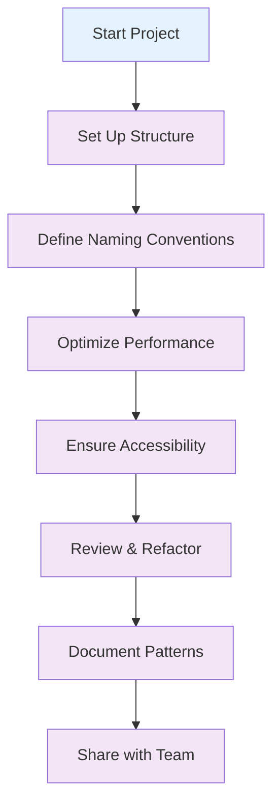

# 🎯 Best Practices

This section covers essential best practices for working with Tailwind CSS v4+ effectively. Learn how to structure your projects, follow naming conventions, optimize performance, and ensure accessibility.

## 📚 What You'll Learn

- **Project Structure**: How to organize your Tailwind CSS projects for scalability
- **Naming Conventions**: Consistent naming patterns for classes and components
- **Performance Tips**: Optimize build times and runtime performance
- **Accessibility**: Ensure your designs are accessible to all users
- **Code Organization**: Best practices for maintainable code

## 🗂️ Section Contents

| Topic                                            | Description                           | Key Topics                                                     |
| ------------------------------------------------ | ------------------------------------- | -------------------------------------------------------------- |
| [📁 Project Structure](./project-structure.md)   | Organizing your Tailwind CSS projects | Directory structure, file organization, component architecture |
| [🏷️ Naming Conventions](./naming-conventions.md) | Consistent naming patterns            | Class naming, component naming, utility patterns               |
| [⚡ Performance Tips](./performance-tips.md)     | Optimizing performance                | Build optimization, runtime performance, bundle size           |
| [♿ Accessibility](./accessibility.md)           | Accessible design practices           | ARIA attributes, keyboard navigation, screen readers           |

## 🎯 Quick Start

### 1. Project Structure

Start with a well-organized project structure:

```
src/
├── styles/
│   ├── globals.css
│   ├── components.css
│   └── utilities.css
├── components/
│   ├── ui/
│   └── layout/
└── pages/
```

### 2. Naming Conventions

Follow consistent naming patterns:

```html
<!-- Component-based naming -->
<div class="card">
  <div class="card-header">
    <h3 class="card-title">Title</h3>
  </div>
  <div class="card-body">
    <p class="card-text">Content</p>
  </div>
</div>

<!-- Utility-based naming -->
<div class="bg-white rounded-lg shadow-md p-6">
  <h3 class="text-xl font-bold text-gray-900 mb-2">Title</h3>
  <p class="text-gray-600">Content</p>
</div>
```

### 3. Performance Optimization

Optimize your build configuration:

```typescript
// vite.config.ts
export default defineConfig({
  plugins: [tailwindcss()],
  build: {
    cssCodeSplit: true,
    rollupOptions: {
      output: {
        manualChunks: {
          tailwind: ["tailwindcss"],
        },
      },
    },
  },
});
```

### 4. Accessibility

Ensure your components are accessible:

```html
<button
  class="btn-primary"
  aria-label="Submit form"
  aria-describedby="submit-help"
>
  Submit
</button>
<p id="submit-help" class="sr-only">Click to submit the form</p>
```

## 🔄 Best Practices Workflow



## 🎨 Design System Principles

### 1. Consistency

- Use consistent spacing scales
- Follow established color patterns
- Maintain typography hierarchy

### 2. Scalability

- Design for growth
- Use component-based architecture
- Implement design tokens

### 3. Maintainability

- Document your patterns
- Use clear naming conventions
- Organize code logically

### 4. Performance

- Optimize build processes
- Minimize bundle size
- Use efficient selectors

## 🚀 Next Steps

1. **Read the Project Structure guide** to understand how to organize your Tailwind CSS projects
2. **Learn Naming Conventions** for consistent and maintainable code
3. **Apply Performance Tips** to optimize your builds and runtime
4. **Ensure Accessibility** in all your designs
5. **Review and Refactor** your existing projects using these practices

## 💡 Pro Tips

- **Start with a design system**: Define your design tokens early
- **Use component libraries**: Leverage existing patterns
- **Test across devices**: Ensure responsive design works everywhere
- **Document everything**: Keep your team aligned
- **Iterate and improve**: Continuously refine your practices

---

Ready to implement these best practices? Start with the [Project Structure](./project-structure.md) guide to set up your project for success!
