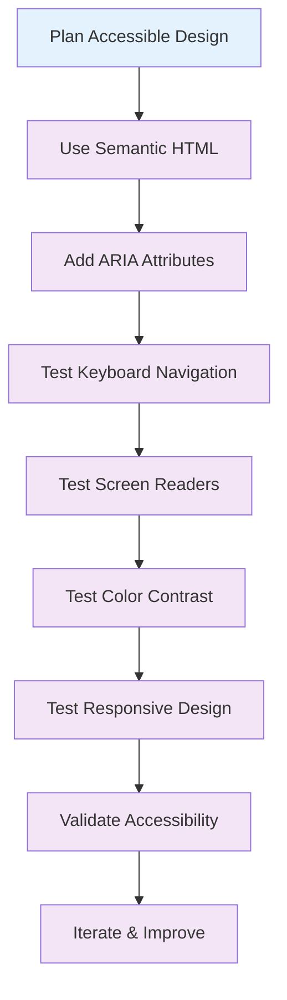

# ♿ Accessibility

Learn how to create accessible designs with Tailwind CSS v4+ that work for all users, including those with disabilities.

## 🎯 Overview

Accessibility is about making your designs usable by everyone. This guide covers ARIA attributes, keyboard navigation, screen reader support, and other accessibility best practices.

## 🎨 Visual Accessibility

### 1. Color Contrast

```html
<!-- ✅ Good: High contrast text -->
<div class="bg-white text-gray-900">
  <h1 class="text-2xl font-bold">High Contrast Heading</h1>
  <p class="text-gray-800">This text has excellent contrast.</p>
</div>

<!-- ❌ Bad: Low contrast text -->
<div class="bg-gray-100 text-gray-300">
  <h1 class="text-2xl font-bold">Low Contrast Heading</h1>
  <p class="text-gray-400">This text is hard to read.</p>
</div>
```

### 2. Focus Indicators

```html
<!-- ✅ Good: Clear focus indicators -->
<button
  class="
  btn-primary
  focus:ring-2 focus:ring-blue-300 focus:ring-offset-2
  focus:outline-none
"
>
  Click me
</button>

<!-- ❌ Bad: No focus indicators -->
<button class="btn-primary">Click me</button>
```

### 3. Color Independence

```html
<!-- ✅ Good: Color is not the only indicator -->
<div class="flex items-center space-x-2">
  <div class="w-3 h-3 bg-red-500 rounded-full"></div>
  <span class="text-sm font-medium">Error</span>
</div>

<!-- ❌ Bad: Color is the only indicator -->
<div class="text-red-500">Error</div>
```

## ⌨️ Keyboard Navigation

### 1. Focus Management

```html
<!-- ✅ Good: Proper focus management -->
<div class="space-y-2">
  <button class="btn-primary focus:ring-2 focus:ring-blue-300">
    First Button
  </button>
  <button class="btn-primary focus:ring-2 focus:ring-blue-300">
    Second Button
  </button>
  <button class="btn-primary focus:ring-2 focus:ring-blue-300">
    Third Button
  </button>
</div>
```

### 2. Tab Order

```html
<!-- ✅ Good: Logical tab order -->
<form class="space-y-4">
  <div>
    <label for="name" class="form-label">Name</label>
    <input id="name" type="text" class="form-input" tabindex="1" />
  </div>
  <div>
    <label for="email" class="form-label">Email</label>
    <input id="email" type="email" class="form-input" tabindex="2" />
  </div>
  <button type="submit" class="btn-primary" tabindex="3">Submit</button>
</form>
```

### 3. Skip Links

```html
<!-- ✅ Good: Skip links for navigation -->
<a
  href="#main-content"
  class="sr-only focus:not-sr-only focus:absolute focus:top-0 focus:left-0 bg-blue-600 text-white px-4 py-2"
>
  Skip to main content
</a>

<nav class="header">
  <!-- Navigation content -->
</nav>

<main id="main-content" class="main-content">
  <!-- Main content -->
</main>
```

## 🗣️ Screen Reader Support

### 1. ARIA Labels

```html
<!-- ✅ Good: Descriptive ARIA labels -->
<button
  class="btn-primary"
  aria-label="Close dialog"
  aria-describedby="close-help"
>
  <svg class="w-5 h-5" fill="none" stroke="currentColor">
    <path
      stroke-linecap="round"
      stroke-linejoin="round"
      stroke-width="2"
      d="M6 18L18 6M6 6l12 12"
    />
  </svg>
</button>
<p id="close-help" class="sr-only">Click to close the dialog</p>
```

### 2. ARIA Describedby

```html
<!-- ✅ Good: ARIA describedby for additional context -->
<div class="form-group">
  <label for="password" class="form-label">Password</label>
  <input
    id="password"
    type="password"
    class="form-input"
    aria-describedby="password-help password-requirements"
  />
  <p id="password-help" class="form-help">
    Your password must be at least 8 characters long.
  </p>
  <ul id="password-requirements" class="sr-only">
    <li>At least 8 characters</li>
    <li>Contains uppercase letter</li>
    <li>Contains lowercase letter</li>
    <li>Contains number</li>
  </ul>
</div>
```

### 3. ARIA Live Regions

```html
<!-- ✅ Good: ARIA live regions for dynamic content -->
<div id="status" class="sr-only" aria-live="polite" aria-atomic="true">
  <!-- Status updates will be announced here -->
</div>

<button
  class="btn-primary"
  onclick="updateStatus('Form submitted successfully')"
>
  Submit
</button>
```

## 🎯 Form Accessibility

### 1. Label Association

```html
<!-- ✅ Good: Proper label association -->
<div class="form-group">
  <label for="email" class="form-label">Email Address</label>
  <input
    id="email"
    type="email"
    class="form-input"
    required
    aria-describedby="email-help"
  />
  <p id="email-help" class="form-help">
    We'll never share your email with anyone else.
  </p>
</div>
```

### 2. Error Handling

```html
<!-- ✅ Good: Accessible error handling -->
<div class="form-group">
  <label for="username" class="form-label">Username</label>
  <input
    id="username"
    type="text"
    class="form-input border-red-500"
    aria-invalid="true"
    aria-describedby="username-error"
  />
  <p id="username-error" class="text-red-600 text-sm mt-1">
    Username is required
  </p>
</div>
```

### 3. Fieldset and Legend

```html
<!-- ✅ Good: Use fieldset and legend for grouped inputs -->
<fieldset class="form-group">
  <legend class="form-label">Contact Preferences</legend>
  <div class="space-y-2">
    <label class="flex items-center">
      <input type="checkbox" class="form-checkbox" />
      <span class="ml-2">Email notifications</span>
    </label>
    <label class="flex items-center">
      <input type="checkbox" class="form-checkbox" />
      <span class="ml-2">SMS notifications</span>
    </label>
  </div>
</fieldset>
```

## 🧭 Navigation Accessibility

### 1. Navigation Structure

```html
<!-- ✅ Good: Accessible navigation -->
<nav class="header" role="navigation" aria-label="Main navigation">
  <ul class="flex space-x-8">
    <li>
      <a href="/" class="nav-link" aria-current="page"> Home </a>
    </li>
    <li>
      <a href="/about" class="nav-link">About</a>
    </li>
    <li>
      <a href="/contact" class="nav-link">Contact</a>
    </li>
  </ul>
</nav>
```

### 2. Breadcrumb Navigation

```html
<!-- ✅ Good: Accessible breadcrumbs -->
<nav class="breadcrumb" aria-label="Breadcrumb">
  <ol class="flex space-x-2">
    <li>
      <a href="/" class="breadcrumb-link">Home</a>
    </li>
    <li aria-hidden="true" class="text-gray-500">/</li>
    <li>
      <a href="/products" class="breadcrumb-link">Products</a>
    </li>
    <li aria-hidden="true" class="text-gray-500">/</li>
    <li aria-current="page" class="text-gray-900">Product Details</li>
  </ol>
</nav>
```

### 3. Tab Navigation

```html
<!-- ✅ Good: Accessible tab navigation -->
<div class="tab-container">
  <div class="tab-list" role="tablist">
    <button
      class="tab-button"
      role="tab"
      aria-selected="true"
      aria-controls="panel-1"
      id="tab-1"
    >
      Tab 1
    </button>
    <button
      class="tab-button"
      role="tab"
      aria-selected="false"
      aria-controls="panel-2"
      id="tab-2"
    >
      Tab 2
    </button>
  </div>

  <div id="panel-1" class="tab-panel" role="tabpanel" aria-labelledby="tab-1">
    Content for tab 1
  </div>

  <div
    id="panel-2"
    class="tab-panel hidden"
    role="tabpanel"
    aria-labelledby="tab-2"
  >
    Content for tab 2
  </div>
</div>
```

## 🎨 Responsive Accessibility

### 1. Mobile Accessibility

```html
<!-- ✅ Good: Mobile-accessible navigation -->
<nav class="header">
  <div class="flex justify-between items-center">
    <a href="/" class="logo">My Site</a>

    <!-- Desktop navigation -->
    <div class="hidden md:flex space-x-8">
      <a href="/" class="nav-link">Home</a>
      <a href="/about" class="nav-link">About</a>
      <a href="/contact" class="nav-link">Contact</a>
    </div>

    <!-- Mobile menu button -->
    <button
      class="md:hidden p-2"
      aria-label="Toggle mobile menu"
      aria-expanded="false"
      aria-controls="mobile-menu"
    >
      <svg class="w-6 h-6" fill="none" stroke="currentColor">
        <path
          stroke-linecap="round"
          stroke-linejoin="round"
          stroke-width="2"
          d="M4 6h16M4 12h16M4 18h16"
        />
      </svg>
    </button>
  </div>

  <!-- Mobile menu -->
  <div id="mobile-menu" class="md:hidden hidden">
    <div class="px-2 pt-2 pb-3 space-y-1">
      <a href="/" class="mobile-nav-link">Home</a>
      <a href="/about" class="mobile-nav-link">About</a>
      <a href="/contact" class="mobile-nav-link">Contact</a>
    </div>
  </div>
</nav>
```

### 2. Touch Targets

```html
<!-- ✅ Good: Adequate touch targets -->
<button
  class="
  btn-primary
  min-h-[44px] min-w-[44px]
  px-4 py-2
"
>
  Click me
</button>

<!-- ❌ Bad: Too small touch target -->
<button class="btn-primary px-2 py-1">Click me</button>
```

## 🔧 Accessibility Utilities

### 1. Screen Reader Only

```css
@utility sr-only {
  position: absolute;
  width: 1px;
  height: 1px;
  padding: 0;
  margin: -1px;
  overflow: hidden;
  clip: rect(0, 0, 0, 0);
  white-space: nowrap;
  border: 0;
}

@utility not-sr-only {
  position: static;
  width: auto;
  height: auto;
  padding: 0;
  margin: 0;
  overflow: visible;
  clip: auto;
  white-space: normal;
}
```

### 2. Focus Utilities

```css
@utility focus-visible {
  outline: 2px solid theme("colors.blue.500");
  outline-offset: 2px;
}

@utility focus-ring {
  outline: 2px solid theme("colors.blue.300");
  outline-offset: 2px;
}
```

### 3. High Contrast Mode

```css
@utility high-contrast {
  @media (prefers-contrast: high) {
    border: 2px solid theme("colors.gray.900");
    background-color: theme("colors.white");
    color: theme("colors.gray.900");
  }
}
```

## 🔄 Accessibility Workflow



## 📋 Accessibility Checklist

### ✅ Visual Accessibility

- [ ] Use high contrast colors
- [ ] Provide focus indicators
- [ ] Don't rely on color alone
- [ ] Use sufficient font sizes
- [ ] Provide alternative text for images

### ✅ Keyboard Navigation

- [ ] Ensure all interactive elements are keyboard accessible
- [ ] Provide logical tab order
- [ ] Include skip links
- [ ] Handle focus management
- [ ] Test keyboard-only navigation

### ✅ Screen Reader Support

- [ ] Use semantic HTML elements
- [ ] Add ARIA labels and descriptions
- [ ] Provide ARIA live regions for dynamic content
- [ ] Use proper heading hierarchy
- [ ] Test with screen readers

### ✅ Form Accessibility

- [ ] Associate labels with inputs
- [ ] Provide error messages
- [ ] Use fieldsets for grouped inputs
- [ ] Handle validation states
- [ ] Test form completion

### ✅ Navigation Accessibility

- [ ] Use proper navigation structure
- [ ] Include breadcrumbs
- [ ] Handle tab navigation
- [ ] Provide mobile accessibility
- [ ] Test navigation flow

## 🚀 Next Steps

1. **Plan your accessible design** from the start
2. **Use semantic HTML** for better accessibility
3. **Add ARIA attributes** for screen reader support
4. **Test keyboard navigation** for all interactive elements
5. **Test with screen readers** to ensure compatibility
6. **Validate accessibility** using automated tools

## 💡 Pro Tips

- **Start with semantic HTML**: Use the right elements for the job
- **Test early and often**: Don't wait until the end to test accessibility
- **Use automated tools**: Leverage accessibility testing tools
- **Test with real users**: Get feedback from users with disabilities
- **Document accessibility decisions**: Keep your team aligned

---

Ready to learn about migration? Check out the [Migration Guide](../6-migration/README.md) next!
