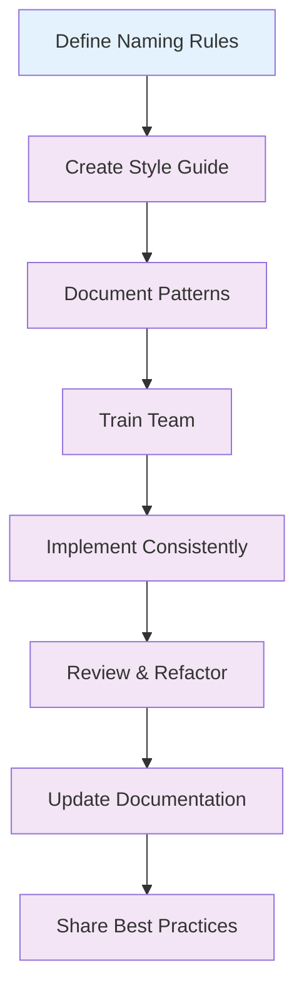

# 🏷️ Naming Conventions

Learn how to create consistent, maintainable naming patterns for your Tailwind CSS v4+ projects.

## 🎯 Overview

Consistent naming conventions are crucial for maintainable code. This guide covers naming patterns for classes, components, utilities, and design tokens.

## 📝 Class Naming Patterns

### 1. Utility-First Approach

```html
<!-- Use descriptive utility classes -->
<div class="bg-white rounded-lg shadow-md p-6 max-w-sm">
  <h3 class="text-xl font-bold text-gray-900 mb-2">Card Title</h3>
  <p class="text-gray-600">Card content goes here.</p>
</div>

<!-- Group related utilities -->
<button
  class="
  bg-blue-500 text-white px-4 py-2 rounded-md
  hover:bg-blue-600 focus:ring-2 focus:ring-blue-300
  transition-colors duration-200
"
>
  Click me
</button>
```

### 2. Component-Based Naming

```html
<!-- Use semantic component classes -->
<div class="card">
  <div class="card-header">
    <h3 class="card-title">Card Title</h3>
  </div>
  <div class="card-body">
    <p class="card-text">Card content goes here.</p>
  </div>
  <div class="card-footer">
    <button class="card-button">Action</button>
  </div>
</div>
```

### 3. Hybrid Approach

```html
<!-- Combine utilities with component classes -->
<div class="card bg-white rounded-lg shadow-md p-6">
  <div class="card-header mb-4">
    <h3 class="card-title text-xl font-bold text-gray-900">Card Title</h3>
  </div>
  <div class="card-body">
    <p class="card-text text-gray-600">Card content goes here.</p>
  </div>
</div>
```

## 🧩 Component Naming

### 1. Atomic Design Principles

```
components/
├── atoms/
│   ├── Button/
│   ├── Input/
│   ├── Label/
│   └── Icon/
├── molecules/
│   ├── SearchBox/
│   ├── FormField/
│   └── Card/
├── organisms/
│   ├── Header/
│   ├── Navigation/
│   └── Footer/
└── templates/
    ├── PageLayout/
    └── DashboardLayout/
```

### 2. Component File Structure

```
Button/
├── Button.jsx
├── Button.test.jsx
├── Button.stories.jsx
├── Button.module.css
└── index.js
```

### 3. Component Naming Examples

```jsx
// ✅ Good: Descriptive and specific
const PrimaryButton = ({ children, onClick }) => {
  return (
    <button className="btn-primary" onClick={onClick}>
      {children}
    </button>
  );
};

// ✅ Good: Clear purpose
const SearchInput = ({ value, onChange, placeholder }) => {
  return (
    <input
      type="text"
      value={value}
      onChange={onChange}
      placeholder={placeholder}
      className="search-input"
    />
  );
};

// ❌ Bad: Too generic
const Button = ({ children }) => {
  return <button className="btn">{children}</button>;
};

// ❌ Bad: Unclear purpose
const Input = ({ value }) => {
  return <input value={value} className="input" />;
};
```

## 🎨 Design Token Naming

### 1. Color Tokens

```css
@theme {
  /* Primary Colors */
  --color-primary-50: #eff6ff;
  --color-primary-100: #dbeafe;
  --color-primary-500: #3b82f6;
  --color-primary-900: #1e3a8a;

  /* Secondary Colors */
  --color-secondary-50: #ecfdf5;
  --color-secondary-100: #d1fae5;
  --color-secondary-500: #10b981;
  --color-secondary-900: #064e3b;

  /* Semantic Colors */
  --color-success: #10b981;
  --color-warning: #f59e0b;
  --color-error: #ef4444;
  --color-info: #3b82f6;
}
```

### 2. Spacing Tokens

```css
@theme {
  /* Spacing Scale */
  --spacing-0: 0;
  --spacing-1: 0.25rem; /* 4px */
  --spacing-2: 0.5rem; /* 8px */
  --spacing-3: 0.75rem; /* 12px */
  --spacing-4: 1rem; /* 16px */
  --spacing-5: 1.25rem; /* 20px */
  --spacing-6: 1.5rem; /* 24px */
  --spacing-8: 2rem; /* 32px */
  --spacing-10: 2.5rem; /* 40px */
  --spacing-12: 3rem; /* 48px */
  --spacing-16: 4rem; /* 64px */
  --spacing-20: 5rem; /* 80px */
  --spacing-24: 6rem; /* 96px */
}
```

### 3. Typography Tokens

```css
@theme {
  /* Font Families */
  --font-sans: "Inter", "system-ui", "sans-serif";
  --font-serif: "Georgia", "serif";
  --font-mono: "Fira Code", "monospace";

  /* Font Sizes */
  --font-size-xs: 0.75rem; /* 12px */
  --font-size-sm: 0.875rem; /* 14px */
  --font-size-base: 1rem; /* 16px */
  --font-size-lg: 1.125rem; /* 18px */
  --font-size-xl: 1.25rem; /* 20px */
  --font-size-2xl: 1.5rem; /* 24px */
  --font-size-3xl: 1.875rem; /* 30px */
  --font-size-4xl: 2.25rem; /* 36px */

  /* Font Weights */
  --font-weight-light: 300;
  --font-weight-normal: 400;
  --font-weight-medium: 500;
  --font-weight-semibold: 600;
  --font-weight-bold: 700;
}
```

## 🔧 Custom Utility Naming

### 1. Utility Naming Patterns

```css
/* ✅ Good: Descriptive and consistent */
@utility btn-primary {
  background-color: theme("colors.blue.500");
  color: theme("colors.white");
  padding: theme("spacing.2") theme("spacing.4");
  border-radius: theme("borderRadius.md");
}

@utility btn-secondary {
  background-color: theme("colors.gray.200");
  color: theme("colors.gray.800");
  padding: theme("spacing.2") theme("spacing.4");
  border-radius: theme("borderRadius.md");
}

@utility card-elevated {
  background-color: theme("colors.white");
  border-radius: theme("borderRadius.lg");
  box-shadow: theme("boxShadow.xl");
  padding: theme("spacing.6");
}

/* ❌ Bad: Inconsistent and unclear */
@utility button {
  background-color: theme("colors.blue.500");
  color: theme("colors.white");
}

@utility card {
  background-color: theme("colors.white");
  border-radius: theme("borderRadius.lg");
}
```

### 2. Variant Naming

```css
/* ✅ Good: Clear variant naming */
@utility btn-primary {
  background-color: theme("colors.blue.500");
  color: theme("colors.white");

  &:hover {
    background-color: theme("colors.blue.600");
  }

  &:focus {
    outline: 2px solid theme("colors.blue.300");
    outline-offset: 2px;
  }

  &:disabled {
    background-color: theme("colors.gray.300");
    color: theme("colors.gray.500");
    cursor: not-allowed;
  }
}

/* ✅ Good: Size variants */
@utility btn-sm {
  padding: theme("spacing.1") theme("spacing.2");
  font-size: theme("fontSize.sm");
}

@utility btn-lg {
  padding: theme("spacing.3") theme("spacing.6");
  font-size: theme("fontSize.lg");
}
```

## 📱 Responsive Naming

### 1. Breakpoint Naming

```html
<!-- Use consistent breakpoint prefixes -->
<div
  class="
  grid grid-cols-1
  sm:grid-cols-2
  md:grid-cols-3
  lg:grid-cols-4
  xl:grid-cols-5
  gap-4
"
>
  <!-- Grid items -->
</div>

<!-- Responsive spacing -->
<div
  class="
  p-4
  sm:p-6
  md:p-8
  lg:p-10
"
>
  <!-- Content -->
</div>
```

### 2. State Naming

```html
<!-- Use consistent state prefixes -->
<button
  class="
  btn-primary
  hover:bg-blue-600
  focus:ring-2 focus:ring-blue-300
  active:bg-blue-700
  disabled:bg-gray-300 disabled:cursor-not-allowed
"
>
  Click me
</button>

<!-- Form states -->
<input
  class="
  form-input
  focus:ring-2 focus:ring-blue-300 focus:border-blue-500
  invalid:border-red-500 invalid:ring-2 invalid:ring-red-300
  valid:border-green-500
"
/>
```

## 🎯 Naming Convention Rules

### 1. General Rules

- **Use kebab-case** for CSS classes and utilities
- **Use PascalCase** for React components
- **Use camelCase** for JavaScript variables and functions
- **Use UPPER_CASE** for constants
- **Use descriptive names** that explain purpose
- **Avoid abbreviations** unless they're widely understood
- **Be consistent** across your entire project

### 2. Class Naming Rules

```html
<!-- ✅ Good: Clear and descriptive -->
<div class="user-profile-card">
  <h3 class="user-profile-name">John Doe</h3>
  <p class="user-profile-email">john@example.com</p>
</div>

<!-- ❌ Bad: Unclear and abbreviated -->
<div class="upc">
  <h3 class="upn">John Doe</h3>
  <p class="upe">john@example.com</p>
</div>
```

### 3. Component Naming Rules

```jsx
// ✅ Good: Descriptive and specific
const UserProfileCard = ({ user }) => {
  return (
    <div className="user-profile-card">
      <h3 className="user-profile-name">{user.name}</h3>
      <p className="user-profile-email">{user.email}</p>
    </div>
  );
};

// ❌ Bad: Too generic
const Card = ({ user }) => {
  return (
    <div className="card">
      <h3 className="name">{user.name}</h3>
      <p className="email">{user.email}</p>
    </div>
  );
};
```

## 🔄 Naming Convention Workflow



## 📋 Naming Convention Checklist

### ✅ Class Naming

- [ ] Use kebab-case for CSS classes
- [ ] Use descriptive names
- [ ] Avoid abbreviations
- [ ] Be consistent across components
- [ ] Use semantic naming when possible

### ✅ Component Naming

- [ ] Use PascalCase for React components
- [ ] Use descriptive names
- [ ] Follow atomic design principles
- [ ] Use consistent file structure
- [ ] Document component APIs

### ✅ Design Tokens

- [ ] Use semantic naming for colors
- [ ] Use consistent scales for spacing
- [ ] Use descriptive names for typography
- [ ] Document token purposes
- [ ] Use consistent prefixes

### ✅ Custom Utilities

- [ ] Use descriptive utility names
- [ ] Follow consistent patterns
- [ ] Document utility purposes
- [ ] Use consistent variants
- [ ] Test across breakpoints

## 🚀 Next Steps

1. **Define your naming rules** based on your project needs
2. **Create a style guide** for your team
3. **Document your patterns** for consistency
4. **Train your team** on the conventions
5. **Implement consistently** across your project
6. **Review and refactor** existing code

## 💡 Pro Tips

- **Start with a style guide**: Document your naming conventions early
- **Be consistent**: Use the same patterns throughout your project
- **Use semantic naming**: Choose names that describe purpose, not appearance
- **Document everything**: Keep your team aligned with clear documentation
- **Iterate and improve**: Continuously refine your naming conventions

---

Ready to learn about performance optimization? Check out the [Performance Tips](./performance-tips.md) guide next!
