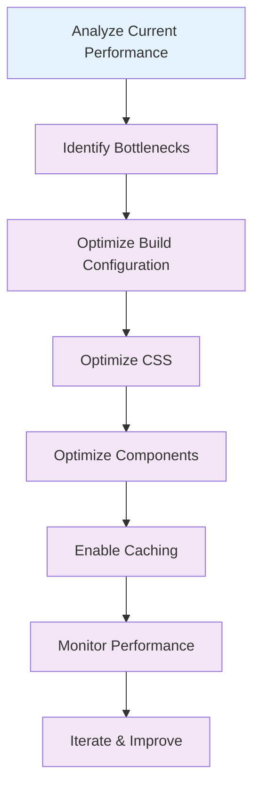

# ⚡ Performance Tips

Learn how to optimize your Tailwind CSS v4+ projects for better build times, runtime performance, and smaller bundle sizes.

## 🎯 Overview

Performance optimization is crucial for modern web applications. This guide covers build optimization, runtime performance, and bundle size reduction techniques.

## 🏗️ Build Performance

### 1. Vite Configuration

```typescript
// vite.config.ts
import { defineConfig } from "vite";
import react from "@vitejs/plugin-react";
import tailwindcss from "@tailwindcss/vite";

export default defineConfig({
  plugins: [react(), tailwindcss()],

  // Build optimizations
  build: {
    // Enable CSS code splitting
    cssCodeSplit: true,

    // Optimize chunk splitting
    rollupOptions: {
      output: {
        manualChunks: {
          tailwind: ["tailwindcss"],
          vendor: ["react", "react-dom"],
        },
      },
    },

    // Enable source maps for debugging
    sourcemap: process.env.NODE_ENV === "development",

    // Optimize for production
    minify: "terser",
    terserOptions: {
      compress: {
        drop_console: true,
        drop_debugger: true,
      },
    },
  },

  // Development optimizations
  server: {
    hmr: true,
    watch: {
      usePolling: false,
    },
  },
});
```

### 2. PostCSS Configuration

```javascript
// postcss.config.mjs
const config = {
  plugins: {
    "@tailwindcss/postcss": {
      // Enable content detection
      content: ["./src/**/*.{js,jsx,ts,tsx}"],

      // Optimize for production
      ...(process.env.NODE_ENV === "production" && {
        // Enable purging
        purge: {
          enabled: true,
          content: ["./src/**/*.{js,jsx,ts,tsx}"],
        },

        // Enable minification
        cssnano: {
          preset: "default",
        },
      }),
    },
  },
};

export default config;
```

### 3. Build Caching

```typescript
// vite.config.ts
export default defineConfig({
  plugins: [react(), tailwindcss()],

  // Enable build caching
  build: {
    rollupOptions: {
      cache: true,
    },
  },

  // Enable dependency pre-bundling
  optimizeDeps: {
    include: ["tailwindcss"],
  },
});
```

## 🚀 Runtime Performance

### 1. CSS Optimization

```css
/* Use efficient selectors */
@utility btn-primary {
  background-color: theme("colors.blue.500");
  color: theme("colors.white");
  padding: theme("spacing.2") theme("spacing.4");
  border-radius: theme("borderRadius.md");

  /* Use efficient hover states */
  &:hover {
    background-color: theme("colors.blue.600");
  }

  /* Use efficient focus states */
  &:focus {
    outline: 2px solid theme("colors.blue.300");
    outline-offset: 2px;
  }
}

/* Avoid inefficient selectors */
@utility btn-primary-bad {
  /* ❌ Bad: Inefficient descendant selector */
  .card & {
    background-color: theme("colors.blue.500");
  }

  /* ❌ Bad: Inefficient attribute selector */
  [data-theme="dark"] & {
    background-color: theme("colors.blue.600");
  }
}
```

### 2. Component Optimization

```jsx
// ✅ Good: Optimized component
import React, { memo } from "react";

const Button = memo(
  ({
    children,
    variant = "primary",
    size = "md",
    className = "",
    ...props
  }) => {
    const baseClasses = "btn";
    const variantClasses = {
      primary: "btn-primary",
      secondary: "btn-secondary",
      outline: "btn-outline",
    };
    const sizeClasses = {
      sm: "btn-sm",
      md: "btn-md",
      lg: "btn-lg",
    };

    const classes = `${baseClasses} ${variantClasses[variant]} ${sizeClasses[size]} ${className}`;

    return (
      <button className={classes} {...props}>
        {children}
      </button>
    );
  }
);

Button.displayName = "Button";

export default Button;

// ❌ Bad: Unoptimized component
const Button = ({ children, variant, size, className, ...props }) => {
  // Recreates classes on every render
  const classes = `btn btn-${variant} btn-${size} ${className}`;

  return (
    <button className={classes} {...props}>
      {children}
    </button>
  );
};
```

### 3. CSS-in-JS Optimization

```jsx
// ✅ Good: Use CSS classes instead of inline styles
const Card = ({ title, content }) => {
  return (
    <div className="card">
      <h3 className="card-title">{title}</h3>
      <p className="card-content">{content}</p>
    </div>
  );
};

// ❌ Bad: Inline styles
const Card = ({ title, content }) => {
  return (
    <div
      style={{
        backgroundColor: "white",
        borderRadius: "0.5rem",
        padding: "1.5rem",
        boxShadow: "0 4px 6px -1px rgba(0, 0, 0, 0.1)",
      }}
    >
      <h3 style={{ fontSize: "1.25rem", fontWeight: "bold" }}>{title}</h3>
      <p style={{ color: "#6b7280" }}>{content}</p>
    </div>
  );
};
```

## 📦 Bundle Size Optimization

### 1. Tree Shaking

```typescript
// vite.config.ts
export default defineConfig({
  plugins: [react(), tailwindcss()],

  build: {
    rollupOptions: {
      output: {
        // Enable tree shaking
        manualChunks: {
          tailwind: ["tailwindcss"],
          vendor: ["react", "react-dom"],
        },
      },
    },
  },
});
```

### 2. CSS Purging

```css
/* Use content detection for automatic purging */
@import "tailwindcss";

@theme {
  --color-primary: #3b82f6;
  --color-secondary: #10b981;
}

/* Only include used utilities */
@utility btn-primary {
  background-color: theme("colors.blue.500");
  color: theme("colors.white");
  padding: theme("spacing.2") theme("spacing.4");
  border-radius: theme("borderRadius.md");
}
```

### 3. Dynamic Imports

```jsx
// ✅ Good: Use dynamic imports for large components
import React, { lazy, Suspense } from "react";

const HeavyComponent = lazy(() => import("./HeavyComponent"));

const App = () => {
  return (
    <div>
      <h1>My App</h1>
      <Suspense fallback={<div>Loading...</div>}>
        <HeavyComponent />
      </Suspense>
    </div>
  );
};

// ❌ Bad: Import everything upfront
import HeavyComponent from "./HeavyComponent";

const App = () => {
  return (
    <div>
      <h1>My App</h1>
      <HeavyComponent />
    </div>
  );
};
```

## 🔧 Build Tool Optimization

### 1. Vite Performance

```typescript
// vite.config.ts
export default defineConfig({
  plugins: [react(), tailwindcss()],

  // Optimize dependencies
  optimizeDeps: {
    include: ["tailwindcss"],
    exclude: ["@tailwindcss/typography"],
  },

  // Enable build caching
  build: {
    rollupOptions: {
      cache: true,
    },
  },

  // Development optimizations
  server: {
    hmr: true,
    watch: {
      usePolling: false,
    },
  },
});
```

### 2. PostCSS Performance

```javascript
// postcss.config.mjs
const config = {
  plugins: {
    "@tailwindcss/postcss": {
      // Enable content detection
      content: ["./src/**/*.{js,jsx,ts,tsx}"],

      // Optimize for production
      ...(process.env.NODE_ENV === "production" && {
        // Enable purging
        purge: {
          enabled: true,
          content: ["./src/**/*.{js,jsx,ts,tsx}"],
        },

        // Enable minification
        cssnano: {
          preset: "default",
        },
      }),
    },
  },
};

export default config;
```

### 3. CLI Performance

```bash
# Use watch mode for development
npx tailwindcss -i ./src/input.css -o ./dist/output.css --watch

# Use minification for production
npx tailwindcss -i ./src/input.css -o ./dist/output.css --minify

# Use content detection
npx tailwindcss -i ./src/input.css -o ./dist/output.css --content "./src/**/*.{js,jsx,ts,tsx}"
```

## 📊 Performance Monitoring

### 1. Build Time Monitoring

```bash
# Monitor build times
time npm run build

# Use build analysis tools
npm install --save-dev rollup-plugin-analyzer
```

### 2. Bundle Size Analysis

```typescript
// vite.config.ts
import { defineConfig } from "vite";
import { analyzer } from "rollup-plugin-analyzer";

export default defineConfig({
  plugins: [react(), tailwindcss()],

  build: {
    rollupOptions: {
      plugins: [
        analyzer({
          summaryOnly: true,
          limit: 10,
        }),
      ],
    },
  },
});
```

### 3. Runtime Performance

```jsx
// Use React DevTools Profiler
import React, { Profiler } from "react";

const onRenderCallback = (id, phase, actualDuration) => {
  console.log("Render:", { id, phase, actualDuration });
};

const App = () => {
  return (
    <Profiler id="App" onRender={onRenderCallback}>
      <div>My App</div>
    </Profiler>
  );
};
```

## 🎯 Performance Best Practices

### 1. CSS Optimization

- Use efficient selectors
- Avoid deep nesting
- Use CSS classes instead of inline styles
- Minimize CSS specificity
- Use CSS custom properties for theming

### 2. Component Optimization

- Use React.memo for expensive components
- Use useMemo and useCallback for expensive calculations
- Avoid unnecessary re-renders
- Use dynamic imports for large components
- Optimize component props

### 3. Build Optimization

- Enable CSS code splitting
- Use manual chunk splitting
- Enable build caching
- Use content detection for purging
- Minimize bundle size

## 🔄 Performance Optimization Workflow



## 📋 Performance Checklist

### ✅ Build Performance

- [ ] Enable CSS code splitting
- [ ] Use manual chunk splitting
- [ ] Enable build caching
- [ ] Optimize dependencies
- [ ] Use content detection

### ✅ Runtime Performance

- [ ] Use efficient CSS selectors
- [ ] Optimize component rendering
- [ ] Use CSS classes instead of inline styles
- [ ] Minimize CSS specificity
- [ ] Use React.memo for expensive components

### ✅ Bundle Size

- [ ] Enable tree shaking
- [ ] Use dynamic imports
- [ ] Minimize CSS purging
- [ ] Use efficient utilities
- [ ] Monitor bundle size

### ✅ Monitoring

- [ ] Monitor build times
- [ ] Analyze bundle size
- [ ] Use performance profiling
- [ ] Set up performance budgets
- [ ] Track performance metrics

## 🚀 Next Steps

1. **Analyze your current performance** using the monitoring tools
2. **Optimize your build configuration** for better performance
3. **Optimize your CSS** for efficient rendering
4. **Optimize your components** for better runtime performance
5. **Enable caching** for faster builds
6. **Monitor performance** continuously

## 💡 Pro Tips

- **Start with monitoring**: Use tools to identify performance bottlenecks
- **Optimize incrementally**: Make small improvements over time
- **Test across devices**: Ensure performance on all target devices
- **Use performance budgets**: Set limits for bundle size and build time
- **Iterate and improve**: Continuously optimize your performance

---

Ready to learn about accessibility? Check out the [Accessibility](./accessibility.md) guide next!
