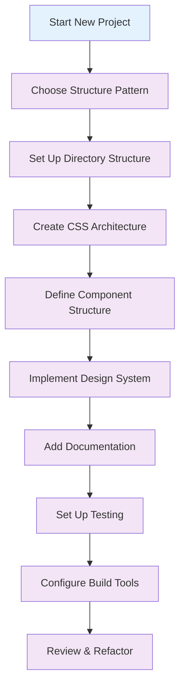

# 📁 Project Structure

Learn how to organize your Tailwind CSS v4+ projects for scalability, maintainability, and team collaboration.

## 🎯 Overview

A well-structured project is the foundation of maintainable Tailwind CSS applications. This guide covers different project structures for various use cases and team sizes.

## 🏗️ Directory Structure Patterns

### 1. Small Projects (1-3 developers)

```
project/
├── src/
│   ├── styles/
│   │   ├── globals.css
│   │   └── components.css
│   ├── components/
│   │   ├── Button.jsx
│   │   ├── Card.jsx
│   │   └── Layout.jsx
│   └── pages/
│       ├── Home.jsx
│       └── About.jsx
├── public/
└── package.json
```

### 2. Medium Projects (3-10 developers)

```
project/
├── src/
│   ├── styles/
│   │   ├── globals.css
│   │   ├── components/
│   │   │   ├── buttons.css
│   │   │   ├── forms.css
│   │   │   └── layout.css
│   │   └── utilities/
│   │       ├── spacing.css
│   │       └── typography.css
│   ├── components/
│   │   ├── ui/
│   │   │   ├── Button/
│   │   │   │   ├── Button.jsx
│   │   │   │   ├── Button.test.jsx
│   │   │   │   └── Button.stories.jsx
│   │   │   └── Card/
│   │   └── layout/
│   │       ├── Header.jsx
│   │       └── Footer.jsx
│   ├── pages/
│   └── hooks/
├── public/
└── package.json
```

### 3. Large Projects (10+ developers)

```
project/
├── src/
│   ├── styles/
│   │   ├── globals.css
│   │   ├── components/
│   │   │   ├── buttons/
│   │   │   ├── forms/
│   │   │   └── layout/
│   │   ├── utilities/
│   │   │   ├── spacing/
│   │   │   ├── typography/
│   │   │   └── colors/
│   │   └── themes/
│   │       ├── light.css
│   │       └── dark.css
│   ├── components/
│   │   ├── ui/
│   │   ├── layout/
│   │   ├── forms/
│   │   └── features/
│   ├── pages/
│   ├── hooks/
│   ├── utils/
│   └── constants/
├── public/
├── docs/
└── package.json
```

## 📁 File Organization

### CSS File Structure

#### 1. Single CSS File (Small Projects)

```css
/* src/styles/globals.css */
@import "tailwindcss";

@theme {
  --color-primary: #3b82f6;
  --color-secondary: #10b981;
  --spacing-18: 4.5rem;
}

/* Component styles */
@utility btn-primary {
  background-color: theme("colors.blue.500");
  color: theme("colors.white");
  padding: theme("spacing.2") theme("spacing.4");
  border-radius: theme("borderRadius.md");
}

@utility btn-secondary {
  background-color: theme("colors.gray.200");
  color: theme("colors.gray.800");
  padding: theme("spacing.2") theme("spacing.4");
  border-radius: theme("borderRadius.md");
}
```

#### 2. Modular CSS Files (Medium Projects)

```css
/* src/styles/globals.css */
@import "tailwindcss";

@theme {
  --color-primary: #3b82f6;
  --color-secondary: #10b981;
}

/* src/styles/components/buttons.css */
@utility btn-primary {
  background-color: theme("colors.blue.500");
  color: theme("colors.white");
  padding: theme("spacing.2") theme("spacing.4");
  border-radius: theme("borderRadius.md");
}

@utility btn-secondary {
  background-color: theme("colors.gray.200");
  color: theme("colors.gray.800");
  padding: theme("spacing.2") theme("spacing.4");
  border-radius: theme("borderRadius.md");
}

/* src/styles/components/forms.css */
@utility form-input {
  border: 1px solid theme("colors.gray.300");
  border-radius: theme("borderRadius.md");
  padding: theme("spacing.2") theme("spacing.3");
  font-size: theme("fontSize.sm");
}

@utility form-label {
  font-weight: theme("fontWeight.medium");
  color: theme("colors.gray.700");
  margin-bottom: theme("spacing.1");
}
```

#### 3. Component-Specific CSS (Large Projects)

```css
/* src/styles/components/buttons/primary.css */
@utility btn-primary {
  background-color: theme("colors.blue.500");
  color: theme("colors.white");
  padding: theme("spacing.2") theme("spacing.4");
  border-radius: theme("borderRadius.md");
  transition: all 0.2s ease-in-out;

  &:hover {
    background-color: theme("colors.blue.600");
    transform: translateY(-1px);
  }

  &:focus {
    outline: 2px solid theme("colors.blue.300");
    outline-offset: 2px;
  }
}

/* src/styles/components/buttons/secondary.css */
@utility btn-secondary {
  background-color: theme("colors.gray.200");
  color: theme("colors.gray.800");
  padding: theme("spacing.2") theme("spacing.4");
  border-radius: theme("borderRadius.md");
  transition: all 0.2s ease-in-out;

  &:hover {
    background-color: theme("colors.gray.300");
  }
}
```

## 🧩 Component Architecture

### 1. Atomic Components

```jsx
// src/components/ui/Button/Button.jsx
import React from "react";

const Button = ({
  children,
  variant = "primary",
  size = "md",
  className = "",
  ...props
}) => {
  const baseClasses = "btn";
  const variantClasses = {
    primary: "btn-primary",
    secondary: "btn-secondary",
    outline: "btn-outline",
  };
  const sizeClasses = {
    sm: "btn-sm",
    md: "btn-md",
    lg: "btn-lg",
  };

  const classes = `${baseClasses} ${variantClasses[variant]} ${sizeClasses[size]} ${className}`;

  return (
    <button className={classes} {...props}>
      {children}
    </button>
  );
};

export default Button;
```

### 2. Composite Components

```jsx
// src/components/ui/Card/Card.jsx
import React from "react";
import Button from "../Button/Button";

const Card = ({ title, description, actions, className = "" }) => {
  return (
    <div className={`card ${className}`}>
      <div className="card-header">
        <h3 className="card-title">{title}</h3>
      </div>
      <div className="card-body">
        <p className="card-text">{description}</p>
      </div>
      {actions && (
        <div className="card-footer">
          {actions.map((action, index) => (
            <Button
              key={index}
              variant={action.variant}
              onClick={action.onClick}
            >
              {action.label}
            </Button>
          ))}
        </div>
      )}
    </div>
  );
};

export default Card;
```

### 3. Layout Components

```jsx
// src/components/layout/Header/Header.jsx
import React from "react";
import Navigation from "../Navigation/Navigation";

const Header = ({ logo, navigation, userMenu }) => {
  return (
    <header className="header">
      <div className="header-container">
        <div className="header-logo">{logo}</div>
        <Navigation items={navigation} />
        {userMenu && <div className="header-user">{userMenu}</div>}
      </div>
    </header>
  );
};

export default Header;
```

## 🎨 Design System Structure

### 1. Design Tokens

```css
/* src/styles/design-tokens/colors.css */
@theme {
  /* Primary Colors */
  --color-primary-50: #eff6ff;
  --color-primary-100: #dbeafe;
  --color-primary-500: #3b82f6;
  --color-primary-900: #1e3a8a;

  /* Secondary Colors */
  --color-secondary-50: #ecfdf5;
  --color-secondary-100: #d1fae5;
  --color-secondary-500: #10b981;
  --color-secondary-900: #064e3b;

  /* Neutral Colors */
  --color-gray-50: #f9fafb;
  --color-gray-100: #f3f4f6;
  --color-gray-500: #6b7280;
  --color-gray-900: #111827;
}
```

### 2. Typography Scale

```css
/* src/styles/design-tokens/typography.css */
@theme {
  /* Font Families */
  --font-sans: "Inter", "system-ui", "sans-serif";
  --font-serif: "Georgia", "serif";
  --font-mono: "Fira Code", "monospace";

  /* Font Sizes */
  --font-size-xs: 0.75rem;
  --font-size-sm: 0.875rem;
  --font-size-base: 1rem;
  --font-size-lg: 1.125rem;
  --font-size-xl: 1.25rem;
  --font-size-2xl: 1.5rem;
  --font-size-3xl: 1.875rem;
  --font-size-4xl: 2.25rem;

  /* Font Weights */
  --font-weight-light: 300;
  --font-weight-normal: 400;
  --font-weight-medium: 500;
  --font-weight-semibold: 600;
  --font-weight-bold: 700;
}
```

### 3. Spacing Scale

```css
/* src/styles/design-tokens/spacing.css */
@theme {
  --spacing-0: 0;
  --spacing-1: 0.25rem;
  --spacing-2: 0.5rem;
  --spacing-3: 0.75rem;
  --spacing-4: 1rem;
  --spacing-5: 1.25rem;
  --spacing-6: 1.5rem;
  --spacing-8: 2rem;
  --spacing-10: 2.5rem;
  --spacing-12: 3rem;
  --spacing-16: 4rem;
  --spacing-20: 5rem;
  --spacing-24: 6rem;
}
```

## 🔄 Project Structure Workflow



## 📋 Best Practices Checklist

### ✅ Directory Structure

- [ ] Use consistent naming conventions
- [ ] Separate concerns (styles, components, pages)
- [ ] Group related files together
- [ ] Use meaningful directory names
- [ ] Keep structure flat when possible

### ✅ CSS Organization

- [ ] Use modular CSS files
- [ ] Separate global and component styles
- [ ] Organize by feature or component
- [ ] Use consistent file naming
- [ ] Document custom utilities

### ✅ Component Architecture

- [ ] Use atomic design principles
- [ ] Create reusable components
- [ ] Separate presentation and logic
- [ ] Use consistent prop interfaces
- [ ] Document component APIs

### ✅ Design System

- [ ] Define design tokens
- [ ] Create consistent scales
- [ ] Document design decisions
- [ ] Use semantic naming
- [ ] Test across devices

## 🚀 Next Steps

1. **Choose your structure pattern** based on project size and team
2. **Set up your directory structure** following the guidelines
3. **Create your CSS architecture** with modular files
4. **Define your component structure** for reusability
5. **Implement your design system** with consistent tokens
6. **Document your decisions** for team alignment

## 💡 Pro Tips

- **Start simple**: Begin with a basic structure and evolve as needed
- **Be consistent**: Use the same patterns throughout your project
- **Document everything**: Keep your team aligned with clear documentation
- **Iterate and improve**: Continuously refine your structure
- **Consider tooling**: Use tools that support your structure

---

Ready to learn about naming conventions? Check out the [Naming Conventions](./naming-conventions.md) guide next!
