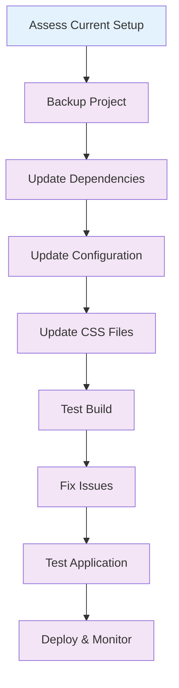

# 🔄 Migration Guide

This section covers migrating from Tailwind CSS v3 to v4+, including automated migration tools, common issues, and step-by-step migration processes.

## 📚 What You'll Learn

- **Migration Process**: Step-by-step guide for migrating from v3 to v4+
- **Common Issues**: Solutions for typical migration problems
- **Migration Checklist**: Comprehensive checklist for successful migration
- **Troubleshooting**: How to resolve migration issues
- **Best Practices**: Tips for smooth migration

## 🗂️ Section Contents

| Topic                                              | Description                        | Key Topics                                                 |
| -------------------------------------------------- | ---------------------------------- | ---------------------------------------------------------- |
| [🔄 v3 to v4 Migration](./v3-to-v4.md)             | Complete migration guide           | Configuration changes, package updates, code updates       |
| [⚠️ Common Issues](./common-issues.md)             | Troubleshooting migration problems | Build errors, configuration issues, compatibility problems |
| [✅ Migration Checklist](./migration-checklist.md) | Step-by-step migration checklist   | Pre-migration, migration, post-migration steps             |

## 🎯 Quick Start

### 1. Pre-Migration Assessment

Before starting migration, assess your current setup:

```bash
# Check current Tailwind version
npm list tailwindcss

# Check for custom configuration
ls -la tailwind.config.js

# Check for custom plugins
grep -r "plugins" tailwind.config.js
```

### 2. Backup Your Project

```bash
# Create a backup branch
git checkout -b backup-before-migration

# Commit current state
git add .
git commit -m "Backup before Tailwind v4 migration"
```

### 3. Update Dependencies

```bash
# Remove old Tailwind packages
npm uninstall tailwindcss @tailwindcss/forms @tailwindcss/typography

# Install new Tailwind v4 packages
npm install @tailwindcss/postcss @tailwindcss/cli @tailwindcss/vite
```

### 4. Update Configuration

```javascript
// Before: tailwind.config.js
module.exports = {
  content: ['./src/**/*.{js,jsx,ts,tsx}'],
  theme: {
    extend: {
      colors: {
        primary: '#3b82f6',
      },
    },
  },
  plugins: [
    require('@tailwindcss/forms'),
    require('@tailwindcss/typography'),
  ],
};

// After: CSS-first configuration
@import "tailwindcss";

@theme {
  --color-primary: #3b82f6;
}

@plugin "@tailwindcss/forms";
@plugin "@tailwindcss/typography";
```

## 🔄 Migration Workflow



## 🚨 Common Migration Issues

### 1. Configuration Errors

```bash
# Error: Cannot find module 'tailwindcss'
# Solution: Update import statements
- @import 'tailwindcss/base';
- @import 'tailwindcss/components';
- @import 'tailwindcss/utilities';

+ @import 'tailwindcss';
```

### 2. Plugin Compatibility

```bash
# Error: Plugin not found
# Solution: Update plugin imports
- plugins: [require('@tailwindcss/forms')]

+ @plugin "@tailwindcss/forms";
```

### 3. Build Errors

```bash
# Error: PostCSS plugin not found
# Solution: Update PostCSS configuration
- plugins: { tailwindcss: {} }

+ plugins: { '@tailwindcss/postcss': {} }
```

## 📋 Migration Checklist

### ✅ Pre-Migration

- [ ] Assess current Tailwind version
- [ ] Document custom configuration
- [ ] List all custom plugins
- [ ] Check for custom utilities
- [ ] Backup project
- [ ] Create migration branch

### ✅ Migration Steps

- [ ] Update package dependencies
- [ ] Remove old configuration files
- [ ] Update CSS imports
- [ ] Convert configuration to CSS-first
- [ ] Update plugin imports
- [ ] Test build process

### ✅ Post-Migration

- [ ] Test all components
- [ ] Verify responsive design
- [ ] Check for visual regressions
- [ ] Test build performance
- [ ] Update documentation
- [ ] Deploy to staging

## 🛠️ Migration Tools

### 1. Automated Migration

```bash
# Use Tailwind's migration tool
npx @tailwindcss/migrate

# Or use the CLI migration
npx tailwindcss migrate
```

### 2. Manual Migration

```bash
# Step 1: Update dependencies
npm uninstall tailwindcss
npm install @tailwindcss/postcss @tailwindcss/cli

# Step 2: Update configuration
# Remove tailwind.config.js
# Update CSS files

# Step 3: Test build
npm run build
```

### 3. Gradual Migration

```bash
# Migrate one component at a time
# Start with simple components
# Test each migration step
# Gradually move to complex components
```

## 🎯 Migration Strategies

### 1. Big Bang Migration

- Migrate entire project at once
- Faster but higher risk
- Requires thorough testing
- Best for small projects

### 2. Gradual Migration

- Migrate component by component
- Lower risk but takes longer
- Allows for testing at each step
- Best for large projects

### 3. Feature Flag Migration

- Use feature flags to control migration
- Allows for A/B testing
- Gradual rollout possible
- Best for production applications

## 🚀 Next Steps

1. **Read the v3 to v4 Migration guide** for detailed migration steps
2. **Check Common Issues** for solutions to typical problems
3. **Follow the Migration Checklist** for a systematic approach
4. **Test thoroughly** at each step
5. **Document your migration** for future reference

## 💡 Pro Tips

- **Start with a test project**: Practice migration on a small project first
- **Use version control**: Commit at each step for easy rollback
- **Test incrementally**: Test each component after migration
- **Document issues**: Keep track of problems and solutions
- **Get help**: Use community resources when stuck

---

Ready to start your migration? Check out the [v3 to v4 Migration](./v3-to-v4.md) guide for detailed steps!
