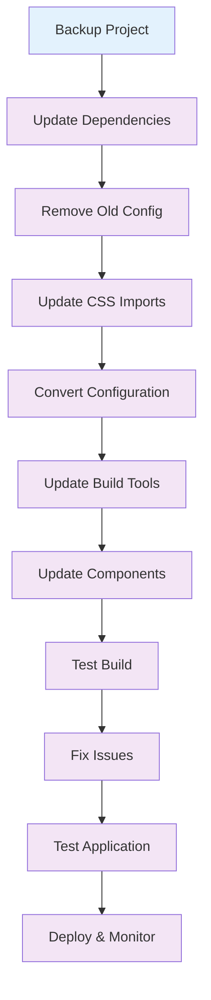

# 🔄 v3 to v4 Migration

Complete guide for migrating from Tailwind CSS v3 to v4+, including configuration changes, package updates, and code modifications.

## 🎯 Overview

Tailwind CSS v4+ introduces significant changes that require careful migration. This guide covers all aspects of the migration process.

## 📦 Package Updates

### 1. Remove Old Packages

```bash
# Remove Tailwind CSS v3
npm uninstall tailwindcss

# Remove old plugins
npm uninstall @tailwindcss/forms @tailwindcss/typography @tailwindcss/aspect-ratio
```

### 2. Install New Packages

```bash
# Install Tailwind CSS v4 packages
npm install @tailwindcss/postcss @tailwindcss/cli @tailwindcss/vite

# Install new plugin packages
npm install @tailwindcss/forms @tailwindcss/typography @tailwindcss/container-queries
```

### 3. Update Package.json

```json
{
  "devDependencies": {
    "@tailwindcss/postcss": "^4.0.0",
    "@tailwindcss/cli": "^4.0.0",
    "@tailwindcss/vite": "^4.0.0",
    "@tailwindcss/forms": "^4.0.0",
    "@tailwindcss/typography": "^4.0.0"
  }
}
```

## ⚙️ Configuration Migration

### 1. Remove Old Configuration

```bash
# Remove old config file
rm tailwind.config.js
# or
rm tailwind.config.ts
```

### 2. Update CSS Files

```css
/* Before: v3 CSS */
@tailwind base;
@tailwind components;
@tailwind utilities;

/* After: v4 CSS */
@import "tailwindcss";
```

### 3. Convert Configuration

```javascript
// Before: tailwind.config.js
module.exports = {
  content: ['./src/**/*.{js,jsx,ts,tsx}'],
  theme: {
    extend: {
      colors: {
        primary: '#3b82f6',
        secondary: '#10b981',
      },
      spacing: {
        '18': '4.5rem',
      },
      fontFamily: {
        sans: ['Inter', 'sans-serif'],
      },
    },
  },
  plugins: [
    require('@tailwindcss/forms'),
    require('@tailwindcss/typography'),
  ],
};

// After: CSS-first configuration
@import "tailwindcss";

@theme {
  --color-primary: #3b82f6;
  --color-secondary: #10b981;
  --spacing-18: 4.5rem;
  --font-sans: 'Inter', 'sans-serif';
}

@plugin "@tailwindcss/forms";
@plugin "@tailwindcss/typography";
```

## 🔧 Build Tool Updates

### 1. Vite Configuration

```typescript
// Before: vite.config.ts
import { defineConfig } from "vite";
import react from "@vitejs/plugin-react";
import tailwindcss from "tailwindcss";
import autoprefixer from "autoprefixer";

export default defineConfig({
  plugins: [react()],
  css: {
    postcss: {
      plugins: [tailwindcss, autoprefixer],
    },
  },
});

// After: vite.config.ts
import { defineConfig } from "vite";
import react from "@vitejs/plugin-react";
import tailwindcss from "@tailwindcss/vite";

export default defineConfig({
  plugins: [react(), tailwindcss()],
});
```

### 2. PostCSS Configuration

```javascript
// Before: postcss.config.js
module.exports = {
  plugins: {
    tailwindcss: {},
    autoprefixer: {},
  },
};

// After: postcss.config.mjs
const config = {
  plugins: {
    "@tailwindcss/postcss": {},
  },
};

export default config;
```

### 3. Webpack Configuration

```javascript
// Before: webpack.config.js
module.exports = {
  module: {
    rules: [
      {
        test: /\.css$/,
        use: ["style-loader", "css-loader", "postcss-loader"],
      },
    ],
  },
};

// After: webpack.config.js
module.exports = {
  module: {
    rules: [
      {
        test: /\.css$/,
        use: [
          "style-loader",
          "css-loader",
          {
            loader: "postcss-loader",
            options: {
              postcssOptions: {
                plugins: ["@tailwindcss/postcss"],
              },
            },
          },
        ],
      },
    ],
  },
};
```

## 🎨 CSS Updates

### 1. Import Statements

```css
/* Before: v3 imports */
@tailwind base;
@tailwind components;
@tailwind utilities;

/* After: v4 imports */
@import "tailwindcss";
```

### 2. Custom CSS

```css
/* Before: v3 custom CSS */
@layer components {
  .btn-primary {
    @apply bg-blue-500 text-white px-4 py-2 rounded;
  }
}

/* After: v4 custom utilities */
@utility btn-primary {
  background-color: theme("colors.blue.500");
  color: theme("colors.white");
  padding: theme("spacing.4") theme("spacing.2");
  border-radius: theme("borderRadius.md");
}
```

### 3. Component Styles

```css
/* Before: v3 component styles */
@layer components {
  .card {
    @apply bg-white rounded-lg shadow-md p-6;
  }

  .card-header {
    @apply text-xl font-bold text-gray-900 mb-2;
  }
}

/* After: v4 custom utilities */
@utility card {
  background-color: theme("colors.white");
  border-radius: theme("borderRadius.lg");
  box-shadow: theme("boxShadow.md");
  padding: theme("spacing.6");
}

@utility card-header {
  font-size: theme("fontSize.xl");
  font-weight: theme("fontWeight.bold");
  color: theme("colors.gray.900");
  margin-bottom: theme("spacing.2");
}
```

## 🔌 Plugin Updates

### 1. Official Plugins

```css
/* Before: v3 plugin configuration */
// tailwind.config.js
plugins: [ require("@tailwindcss/forms"), require("@tailwindcss/typography"), ]
    /* After: v4 plugin configuration */ @plugin "@tailwindcss/forms";
@plugin "@tailwindcss/typography";
```

### 2. Custom Plugins

```javascript
// Before: v3 custom plugin
const plugin = require('tailwindcss/plugin');

module.exports = {
  plugins: [
    plugin(function({ addUtilities }) {
      addUtilities({
        '.btn-primary': {
          backgroundColor: '#3b82f6',
          color: '#ffffff',
          padding: '0.5rem 1rem',
          borderRadius: '0.375rem',
        },
      });
    }),
  ],
};

// After: v4 custom utilities
@utility btn-primary {
  background-color: #3b82f6;
  color: #ffffff;
  padding: 0.5rem 1rem;
  border-radius: 0.375rem;
}
```

### 3. Third-party Plugins

```bash
# Check plugin compatibility
npm list | grep tailwindcss

# Update incompatible plugins
npm uninstall incompatible-plugin
npm install @tailwindcss/compatible-plugin
```

## 🎯 Component Updates

### 1. React Components

```jsx
// Before: v3 component
import React from "react";

const Button = ({ children, variant = "primary" }) => {
  const baseClasses = "px-4 py-2 rounded font-medium";
  const variantClasses = {
    primary: "bg-blue-500 text-white hover:bg-blue-600",
    secondary: "bg-gray-200 text-gray-800 hover:bg-gray-300",
  };

  return (
    <button className={`${baseClasses} ${variantClasses[variant]}`}>
      {children}
    </button>
  );
};

// After: v4 component (using custom utilities)
import React from "react";

const Button = ({ children, variant = "primary" }) => {
  const baseClasses = "btn";
  const variantClasses = {
    primary: "btn-primary",
    secondary: "btn-secondary",
  };

  return (
    <button className={`${baseClasses} ${variantClasses[variant]}`}>
      {children}
    </button>
  );
};
```

### 2. Vue Components

```vue
<!-- Before: v3 Vue component -->
<template>
  <div class="bg-white rounded-lg shadow-md p-6">
    <h3 class="text-xl font-bold text-gray-900 mb-2">Card Title</h3>
    <p class="text-gray-600">Card content goes here.</p>
  </div>
</template>

<!-- After: v4 Vue component -->
<template>
  <div class="card">
    <h3 class="card-header">Card Title</h3>
    <p class="card-content">Card content goes here.</p>
  </div>
</template>
```

### 3. Svelte Components

```svelte
<!-- Before: v3 Svelte component -->
<div class="bg-white rounded-lg shadow-md p-6">
  <h3 class="text-xl font-bold text-gray-900 mb-2">Card Title</h3>
  <p class="text-gray-600">Card content goes here.</p>
</div>

<!-- After: v4 Svelte component -->
<div class="card">
  <h3 class="card-header">Card Title</h3>
  <p class="card-content">Card content goes here.</p>
</div>
```

## 🧪 Testing Migration

### 1. Build Testing

```bash
# Test build process
npm run build

# Check for build errors
npm run build 2>&1 | grep -i error

# Test development server
npm run dev
```

### 2. Visual Testing

```bash
# Test responsive design
# Check all breakpoints
# Verify component styling
# Test dark mode (if applicable)
```

### 3. Performance Testing

```bash
# Test build performance
time npm run build

# Test runtime performance
# Check bundle size
# Monitor memory usage
```

## 🔄 Migration Workflow



## 📋 Migration Checklist

### ✅ Pre-Migration

- [ ] Backup project
- [ ] Document current configuration
- [ ] List all custom utilities
- [ ] Check plugin compatibility
- [ ] Create migration branch

### ✅ Package Updates

- [ ] Remove old Tailwind packages
- [ ] Install new v4 packages
- [ ] Update plugin packages
- [ ] Check dependency conflicts
- [ ] Update package.json

### ✅ Configuration

- [ ] Remove old config files
- [ ] Update CSS imports
- [ ] Convert theme configuration
- [ ] Update plugin imports
- [ ] Test configuration

### ✅ Build Tools

- [ ] Update Vite configuration
- [ ] Update PostCSS configuration
- [ ] Update Webpack configuration
- [ ] Test build process
- [ ] Fix build errors

### ✅ Components

- [ ] Update React components
- [ ] Update Vue components
- [ ] Update Svelte components
- [ ] Test component styling
- [ ] Fix styling issues

### ✅ Testing

- [ ] Test build process
- [ ] Test development server
- [ ] Test responsive design
- [ ] Test performance
- [ ] Test accessibility

### ✅ Post-Migration

- [ ] Deploy to staging
- [ ] Test in production
- [ ] Monitor performance
- [ ] Update documentation
- [ ] Train team

## 🚀 Next Steps

1. **Follow the migration checklist** step by step
2. **Test thoroughly** at each step
3. **Fix issues** as they arise
4. **Document your migration** for future reference
5. **Deploy and monitor** your application

## 💡 Pro Tips

- **Start with a test project**: Practice migration on a small project first
- **Use version control**: Commit at each step for easy rollback
- **Test incrementally**: Test each component after migration
- **Document issues**: Keep track of problems and solutions
- **Get help**: Use community resources when stuck

---

Ready to troubleshoot migration issues? Check out the [Common Issues](./common-issues.md) guide next!
