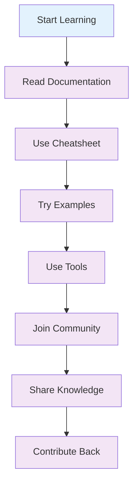

# 📚 Resources

This section provides additional resources for working with Tailwind CSS v4+, including cheatsheets, tools, and community support.

## 📚 What You'll Find

- **Cheatsheets**: Quick reference guides for Tailwind CSS v4+
- **Tools**: Development tools and utilities
- **Community**: Support and learning resources
- **Examples**: Sample projects and code examples
- **Templates**: Starter templates and boilerplates

## 🗂️ Section Contents

| Topic                            | Description                          | Key Topics                                  |
| -------------------------------- | ------------------------------------ | ------------------------------------------- |
| [📋 Cheatsheet](./cheatsheet.md) | Quick reference for Tailwind CSS v4+ | Classes, utilities, configuration, examples |
| [🛠️ Tools](./tools.md)           | Development tools and utilities      | IDEs, extensions, generators, validators    |
| [👥 Community](./community.md)   | Community resources and support      | Forums, Discord, GitHub, tutorials          |

## 🎯 Quick Reference

### 1. Essential Classes

```html
<!-- Layout -->
<div class="flex items-center justify-center">
  <div class="grid grid-cols-1 md:grid-cols-2 lg:grid-cols-3 gap-4">
    <!-- Grid items -->
  </div>
</div>

<!-- Spacing -->
<div class="p-4 m-2 space-y-4">
  <div class="px-6 py-3">Content</div>
</div>

<!-- Colors -->
<div class="bg-blue-500 text-white border border-gray-300">
  <h1 class="text-2xl font-bold text-gray-900">Title</h1>
</div>
```

### 2. Responsive Design

```html
<!-- Mobile-first responsive design -->
<div
  class="
  grid grid-cols-1
  sm:grid-cols-2
  md:grid-cols-3
  lg:grid-cols-4
  xl:grid-cols-5
  gap-4
"
>
  <!-- Responsive grid -->
</div>
```

### 3. Custom Utilities

```css
@utility btn-primary {
  background-color: theme("colors.blue.500");
  color: theme("colors.white");
  padding: theme("spacing.2") theme("spacing.4");
  border-radius: theme("borderRadius.md");

  &:hover {
    background-color: theme("colors.blue.600");
  }
}
```

## 🛠️ Development Tools

### 1. IDE Extensions

- **VS Code**: Tailwind CSS IntelliSense
- **WebStorm**: Tailwind CSS support
- **Sublime Text**: Tailwind CSS package
- **Vim**: Tailwind CSS plugin

### 2. Online Tools

- **Tailwind Play**: Online playground
- **Tailwind UI**: Component library
- **Headless UI**: Unstyled components
- **Heroicons**: Icon library

### 3. Development Utilities

- **Tailwind CLI**: Command-line tool
- **PostCSS**: CSS processing
- **Autoprefixer**: Vendor prefixes
- **CSS Purge**: Remove unused styles

## 👥 Community Support

### 1. Official Resources

- **Documentation**: Official Tailwind CSS docs
- **GitHub**: Source code and issues
- **Discord**: Community chat
- **Twitter**: Updates and announcements

### 2. Learning Resources

- **Tutorials**: Step-by-step guides
- **Courses**: Video courses
- **Blogs**: Articles and tips
- **Podcasts**: Audio content

### 3. Community Projects

- **Templates**: Starter templates
- **Components**: Reusable components
- **Themes**: Color schemes and designs
- **Plugins**: Custom functionality

## 🔄 Resource Workflow



## 📋 Resource Checklist

### ✅ Getting Started

- [ ] Read the official documentation
- [ ] Set up your development environment
- [ ] Install necessary tools and extensions
- [ ] Create your first project
- [ ] Join the community

### ✅ Learning Path

- [ ] Complete the introduction guide
- [ ] Follow the setup instructions
- [ ] Learn core concepts
- [ ] Explore advanced features
- [ ] Build UI examples

### ✅ Best Practices

- [ ] Follow naming conventions
- [ ] Optimize performance
- [ ] Ensure accessibility
- [ ] Document your code
- [ ] Share with the community

## 🚀 Next Steps

1. **Check out the Cheatsheet** for quick reference
2. **Explore the Tools** for development efficiency
3. **Join the Community** for support and learning
4. **Try the Examples** to see Tailwind in action
5. **Contribute back** to help others learn

## 💡 Pro Tips

- **Bookmark the cheatsheet**: Keep it handy while coding
- **Use the tools**: They'll make your development faster
- **Join the community**: Get help and share knowledge
- **Follow best practices**: Learn from experienced developers
- **Stay updated**: Keep up with the latest Tailwind features

---

Ready to dive deeper? Check out the [Cheatsheet](./cheatsheet.md) for quick reference!
